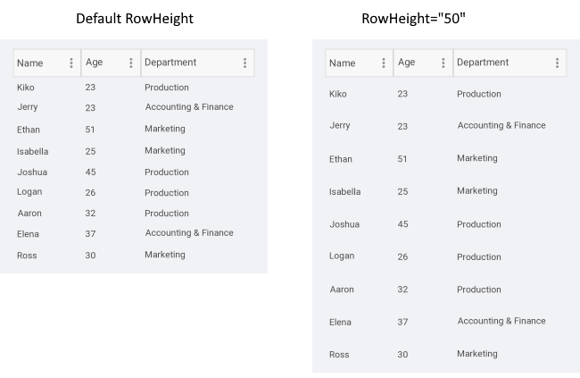

# Row Height

Telerik UI for .NET MAUI DataGrid provides the option to manually set the grid row height, so you have full control over the way the content is accommodated inside the grid cells.  By default row height is calculated according to the cells content.

Apply `RowHeight` property of type `double` to the DataGrid instance to specify the row height: 


```XAML
<telerik:RadDataGrid x:Name="dataGrid"
							RowHeight="50"
							ItemsSource="{Binding Source}" />
```

Here is the difference in the way DataGrid is rendered with and without `RowHeight` specifically set:



>Take a look at the [CellContentStyle](#cellcontentstyle) topic for additional customization options related to positioning the text inside the cells, such as text margin and text alignment as this can also affect the overall row height.


## See Also

- [Columns Styling]()
- [Selection]()
