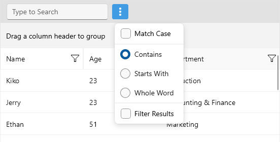

# .NET MAUI DataGrid Search as You Type

Telerik .NET MAUI DataGrid provides the ability to search for specific data within its ItemsSource by using its built-in search funcionality. The default behavior is to search as you type, but it can also be performed when the end user finishes typing and presses Enter.

Through the DataGrid's `SearchSettings` property you can control when to show the search panel as well as configure the way the search is performed, so it best suits the end users' needs.

### Show/Hide the Search Panel

The DataGrid's `SearchSettings` exposes  a `SearchPanelVisibilityMode` property which controls when the search panel will appear, here are the available options:

* `NeverVisible`&mdash;the search panel never appears.
* `ControlledByUser`&mdash;the search panel becomes visible after a user's interaction (pressing Control / Command +F in Windows / MacOS respectively) and its close button is also visible.
* `AlwaysVisible`&mdash;the search panel is always visible and its close button is not visible.

### Search Panel UI

The search panel provides an entry where the end user can enter the search terms, and also some search options to choose from, such as whether to match the case, whether to filter the results. The additional search settings can be accessed by the Options button (the tree dots) next to the entry.

You can check how the Search Panel UI looks on Windows at the image below:

### Search Settings

The default searching behavior works in the following way - all the words divided by space are trimmed from the search text and searched by according to the `LogicalOperator` property.

Below you can find a list of the available configuration options applied through the `RadDataGrid`.`SearchSettings`:

* `IntermediateSearchText`(`string`)&mdash;Specifies the text of the search entry. Change of this value will not necessarily trigger a search, i.e. it will not necessarily change the `SearchText` property. The `SearchText` property is updated in accordance `SearchTrigger` property.
* `SearchText`(`string`)&mdash;the search text. Before a search is started, this value is trimmed, and the `SearchStarting` event is raised. `SearchStarting` event allows to change the effective search text that will be used for searching.
* `SearchTrigger`(`DataGridSearchTrigger`)&mdash;Indicates when a search operation should be performed while the end user is typing in the search entry of the search panel. Available options are:
    * `TextChanged`&mdash;a search operation is triggered every time the text of the entry changes.
    * `Completed`&mdash;a search operation is triggered when the corresponding entry completes (by pressing Enter/Return key).
* `TextMatchMode`(`DataGridSearchTextMatchMode`)&mdash;Indicates how a search term should be searched for within a text. Available options are:
    * `Contains`&mdash;an item is marked as a search-match as long as the search text is contained anywhere in the text element (cell or other).
    * `StartsWith`&mdash;an item is marked as a search-match only if the text of the text element (cell or other) contains a word that starts with the search text.
    * `WholeWord`&mdash;an item is marked as a search-match only if the text of the text element (cell or other) contains a word that matches the search text.
* `LogicalOperator`(`Telerik.Maui.LogicalOperator`)&mdash;Specifies the logical operator when the search text is comprised of more than one search term.
* `CaseSensitive`(`bool`)&mdash;Indicates whether string comparison should be case sensitive.
* `ApplyFilter`(`bool`)&mdash; Determines whether business items that do not satisfy the search criteria should be filtered.
* `SearchMatchesCount`(`int`)&mdash;Gets the number of search matches.
* `ProvideSearchMatchesAction`(`Action<DataGridSearchProbe>`)&mdash;Applies custom action that is invoked when determining the search matches for an item. Use this action when you need to specify search matches based on custom logic.

### Events

* `SearchStarting`&mdash;Raised before searching starts. The effective search text can be changed and searching can be cancelled from the arguments.
    * The sender argument, which is of type `object`, but can be cast to the `RadDataGrid` type.
    * A `DataGridSearchStartingEventArgs` object which provides `SearchText` - the text that will be used for searching and `Cancel` - indicates whether to cancel the search.

### Commands

* `CloseSearchPanelCommand`&mdash;Called when pressing the close button in the search panel.
* `SearchEntryCompletedCommand`&mdash;Called when the `Completed` event of the search entry in the search panel is raised.

### Example

Here is an example on how you can configure the search through the `SearchSettings`:

**1.** Add the DataGrid definition to the page with the `SearchSettings` applied:

<snippet id='datagrid-search-xaml' />

**2.** Add a sample `SearchStarting` event handler:

<snippet id='scheduler-search-searchstarting-event' />

Check the result at the image below:

## See Also

- [Localization]()
- [Defining Columns]()