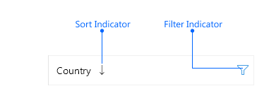
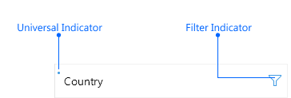

# .NET MAUI DataGrid Columns Styling

The [Telerik UI for .NET MAUI DataGrid]() component provides styling mechanism for customizing the look of the columns and their cells.

The styling mechanism is represented by the following properties:

* `HeaderStyle` (`DataGridColumnHeaderStyle`)&mdash;Sets the style to the columns' headers.
* `CellContentStyle` (`DataGridTextCellStyle`)&mdash;Defines the appearance of each cell associated with the column.
* `CellDecorationStyle` (`DataGridBorderStyle`)&mdash;Defines the style of the border of each cell associated with the column.
* `CellEditorStyle` (`Style` with `TargetType` depending on the editor type)&mdash;Defines the style that will be applied to the cell editor.
* `FooterStyle` (`DataGridColumnFooterStyle`)&mdash;Defines the appearance of the column footer.

## Header Style

`HeaderStyle` defines the appearance of the column header. The `DataGridColumnHeaderStyle` exposes properties for styling its header and data operations indicators (filter indicator and sort indicator or universal indicator).

### Header Styling

To style the `RadDataGridColumnHeader` use the following properties:

* `TextColor` and `BackgroundColor`&mdash;Define the colors of the text part/background respectively.
* `HoverBackgroundColor`&mdash;(Desktop only)Defines the background color when the mouse is over the column header. 
* `BorderColor` and `BorderThickness`&mdash;Define the style of the border around the column header.
* `Font Options` (`TextFontAttributes`, `TextFontFamily`, `TextFontSize`)&mdash;Define the font options to the text part of the `ColumnHeader`.
* `Text Alignment` (`TextMargin`, `HorizontalTextAlignment`, `VerticalTextAlignment`)&mdash;Define the positioning for the text part of the `ColumnHeader`.
* `TextHorizontalOptions`(`LayoutOptions`)&mdash;Defines the horizontal options of the text part of the header. 
* `TextVerticalOptions`(`LayoutOptions`)&mdash;Defines the vertical options of the text part of the header.

When you set the `TextHorizontalOptions` of the text part of the header, consider the current position of the sort indicator as both elements are ordered in а defined way and modifying the position of any of them affects the other one.

For example, to position the column header text to `Center`, you have to set the `SortDescriptor` position to `Center` as well:

 ```XAML
<telerik:DataGridColumnHeaderStyle TextHorizontalOptions="Center"
                                   SortIndicatorHorizontalOptions="Center" />
```

>tip For more details how to hide the column headers from the DataGrid visualization, review the following article: [How to Hide Column Headers in a DataGrid for MAUI]().

In addition to the column header text, the column header can contain the following indicators for sorting and filtering operations upon the DataGrid data: filter indicator, sort indicator and universal indicator. Use `RadDataGrid`'s `DataOperationIndicationMode` property to define what indicators to appear in the columns' headers:

* `DataOperationIndicationMode`(`Telerik.Maui.Controls.DataGrid.DataOperationIndicationMode`)&mdash;Defines what indicators will be used in columns' headers when sorting and filtering are applied. Possible options are:
	* `Individual`&mdash;(default)An individual indicator with a unique appearance will be used when a data operation is applied. In case sorting is applied, sort indicator will appear, in case filtering is applied, the filter indicator takes its active color (the active color can be modified through the `DataGridColumnHeaderStyle`'s `FilterIndicatorActiveTextColor` property).

    You can check how the individual indicators look on Windows below:

    


    * `Universal`&mdash;A single indicator will be used when any data operation (filtering and/or sorting) is applied. In case filtering is applied, in addition to the universal indicator, the filter indicator takes its active color (the active color can be modified through the `DataGridColumnHeaderStyle`'s `FilterIndicatorActiveTextColor` property).

    Check below how the indicators are displayed in `DataOperationIndicationMode`.`Universal`:

    

### Filter Indicator Styling

The `FilterIndicator` enables users to show the Filtering UI and filter the data. Style the `FilterIndicator` using the following properties:

* `FilterIndicatorTextColor`&mdash;Defines the color for the filter indicator part of the `ColumnHeader`.  
* `FilterIndicatorActiveTextColor`&mdash;Defines the color of the filter symbol when filtering is applied.
* `FilterIndicatorText`&mdash;Defines the text for the filter indicator part of the `ColumnHeader`. For the `FilterIndicatorText` to appear, set the `FilterIndicatorFontFamily` property.
* `FilterIndicatorMargin`&mdash;Defines the margin of the filter indicator part of the `ColumnHeader`.
* `Font Options`(`FilterIndicatorFontAttributes`, `FilterIndicatorFontFamily`, `FilterIndicatorFontSize`)&mdash;Define the font options to the filter indicator text. 

>note By default, the filter indicator is represented by a string symbol that can be changed by using the `FilterIndicatorText` and `FilterIndicatorFontFamily` properties. 

### Sort Indicators Styling

The `SortIndicator` appears once the `RadDataGridColumnHeader` is sorted (tapped/clicked on the `ColumnHeader` cell) and can be styled with the following properties:

* `SortIndicatorColor`&mdash;Defines the color for the sort indicator part of the `ColumnHeader`.  
* `SortIndicatorMargin`&mdash;Defines the margin of the sort indicator part of the `ColumnHeader`.
* `SortIndicatorAscendingText`&mdash;Defines the text of the sort indicator when the sorting is ascending.
* `SortIndicatorDescendingText`&mdash;Defines the text of the sort indicator when the sorting is descending.
* `SortIndicatorHorizontalOptions`&mdash;Defines the horizontal options of the sort indicator.

### Universal Indicator Styling

Style the universal indicator using the following properties:

* `IndicatorColor`&mdash;Defines the color for the universal indicator part of the `ColumnHeader`.
* `IndicatorText`&mdash;Defines the text for the universal indicator part of the `ColumnHeader`.  
* `IndicatorMargin`&mdash;Defines the margin of the universal indicator part of the `ColumnHeader`.
* `Font Options`(`IndicatorFontAttributes`, `IndicatorFontFamily`, `IndicatorFontSize`)&mdash;Define the font options to the universal indicator text. 

Check below a quick example of a DataGrid with a `HeaderStyle`:

<snippet id='datagrid-columnstyle-headerstyle'/>

## CellContentStyle

The `CellContentStyle` property defines the appearance of each cell associated with the column. `CellContentStyle` is of type `DataGridTextCellStyle` which provides the following properties for styling the cell text:

* `Font` options (`FontAttributes`, `FontFamily`, `FontSize`)&mdash;Define the font of the cell text.
* `TextColor`/`SelectedTextColor`&mdash;Define the color of the cells text. You can set a different value for the selected cell.
* `HoverTextColor`&mdash;Sets the color of the cells text when the mouse hovers over it. Applicable only on Desktop.
* `TextMargin`/ `HorizontalTextAlignment`/ `VerticalTextAlignment`)&mdash;Define the positioning of the text inside the cell.
* `SearchMatchTextColor`&mdash;Defines the color that is used for the parts of the text that are search matches.

Here is an example how to set the `CellContentStyle` property:

<snippet id='datagrid-columnstyle-cellcontent'/>

## CellDecorationStyle

To style the border of each cell associated with the column the `CellDecorationStyle` property is used. `CellDecorationStyle` is of type `DataGridBorderStyle` which provides the following properties&mdash;`BackgroundColor`, `BorderColor`, `BorderTickness`.

In addition, `DataGridBorderStyle` provides the `SearchMatchBackgroundColor` property used to apply a separate background color to the border when the cell contains a search-match. 

Here is an example how to set those properties on a column:

<snippet id='datagrid-columnstyle-celldecoration'/>

## CellEditorStyle

`CellEditorStyle` defines the style that will be applied to the cell editor.

Here is an example how to set this property:

<snippet id='datagrid-columnstyle-celleditor'/>

And this is how the column style looks when the properties for customizing the column are applied:


## FooterStyle

`FooterStyle` defines the appearance of the column footer. The `DataGridColumnFooterStyle` exposes the following properties for styling:

* `TextColor` and `BackgroundColor`&mdash;Define the colors of the text part/background respectively.
* `BorderColor` and `BorderThickness`&mdash;Define the style of the border around the column footer.
* `Font Options` (`TextFontFamily`, `TextFontAttributes`, `TextFontSize`)&mdash;Define the font options to the text part of the `ColumnFooter`.
* `Text Alignment` (`TextMargin`, `HorizontalTextAlignment`, `VerticalTextAlignment`)&mdash;Define the positioning for the text part of the `ColumnFooter`.

<snippet id='datagrid-columnstyle-footerstyle' />


## DataGrid Toggle Row Details Column Styling

`CellContentStyle` defines the appearance of the `DataGridToggleRowDetailsColumn`. The `DataGridToggleRowDetailsCellStyle` exposes the following properties for styling:

* `ButtonFontFamily`&mdash;Defines the font family for the toggle symbol.
* `ExpandButtonText`&mdash;Defines the text for the expanded state.
* `CollapseButtonText`&mdash;Defines the text for the collapsed state.
* `ButtonTextColor`&mdash;Defines the color for the toggle symbol.
* `SelectedButtonTextColor`&mdash;Defines the color for the toggle symbol when the item is selected.
* `HoverButtonTextColor`&mdash;Defines the color for the toggle symbol when the item is being hovered over.
* `ButtonFontSize`&mdash;Defines the font size for the toggle symbol.
* `ButtonFontAttributes`&mdash;Defines `Microsoft.Maui.Controls.FontAttributes` for the toggle symbol.
* `ButtonMargin`(type `Thickness`)&mdash;Defines the margin for the toggle symbol.


## See Also

- [DataGrid Styling]()
- [Style Selectors]()
- [Search as You Type]()
