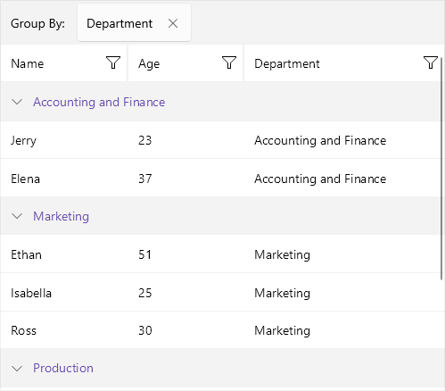

# Group Header Styling for .NET MAUI DataGrid

Telerik .NET MAUI DataGrid provides a `GroupHeaderStyle` property which defines the appearance of the group headers when the data is grouped.

>To learn more about the grouping functionality of the DataGrid, go to [Grouping Overview]() topic.

*`GroupHeaderStyle` is of type `DataGridGroupHeaderStyle` and provides the following styling properties:

* `TextColor`(`Color`)&mdash;Defines the color for the text part of the group header.
* `SearchMatchTextColor`(`Color`)&mdash;Defines the color that is used for the parts of the group header's text that are search matches. For more details on this, go to [Search as You Type]() topic.
* `AggregatesTextColor`(`Color`)&mdash;Defines the color for the aggregates part of the group header. For more details on this, go to [Aggregates]() topic.
* `BackgroundColor`(`Color`)&mdash;Defines the color that fills the area within the header of the DataGrid group header.
* `SearchMatchBackgroundColor`(`Color`)&mdash;Defines the color that fills the area within the border when the cell contains a search-match. For more details on this, go to [Search as You Type]() topic.
* `GroupLevelIndentation`(`double`)&mdash;Defines the indentation that accumulates for each group level.
* `BorderColor`(`Color`)&mdash;Defines the color that fills the border region of the group header.
* `BorderThickness`(`Thickness`)&mdash;Defines the thickness of the border.
* `ButtonFontAttributes`(`FontAttributes`), `ButtonFontFamily`(`string`), and `ButtonFontSize`(`double`) options&mdash;Define the font options of the expand and collapse symbol.

  By default, the Button of the group header uses an internal symbol font family. To render text when the button is expanded or collapsed, instead of a symbol, set a font family to the `ButtonFontFamily` property and add the text to the `ExpandButtonText` and `CollapseButtonText` properties. 

* `ButtonMargin`(`Thickness`)&mdash;Defines the margin of the expand and collapse symbol of the group header.
* `ButtonTextColor`(`Color`)&mdash;Defines the text color of the expand and collapse symbol of the group header.
* `CollapseButtonText`(`string`)&mdash;Defines the text for the collapse state of the group header.
* `ExpandButtonText`(`string`)&mdash;Defines the text for the expand state of the group header.
* `TextMargin`(`Thickness`), `VerticalTextAlignment`(`TextAlignment`), and `HorizontalTextAlignment`(`TextAlignment`) text alignment options&mdash;Define the positioning of the text that is part of the group header.
* `AggregatesTextMargin`(`Thickness`)&mdash;Defnes the margin for the aggregates part of the group header. For more details on this, go to [Aggregates]() topic.
* `TextFontattributes`(`FontAttributes`), `TextFontFamily`(`string`), and `TextFontSize`(`double`) text font options&mdash;Define the font options of the group header's text part.
* `AggregatesTextFontAttributes`(`FontAttributes`), `AggregatesTextFontFamily`(`string`), and `AggregatesTextFontSize`(`double`)&mdash;Define the font options for the aggregates part of the group header. For more details on this, go to [Aggregates]() topic.

The following example demonstrates how to apply a sample `GroupHeaderStyle` to the DataGrid:

**1.** Add a sample `DataGridGroupHeaderStyle` to the page's resources:

<snippet id='datagrid-groupheader-styling-style' />

**2.** Add the DataGrid definition to the page with its `GroupHeaderStyle` applied:

<snippet id='datagrid-groupheader-styling-xaml' />

**3.** Add the ViewModel class:

<snippet id='datagrid-grouping-viewmodel' />

**4.** Add the data item used for binding the DataGrid:

<snippet id='datagrid-grouping-object' />

**5.** Set the binding context of the DataGrid to the ViewModel class:

<snippet id='datagrid-grouping-propertygroupdescriptor-setvm' />

Check the result at the image below:

## See Also

* [Grouping Overview]()
* [Search as You Type]()
* [Aggregates]()