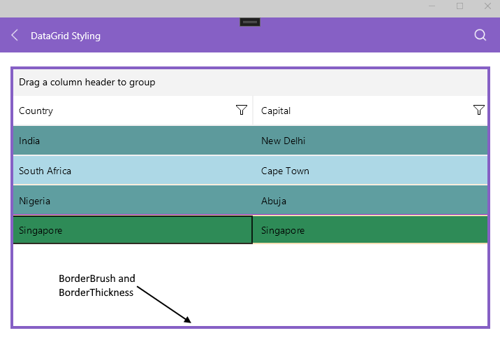

# .NET MAUI DataGrid Styling

The DataGrid enables you to customize its look and feel through the available `Style` configuration options. Also, you can modify the appearance of its splitter element, which divides the frozen columns from the rest of the data.

## Border Brush and Thickness

`Style` supports the following properties for styling the border brush and thickness of the DataGrid:

* `BorderBrush`&mdash;Defines the brush of the border placed around the DataGrid control.
* `BorderThickness`&mdash;Defines the thickness of the border around the DataGrid control.

The following snippet shows how to set the `BorderBrush` and `BorderThickness` properties of the DataGrid control:

```XAML
 <telerik:RadDataGrid x:Name="DataGrid"
                      BorderBrush="#8660C5"
                      BorderThickness="4"/>
```

The next image shows the end result.



## Cells and Rows

`Style` supports the following properties for styling the cells and rows of the DataGrid:

* `RowBackgroundStyle`&mdash;Defines the style of each row.
* `AlternateRowBackgroundStyle`&mdash;Defines the appearance style of an alternated row.
* `SelectionStyle`&mdash;Defines the appearance settings applied to the selected DataGrid row.
* `CurrentCellStyle`&mdash;Defines the style applied to the current cell.
* `MouseHoverStyle`&mdash;Specifies the style applied to the cells and rows when the mouse is over them. The style is applicable for Desktop (`MacCatalyst` and `WinUI`).

The `RowBackgroundStyle`, `AlternateRowBackgroundStyle`, `SelectionStyle`, `CurrentCellStyle`, and `MouseHoverStyle` styling options are of type `DataGridBorderStyle`. `DataGridBorderStyle` defines the appearance settings applied to a `BorderPaintable` instance and exposes the `BackgroundColor`, `BorderColor`, and `BorderTickness` properties.

The following example shows how to set the `RowBackgroundStyle` property:

<snippet id='datagrid-styling-rowbackgroundstyle'/>

The next example demonstrates how to set the `AlternateRowBackgroundStyle` property:

<snippet id='datagrid-styling-alternaterowbackgroundstyle'/>

The following snippet shows how to set the `SelectionStyle` property:

<snippet id='datagrid-styling-selectionstyle'/>

For styling the `CurrentCell` by using the `CurrentCellStyle` property, review the [Cells](#styling-the-cell) article.

## Text on Hover

`Style` supports the `HoverTextColor` property which defines the text color of the hovered cell, as demonstrated in the following example.

```XAML
<telerik:DataGridTextColumn PropertyName="Name"
                            HeaderText="Name">
    <telerik:DataGridTextColumn.CellContentStyle>
        <telerik:DataGridTextCellStyle TextColor="Green"
                                        HoverTextColor="Red"
                                        FontSize="15"
                                        SelectedTextColor="Orange"  />   
    </telerik:DataGridTextColumn.CellContentStyle>
</telerik:DataGridTextColumn>
```

## Lines

`Style` supports the following properties for configuring the DataGrid lines:

* `GridLinesVisibility`(`Telerik.Maui.Controls.Compatibility.DataGrid.GridLinesVisibility`)&mdash;Defines which DataGrid lines are currently visible (displayed). The property accepts the `Both`, `Horizontal`, `None`, and `Vertical` values.
* `GridLinesColor`&mdash;Defines the appearance of the horizontal and vertical DataGrid lines.
* `GridLinesThickness`&mdash;Defines the width of the vertical and the height of the horizontal DataGrid lines.

You can set the `GridLinesVisibility` property in the following way:

```XAML
 <telerik:RadDataGrid GridLinesVisibility="Both"
                             Grid.Row="2"
                             Grid.ColumnSpan="3"
                             ItemsSource="{Binding GridSource}"
                             GridLinesColor="Red"
                             GridLinesThickness="5" />
```

## Frozen Columns

`Style` supports the `FrozenColumnsSplitterStyle` (`Telerik.Maui.Controls.Compatibility.DataGrid.DataGridFrozenColumnsSplitterStyle`) property which allows you to style the UI of the splitter dividing the frozen (locked) from the unfrozen (unlocked) columns.

## Splitter UI

To style the appearance of the splitter, which appears when the user freezes (locks) DataGrid columns, use the `Width`, `BackgroundColor`, `BorderColor`, and `BorderThickness` properties.

```XAML
<telerik:RadDataGrid.FrozenColumnsSplitterStyle>
    <telerik:DataGridFrozenColumnsSplitterStyle Width="20"
                                                BorderColor="Gray"
                                                BorderThickness="2"
                                                BackgroundColor="LightBlue"/>
</telerik:RadDataGrid.FrozenColumnsSplitterStyle>
```

## See Also

- [Styling the .NET MAUI DataGrid Columns]()
- [Available DataGrid Style Selectors]()
