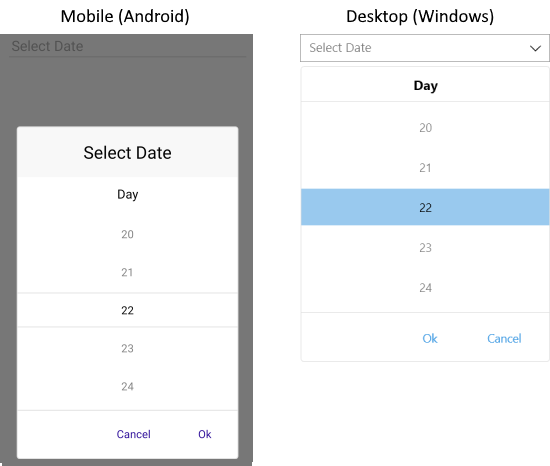
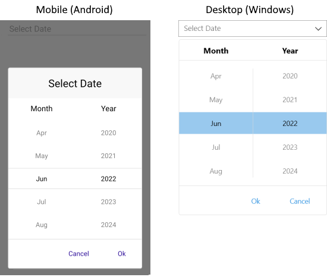

# Formatting

This topic describes the formatting capabilities of Telerik DatePicker for .NET MAUI control both when the picker dialog is open and when a date value is picked.

## DisplayString Format

`DisplayStringFormat` property defines the format of the string that will be visualized when the picker dialog is closed. 

>note The format set for **DisplayStringFormat** should be a valid date format. 

Here is a sample Date Picker definition:

<snippet id='datepicker-keyfeatures-date-defaulthighlighted' />
```XAML
<telerikInput:RadDatePicker DefaultHighlightedDate="2020,05,15"
                            DisplayStringFormat="yyyy/MMM/dd"
                            Placeholder="Pick a date!"
                            SpinnerFormat="dd/MMM/yyyy"
                            AreSpinnerHeadersVisible="False"/>
```

In addition to this, you need to add the following namespace:

```XAML
xmlns:telerikInput="clr-namespace:Telerik.XamarinForms.Input;assembly=Telerik.Maui.Controls.Compatibility"
```

## Spinner Format

DatePicker for .NET MAUI allows you to use standard or custom date format strings through the `SpinnerFormat` property. Depending on what format is set, the picker visualizes spinner controls with prepopulated values to be picked.

`SpinnerFormat` property defines the string format for the spinners. The default format is **"g"**.

## Standard Date Format Strings

The available Standard Date Format Strings which can be set to the SpinnerFormat property are described in the table below:

| Supported Standard Date Format String | Description |
| -------- | -------- |
| "d" | Short Date Format. Invariant culture format is MM/dd/yyyy |
| "G" | Short Date "d" and Long Time "T" |
| "g" | Short Date "d" and Short Time "t" |
| "M" | Month Format Specifier |
| "m" | Month Format specifier |
| "Y" | Year Month Format Specifier |
| "y" | Year Month Format Specifier |

## Custom Date Format Strings

The available Custom Date Format Strings which can be set to the SpinnerFormat property are described in the table below:

| Supported Custom Date Format Strings|
| -------- |
| "d" |
| "dd" |
| "M" |
| "MM" |
| "MMM" |
| "MMMM" |
| "y" |
| "yyy" |
| "yyyy" |

>important We currently do not support any standard date formats which contain long date inside them. [Standard Date Format Strings](https://docs.microsoft.com/en-us/dotnet/standard/base-types/standard-date-and-time-format-strings) to the Date Picker control.

### Supported Separators

When `SpinnerFormat` is set and the device culture is changed, the separators used for the format string won't be changed:

| Supported Format Separators |
| -------- |
| "-" |
| "." |
| "," |
| " " |
| ":" |
| "/" |

### Examples

#### SpinnerFormat="MMMM dd"

```XAML
<telerikInput:RadDatePicker SpinnerFormat="MMMM dd" />
```

And the result:


#### SpinnerFormat="dd"

```XAML
<telerikInput:RadDatePicker SpinnerFormat="dd" />
```

And the result:



#### SpinnerFormat="MMM yyyy"

```XAML
<telerikInput:RadDatePicker SpinnerFormat="MMM yyyy" />
```

And the result:



#### SpinnerFormat="yyyy/dd/MMM"

```XAML
<telerikInput:RadDatePicker SpinnerFormat="yyyy/dd/MMM" />
```

And the result:


## See Also

- [Templates]()
- [Styling]()
- [Selection]()
- [Commands]()
