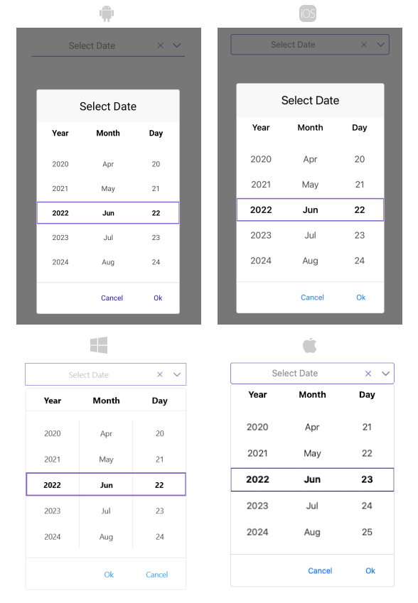

# Styling

The DatePicker control for .NET MAUI provides styling options for customizing its appearance.

## DatePicker Styling

The control supports the following properties:

* `SpinnerStyle`(of type `Style` with target type `telerikDataControls:RadSpinner`)&mdash;Defines the style applied to the spinner item and the selected item.
* `SpinnerHeaderStyle`(of type `Style` with target type `Label`)&mdash;Specifies the style applied to each spinner header label.
* `SelectionHighlightStyle`(of type `Style` with target type `telerikPrimitives:RadBorder`)&mdash;Specifies the style applied to the border that highlights the selection.
* `PlaceholderLabelStyle`(of type `Style` with target type `Label`)&mdash;Specifies the style applied to the label defined in the [default `PlaceholderTemplate`](#default-placeholdertemplate).
* `DisplayLabelStyle`(of type `Style` with target type `Label`)&mdash;Defines the style applied to the label, which is visualized when a date is selected.

The `PickerContentView` class exposes the following properties for styling the DatePicker border and background color:

* `BackgroundColor`&mdash;Defines the background color of the picker.
* `BorderColor`&mdash;Defines the border color of the picker.
* `BorderThickness`&mdash;Specifies the border thickness of the picker. Its default value is `new Thickness(0,0,0,1)`.
* `CornerRadius`&mdash;Specifies the corner radius of the picker.

## Popup Styling

By using the `SelectorSettings` property (of type `Telerik.XamarinForms.Input.PickerPopupSelectorSettings`) of the DatePicker, you can modify the appearance of the dialog (popup). The `PickerPopupSelectorSettings` class exposes the following `Style` properties:

* `PopupViewStyle`(of type `Style` with target type `telerikInput:PickerPopupContentView`)&mdash;Defines the popup view style.
* `HeaderStyle`(of type `Style` with target type `telerikInput:PickerPopupHeaderView`)&mdash;Defines the popup header style.
* `HeaderLabelStyle`(of type `Style` with target type `Label`)&mdash;Defines the popup header label style.
* `FooterStyle`(of type `Style` with target type `telerikInput:PickerPopupFooterView`)&mdash;Defines the popup footer style.
* `AcceptButtonStyle`(of type `Style` with target type `Button`)&mdash;Defines the **Accept** button style.
* `CancelButtonStyle`(of type `Style` with target type `Button`)&mdash;Defines the **Cancel** button style.

The `SelectorSettings` also provides the following properties for popup customization:

* `PopupOutsideBackgroundColor`&mdash;Defines the color outside of the popup.
* `IsPopupModal`(`bool`)&mdash;Defines a Boolean value indicating if the popup will be closed when tapped outside of the popup. By default, the value of the `IsPopupModal` is `false`.

	When `IsPopupModal="True"`, the UI behind the popup gets inactive and cannot be used until the popup is closed.

	When `IsPopupModal="False"`, the popup can be closed when clicking outside the popup. 	

* `HeaderLabelText`(`string`)&mdash;Specifies the text visualized in the popup header.
* `IsHeaderVisible`(`bool`)&mdash;Specifies whether the Popup header is currently visible. By default, the value is `True`
* `IsFooterVisible`(`bool`)&mdash;Specifies whether the Popup footer is currently visible. By default, the value is `True`.
* `AcceptButtonText`(`string`)&mdash;Defines the text visualized for the **Accept** button. By default, the text is `OK`.
* `CancelButtonText`(`string`)&mdash;Defines the text visualized for the **Cancel** button. By default, the text is `Cancel`.

## Namespaces

When you use `PopupViewStyle`, `HeaderStyle`, `FooterStyle`, you will need to add the following namespace:

```XAML
xmlns:telerikInput="clr-namespace:Telerik.XamarinForms.Input;assembly=Telerik.Maui.Controls.Compatibility"
```

When you use `SelectionHighlightStyle`, you need to add the following namespace:

```XAML
xmlns:telerik="clr-namespace:Telerik.Maui.Controls;assembly=Telerik.Maui.Controls"
```

When you use `SpinnerStyle`, you need to add the following namespace:

```XAML
xmlns:telerikDataControls="clr-namespace:Telerik.XamarinForms.DataControls;assembly=Telerik.Maui.Controls.Compatibility"
```

## Example for Implementing the Styling Options

The following example demonstrates how to define a sample DatePicker.

1. Defining the RadDatePicker

<snippet id='datepicker-style' />
 ```XAML
<telerikInput:RadDatePicker SpinnerHeaderStyle="{StaticResource spinnerHeaderStyle}"
							SpinnerStyle="{StaticResource spinnerStyle}"
							SelectionHighlightStyle="{StaticResource selectionHighlightStyle}"
							DisplayLabelStyle="{StaticResource displayLabelStyle}"
							PlaceholderLabelStyle="{StaticResource placeholderLabelStyle}"
							DefaultHighlightedDate="2020,05,15"
							SpinnerFormat="yyy/MMM/dd"
							DisplayStringFormat="yyyy/MMM/dd">
	<telerikInput:RadDatePicker.SelectorSettings>
		<telerikInput:PickerPopupSelectorSettings PopupOutsideBackgroundColor="#D9D9D9CC"
												  PopupViewStyle="{StaticResource popupViewStyle}"
												  HeaderStyle="{StaticResource headerStyle}"
												  HeaderLabelText="Date Picker"
												  HeaderLabelStyle="{StaticResource headerLabelStyle}"
												  FooterStyle="{StaticResource footerStyle}"
												  AcceptButtonStyle="{StaticResource acceptButtonStyle}"
												  CancelButtonStyle="{StaticResource cancelButtonStyle}"/>
	</telerikInput:RadDatePicker.SelectorSettings>
</telerikInput:RadDatePicker>
 ```

The following examples demonstrate how to set the styling of the page resources.

## Spinner Style

<snippet id='datepicker-style-spinner-style' />
```XAML
<Style TargetType="telerikDataControls:RadSpinner" x:Key="spinnerStyle">
	<Setter Property="ItemStyle">
		<Setter.Value>
			<Style TargetType="telerikDataControls:SpinnerItemView">
				<Setter Property="TextColor" Value="#4A4949"/>
			</Style>
		</Setter.Value>
	</Setter>
	<Setter Property="SelectedItemStyle">
		<Setter.Value>
			<Style TargetType="telerikDataControls:SpinnerItemView">
				<Setter Property="TextColor" Value="Black"/>
				<Setter Property="FontAttributes" Value="Bold"/>
			</Style>
		</Setter.Value>
	</Setter>
</Style>
```

## SpinnerHeader Style

<snippet id='datepicker-style-spinner-header-style' />
```XAML
<Style TargetType="Label" x:Key="spinnerHeaderStyle">
	<Setter Property="TextColor" Value="Black"/>
	<Setter Property="FontAttributes" Value="Bold"/>
	<Setter Property="HorizontalOptions" Value="FillAndExpand"/>
	<Setter Property="VerticalOptions" Value="FillAndExpand"/>
	<Setter Property="HorizontalTextAlignment" Value="Center"/>
	<Setter Property="VerticalTextAlignment" Value="Center"/>
</Style>
```

## SelectionHighlight Style

<snippet id='datepicker-style-selection-highlight-style' />
```XAML
<Style TargetType="telerik:RadBorder" x:Key="selectionHighlightStyle">
	<Setter Property="BorderColor" Value="#00B5DC"/>
	<Setter Property="BorderThickness" Value="1"/>
	<Setter Property="Padding" Value="0,6,0,6"/>
	<Setter Property="HeightRequest" Value="40"/>
	<Setter Property="VerticalOptions" Value="Center"/>
</Style>
```

## PlaceholderLabel Style

<snippet id='datepicker-style-placeholder-label-style' />
```XAML
<Style TargetType="Label" x:Key="placeholderLabelStyle">
	<Setter Property="TextColor" Value="#4A4949"/>
	<Setter Property="VerticalTextAlignment" Value="Center"/>
	<Setter Property="HorizontalTextAlignment" Value="Center"/>
	<Setter Property="HeightRequest" Value="50"/>
</Style>
```

## DisplayLabel Style

<snippet id='datepicker-style-display-label-style' />
```XAML
<Style TargetType="Label" x:Key="displayLabelStyle">
	<Setter Property="TextColor" Value="Black"/>
	<Setter Property="VerticalTextAlignment" Value="Center"/>
	<Setter Property="HorizontalTextAlignment" Value="Center"/>
	<Setter Property="HeightRequest" Value="50"/>
</Style>
```

## PopupView Style

<snippet id='datepicker-style-popupview-style' />
```XAML
<Style TargetType="telerikInput:PickerPopupContentView" x:Key="popupViewStyle">
	<Setter Property="BackgroundColor" Value="White"/>
	<Setter Property="WidthRequest" Value="270"/>
</Style>
```

## Header Style

<snippet id='datepicker-style-header-style' />
```XAML
<Style TargetType="telerikInput:PickerPopupHeaderView" x:Key="headerStyle">
	<Setter Property="BackgroundColor" Value="#00B5DC"/>
	<Setter Property="HeightRequest" Value="60"/>
	<Setter Property="Margin" Value="0"/>
	<Setter Property="Padding" Value="0"/>
	<Setter Property="HorizontalOptions" Value="FillAndExpand"/>
	<Setter Property="VerticalOptions" Value="FillAndExpand"/>
</Style>
```

## HeaderLabel Style

<snippet id='datepicker-style-header-label-style' />
```XAML
<Style TargetType="Label" x:Key="headerLabelStyle">
	<Setter Property="TextColor" Value="White"/>
	<Setter Property="HorizontalOptions" Value="Center"/>
	<Setter Property="VerticalOptions" Value="Center"/>
	<Setter Property="FontSize" Value="Title"/>
</Style>
```

## Footer Style

<snippet id='datepicker-style-footer-style' />
```XAML
<Style TargetType="telerikInput:PickerPopupFooterView" x:Key="footerStyle">
	<Setter Property="BackgroundColor" Value="Transparent"/>
</Style>
```

## AcceptButton Style

<snippet id='datepicker-style-accept-button-style' />
```XAML
<Style TargetType="Button" x:Key="acceptButtonStyle">
	<Setter Property="BackgroundColor" Value="Transparent"/>
	<Setter Property="Text" Value="OK"/>
	<Setter Property="TextColor" Value="#00B5DC"/>
</Style>
```

## CancelButton Style

<snippet id='datepicker-style-cancel-button-style' />
```XAML
<Style TargetType="Button" x:Key="cancelButtonStyle">
	<Setter Property="BackgroundColor" Value="Transparent"/>
	<Setter Property="Text" Value="X"/>
	<Setter Property="TextColor" Value="#00B5DC"/>
</Style>
```

## Namespaces

In addition, add the following namespaces:

```XAML
xmlns:telerikInput="clr-namespace:Telerik.XamarinForms.Input;assembly=Telerik.Maui.Controls.Compatibility"
xmlns:telerikDataControls="clr-namespace:Telerik.XamarinForms.DataControls;assembly=Telerik.Maui.Controls.Compatibility"
xmlns:telerik="clr-namespace:Telerik.Maui.Controls;assembly=Telerik.Maui.Controls"
```

The following image shows what the DatePicker control looks like when the styles described above are applied:



## See Also

- [Formatting]()
- [Templates]()
- [Commands]()
- [Visual Structure]()
