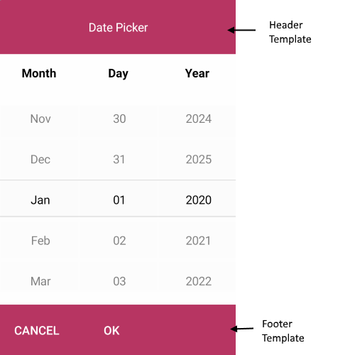

# Templates

If the default templates of the control do not suit your needs, you can easily define custom ones. The available templates for customizing are:

* `PlaceholderTemplate`(*ControlTemplate*): Defines the template visualized for the placeholder.  
* `DisplayTemplate`(*ControlTemplate*): Defines the template visualized when the picked date/time is displayed.
* `HeaderTemplate`(*ControlTemplate*): Defines what will be displayed inside the dialog(popup) header.
* `FooterTemplate`(*ControlTemplate*): Defines what will be displayed inside the dialog(popup) footer.

## PlaceholderTemplate

<snippet id='datepicker-placeholder-default-template' />
```XAML
<ControlTemplate x:Key="Picker_PlaceholderView_ControlTemplate">
	<Grid>
		<Grid.GestureRecognizers>
			<TapGestureRecognizer Command="{TemplateBinding ToggleCommand}" />
		</Grid.GestureRecognizers>
		<Label Text="{TemplateBinding Placeholder}"
			   Style="{TemplateBinding PlaceholderLabelStyle}"
			   AutomationId="PickerPlaceholderLabel"/>
	</Grid>
</ControlTemplate>
```

## DisplayTemplate

<snippet id='datepicker-display-default-template' />
```XAML
<ControlTemplate x:Key="Picker_DisplayView_ControlTemplate">
	<Grid>
		<Grid.GestureRecognizers>
			<TapGestureRecognizer Command="{TemplateBinding ToggleCommand}" />
		</Grid.GestureRecognizers>
		<Label Text="{TemplateBinding DisplayString}"
			   Style="{TemplateBinding DisplayLabelStyle}"
			   AutomationId="PickerDisplayLabel"/>
	</Grid>
</ControlTemplate>
```

## HeaderTemplate

<snippet id='datepicker-header-default-template' />
```XAML
<ControlTemplate x:Key="PopupView_Header_ControlTemplate">
	<telerik:RadBorder BackgroundColor="{TemplateBinding BackgroundColor}"
					   BorderColor="{TemplateBinding BorderColor}"
					   BorderThickness="{TemplateBinding BorderThickness}"
					   CornerRadius="{TemplateBinding CornerRadius}">
		<Label Text="{TemplateBinding HeaderLabelText}"
			   Style="{TemplateBinding HeaderLabelStyle}"
			   AutomationId="PickerPopupHeaderLabel"/>
	</telerik:RadBorder>
</ControlTemplate>
```

## FooterTemplate

<snippet id='datepicker-footer-default-template' />
```XAML
<ControlTemplate x:Key="PopupView_Footer_ControlTemplate">
	<telerik:RadBorder BackgroundColor="{TemplateBinding BackgroundColor}"
					   BorderColor="{TemplateBinding BorderColor}"
					   BorderThickness="{TemplateBinding BorderThickness}"
					   CornerRadius="{TemplateBinding CornerRadius}">
		<OnPlatform x:TypeArguments="View">
			<On Platform="Android, iOS">
				<HorizontalStackLayout Spacing="0" HorizontalOptions="End">
					<Button Text="{TemplateBinding CancelButtonText}"
							Style="{TemplateBinding CancelButtonStyle}"
							Command="{TemplateBinding CancelCommand}" 
							AutomationId="PickerPopupCancelButton"/>
					<Button Text="{TemplateBinding AcceptButtonText}"
							Style="{TemplateBinding AcceptButtonStyle}"
							Command="{TemplateBinding AcceptCommand}"
							AutomationId="PickerPopupOkButton"/>
				</HorizontalStackLayout>
			</On>
			<On Platform="UWP">
				<HorizontalStackLayout Spacing="0" HorizontalOptions="End">
					<Button Text="{TemplateBinding AcceptButtonText}"
							Style="{TemplateBinding AcceptButtonStyle}"
							Command="{TemplateBinding AcceptCommand}"
							AutomationId="PickerPopupOkButton"/>
					<Button Text="{TemplateBinding CancelButtonText}"
							Style="{TemplateBinding CancelButtonStyle}"
							Command="{TemplateBinding CancelCommand}" 
							AutomationId="PickerPopupCancelButton"/>
				</HorizontalStackLayout>
			</On>
		</OnPlatform>
	</telerik:RadBorder>
</ControlTemplate>
```

Аnd the DatePicker definition:

```XAML
<telerikInput:RadDatePicker MinimumDate="2020,01,1" 
							MaximumDate="2025,12,31"
							SpinnerFormat="MMM/dd/yyyy"
							PlaceholderTemplate="{StaticResource Picker_PlaceholderView_ControlTemplate}"
							DisplayTemplate="{StaticResource Picker_DisplayView_ControlTemplate}">
	<telerikInput:RadDatePicker.SelectorSettings>
		<telerikInput:PickerPopupSelectorSettings HeaderTemplate="{StaticResource PopupView_Header_ControlTemplate}"
												  HeaderLabelText="Date Picker"
												  FooterTemplate="{StaticResource PopupView_Footer_ControlTemplate}"/>
	</telerikInput:RadDatePicker.SelectorSettings>
</telerikInput:RadDatePicker>
```

## Example How to Customize the Default Look

The snippet below shows a simple Date Picker definition:

<snippet id='datepicker-custom-templates' />
```XAML
<telerikInput:RadDatePicker MinimumDate="2020,01,1" 
							MaximumDate="2025,12,31"
							SpinnerFormat="MMM/dd/yyyy"
							PlaceholderTemplate="{StaticResource placeholderTemplate}"
							DisplayTemplate="{StaticResource displayTemplate}">
	<telerikInput:RadDatePicker.SelectorSettings>
		<telerikInput:PickerPopupSelectorSettings HeaderTemplate="{StaticResource headerTemplate}" 
												  HeaderLabelText="This is the Header Template"
												  FooterTemplate="{StaticResource footerTemplate}"/>
	</telerikInput:RadDatePicker.SelectorSettings>
</telerikInput:RadDatePicker>
```

Now lets add the templates definition to the page resources:

### Custom PlaceholderTemplate

<snippet id='datepicker-placeholder-template' />
```XAML
<ControlTemplate x:Key="placeholderTemplate">
	<Button Text="{TemplateBinding Placeholder}" 
			FontAttributes="Bold" 
			TextColor="White"
			BackgroundColor="#B73562" 
			HeightRequest="50" Command="{TemplateBinding ToggleCommand}" />
</ControlTemplate>
```


### Custom DisplayTemplate

<snippet id='datepicker-display-template' />
```XAML
<ControlTemplate x:Key="displayTemplate">
	<Button Text="{TemplateBinding DisplayString}" 
			TextColor="White" 
			BackgroundColor="#7BAEFF"
			HeightRequest="50"
			Command="{TemplateBinding ToggleCommand}" />
</ControlTemplate>
```


### Custom HeaderTemplate

<snippet id='datepicker-header-template' />
```XAML
<ControlTemplate x:Key="headerTemplate">
	<Label Text="Date Picker" 
		   TextColor="White"
		   VerticalTextAlignment="Center"
		   HorizontalTextAlignment="Center"
		   BackgroundColor="#B73562"/>
</ControlTemplate>
```

### Custom FooterTemplate

<snippet id='datepicker-footer-template' />
```XAML
<ControlTemplate x:Key="footerTemplate">
	<HorizontalStackLayout Spacing="0" HorizontalOptions="FillAndExpand" BackgroundColor="#B73562">
		<Button Text="Cancel" 
				TextColor="White"
				BackgroundColor="Transparent"
				Command="{TemplateBinding CancelCommand}" />
		<Button Text="OK"
				TextColor="White"
				BackgroundColor="Transparent"
				Command="{TemplateBinding AcceptCommand}" />
	</HorizontalStackLayout>
</ControlTemplate>
```



In addition to this, you need to add the following namespace:

```XAML
xmlns:telerikInput="clr-namespace:Telerik.XamarinForms.Input;assembly=Telerik.Maui.Controls.Compatibility"
```

## See Also

- [Formatting]()
- [Date Range]()
- [Styling]()