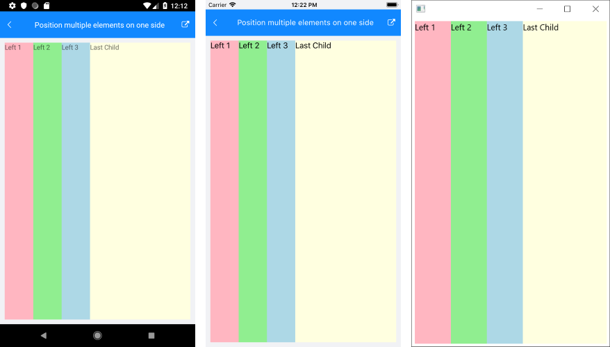

# Docking Functionality

The DockLayout provides options for setting the position of child elements to different areas of the layout and aligning multiple elements to one side.  

## Setting the Position of Child Elements

To define the docking side of a child element inside the dock layout component, use **RadDockLayout.Dock** attached property which receives any of the following values:

* `Left`
* `Top`
* `Right`
* `Bottom`

The way the child elements are docked and arranged depends on their order inside the DockLayout’s Children collection (the order they’re defined in XAML).

Following is a quick example on how you can utilize the docking functionality:

<snippet id='docklayout-docking-feature' />
```XAML
<telerik:RadDockLayout x:Name="dockLayout">
    <Label Text="Left" telerik:RadDockLayout.Dock="Left" WidthRequest="60" BackgroundColor="LightPink" />
    <Label Text="Top" telerik:RadDockLayout.Dock="Top" HeightRequest="60" BackgroundColor="LightGreen" />
    <Label Text="Right" telerik:RadDockLayout.Dock="Right" WidthRequest="60" BackgroundColor="LightBlue" />
    <Label Text="Bottom" telerik:RadDockLayout.Dock="Bottom" BackgroundColor="LightYellow" />
</telerik:RadDockLayout>
```

Define `telerik` in the following way:

```XAML
xmlns:telerik="clr-namespace:Telerik.Maui.Controls;assembly=Telerik.Maui.Controls"
```

The following image shows the result on different platforms:


## Positioning Multiple Elements on One Side

Setting the same docking side to a few child elements will arrange them according to their order inside the DockLayout children collection.  

<snippet id='docklayout-position-elementsoneside'/>
```XAML
<telerik:RadDockLayout x:Name="dockLayout" >
    <Label Text="Left 1" telerik:RadDockLayout.Dock="Left" WidthRequest="60" BackgroundColor="LightPink" />
    <Label Text="Left 2" telerik:RadDockLayout.Dock="Left" WidthRequest="60" BackgroundColor="LightGreen" />
    <Label Text="Left 3" telerik:RadDockLayout.Dock="Left" WidthRequest="60" BackgroundColor="LightBlue" />
    <Label Text="Last Child" telerik:RadDockLayout.Dock="Left" BackgroundColor="LightYellow" />
</telerik:RadDockLayout>
```

The following image shows the end result.



## Setting the Position of the Last Child Element

By default, the last element inside the DockLayout stretches over the remaining space that is not occupied by the other child elements.

You can prevent this behavior by setting `StretchLastChild` property of the DockLayout control to `False` as demonstrated in the following example.

<snippet id='docklayout-position-lastelement'/>
```XAML
<telerik:RadDockLayout x:Name="dockLayout" StretchLastChild="False">
    <Label Text="Left" telerik:RadDockLayout.Dock="Left" WidthRequest="60" BackgroundColor="LightPink" />
    <Label Text="Top" telerik:RadDockLayout.Dock="Top" HeightRequest="60" BackgroundColor="LightGreen" />
    <Label Text="Right" telerik:RadDockLayout.Dock="Right" WidthRequest="60" BackgroundColor="LightBlue" />
    <Label Text="Bottom" telerik:RadDockLayout.Dock="Bottom" BackgroundColor="LightYellow" />
</telerik:RadDockLayout>
```

The following image shows the end result.


