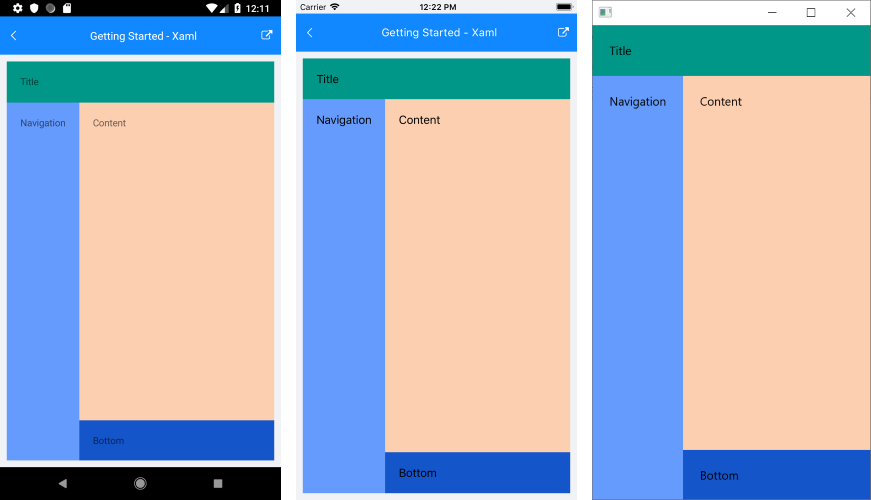

# Getting Started

This guide provides the information you need to start using the Telerik UI for .NET MAUI DockLayout by adding the control to your project.

At the end, you will be able to achieve the following result.



## Prerequisites

Before adding the DockLayout, you need to:

1. [Set up your .NET MAUI application](#set-up-your-net-maui-application).

1. [Download Telerik UI for .NET MAUI](#download-telerik-ui-for-net-maui).

1. [Install Telerik UI for .NET MAUI](#install-telerik-ui-for-net-maui).

## Define the Control

1. When the your .NET MAUI application is set up, you are ready to add a Barcode control to your page.

<snippet id='docklayout-getting-started-xaml' />
 ```XAML
<telerik:RadDockLayout x:Name="dockLayout">
    <Grid HeightRequest="60"
          BackgroundColor="#009688"
          telerik:RadDockLayout.Dock="Top">
        <Label Margin="20" Text="Title"/>
    </Grid>
    <Grid BackgroundColor="#659BFC"
          telerik:RadDockLayout.Dock="Left">
        <Grid.ColumnDefinitions>
            <ColumnDefinition Width="Auto"/>
        </Grid.ColumnDefinitions>
        <Label Margin="20" Text="Navigation" />
    </Grid>
    <Grid BackgroundColor="#1455C9"
          telerik:RadDockLayout.Dock="Bottom">
        <Grid.RowDefinitions>
            <RowDefinition Height="Auto"/>
        </Grid.RowDefinitions>
        <Label Margin="20" Text="Bottom" />
    </Grid>
    <Grid  BackgroundColor="#FCCFB0">
        <Label Margin="20" Text="Content" />
    </Grid>
</telerik:RadDockLayout>
 ```

1. Add the following namespace:

 ```XAML
xmlns:telerik="clr-namespace:Telerik.Maui.Controls;assembly=Telerik.Maui.Controls"
 ```

1. Register the Telerik controls through the `Telerik.Maui.Controls.Compatibility.UseTelerik` extension method called inside the `CreateMauiApp` method of the `MauiProgram.cs` file of your project:

 ```C#
using Telerik.Maui.Controls.Compatibility;


public static class MauiProgram
{
	public static MauiApp CreateMauiApp()
	{
		var builder = MauiApp.CreateBuilder();
		builder
			.UseTelerik()
			.UseMauiApp<App>()
			.ConfigureFonts(fonts =>
			{
				fonts.AddFont("OpenSans-Regular.ttf", "OpenSansRegular");
			});

		return builder.Build();
	}
}           
 ```

## See Also

* [Docking Functionality]()
