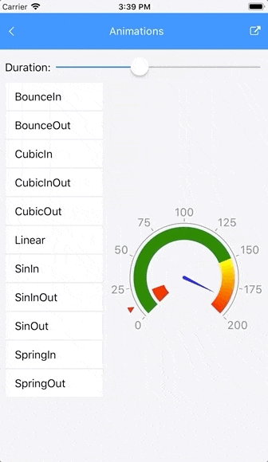

# Animations

All gauge indicators are being animated upon initial load and upon value change. The animations are enabled by default and you have full control over them via the **AnimationSettings** property. 

**AnimationSettings** property could be applied to the Gauge or separately to the indicators. By default the property of the indicator is null and in this case the **AnimationSettings** property of the gauge is taken into consideration. This allows you to control all animations by setting only one property - the property of the gauge. If you need an indicator to be animated differently, you can set its **AnimationSettings** property as it has a higher precedence than the gauge's property.

The **AnimationSettings** class contains the following properties:

* Duration *(int)*: Defines the duration of the animation in milliseconds.
* Easing: Defines the easing of the animation.
* Enabled *(bool)*: Specifies whether the animation will be enabled or not. By default the Enabled property is *true*.

## Example

Here is an example how to set the AnimationSettings property:

```XAML
<telerikGauges:RadRadialGauge x:Name="gauge1"
                              Grid.Row="1"
                              Grid.Column="1">
    <telerikGauges:RadRadialGauge.AnimationSettings>
        <telerikCommon:AnimationSettings x:Name="gauge1Animations" Easing="CubicOut" />
    </telerikGauges:RadRadialGauge.AnimationSettings>
    <telerikGauges:RadRadialGauge.Axis>
        <telerikGauges:GaugeLinearAxis Maximum="200"
                                       Minimum="0"
                                       Step="25" />
    </telerikGauges:RadRadialGauge.Axis>
    <telerikGauges:RadRadialGauge.Indicators>
        <telerikGauges:GaugeShapeIndicator Value="80" />
        <telerikGauges:GaugeBarIndicator Offset="30" Value="100" />
        <telerikGauges:GaugeNeedleIndicator Fill="Blue"
                                            Offset="30"
                                            Value="120" />
    </telerikGauges:RadRadialGauge.Indicators>
    <telerikGauges:RadRadialGauge.Ranges>
        <telerikGauges:GaugeRangesDefinition>
            <telerikGauges:GaugeRange Color="Green"
                                      From="0"
                                      To="150" />
            <telerikGauges:GaugeGradientRange From="150" To="200">
                <telerikCommon:RadGradientStop Offset="150" Color="Yellow" />
                <telerikCommon:RadGradientStop Offset="200" Color="Red" />
            </telerikGauges:GaugeGradientRange>
        </telerikGauges:GaugeRangesDefinition>
    </telerikGauges:RadRadialGauge.Ranges>
</telerikGauges:RadRadialGauge>
```

Here is a gif animation that shows all animations provided in the Gauge control:



## See Also

- [Indicators]()
- [Positioning]()
- [Ranges]()
