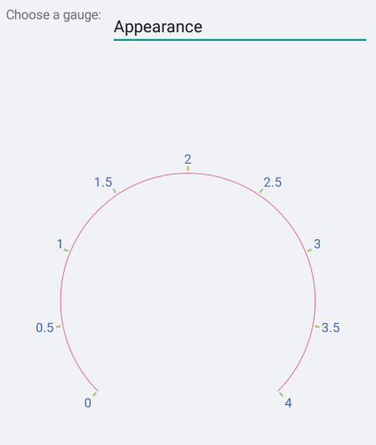
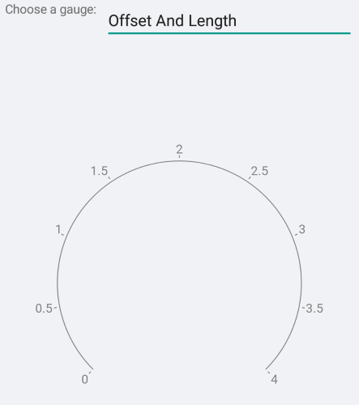
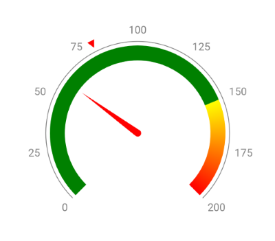
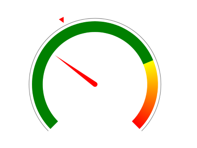

# Axis

The axis provides options for you to control all its displayed elements including ticks, labels, appearance, and axis range.

## Axis Range

Presently, the axis does not have an auto-range mechanism so it is mandatory that you set the `Minimum`, `Maximum`, and `Step` properties.

```XAML
<telerikGauges:GaugeLinearAxis Maximum="4"
                               Minimum="0"
                               Step="0.5" />
```


The following image shows the end result.  


## Axis Line Stroke and Ticks

You can control the stroke of the axis line and ticks through the `Stroke` property. To set a different color for the ticks, use the `TickStroke` property. Similarly, setting the `StrokeThickness` affects both the axis line and ticks. To set a different stroke thickness for the ticks, use the `TickThickness` property.

```XAML
<telerikGauges:GaugeLinearAxis Maximum="4"
                               Minimum="0"
                               Step="0.5"
                               Stroke="#FFDD789B"
                               StrokeThickness="1"
                               TextColor="#FF4062AD"
                               TickStroke="#FFAAC271"
                               TickThickness="2" />
```


The following image shows the end result.



## Font Style

You can control the appearance of the labels with the `FontSize`, `FontFamily` and `FontAttributes` properties.

```XAML
<telerikGauges:GaugeLinearAxis FontAttributes="Bold"
                               FontSize="30"
                               Maximum="4"
                               Minimum="0"
                               Step="0.5" />
```


The following image shows the end result.


## Font Family

The `FontFamily` property is of type `string` and you need to pass the name of the font family. Remember that the different platforms work with different fonts so you may need to use the `OnPlatform` method.

<snippet id='gauge-axis-font-family'/>


The following image shows the end result.


## Label Format

You can control the numeric format of the content of the labels. The default label format is `"G7"`.

```XAML
<telerikGauges:GaugeLinearAxis LabelFormat="N2"
                               Maximum="4"
                               Minimum="0"
                               Step="0.5" />
```							   


The following image shows the end result.


## Label and Tick Position

In the Radial Gauge, the Gauge elements can be positioned on the inside or on the outside of the axis line. Some of the elements, such as the ticks, can also be centered on the axis line. This behavior is controlled by the `Position` property of the specific element.

```XAML
<telerikGauges:GaugeLinearAxis LabelPosition="Start"
                               Maximum="4"
                               Minimum="0"
                               Step="0.5"
                               TickPosition="Start" />
```


The following image shows the end result.


## Offset and Length

The distance between the specific element and the axis line is defined by the `Offset`, `TickOffset`, and `LabelOffset` properties. You can also specify the length of the ticks.

```XAML
<telerikGauges:GaugeLinearAxis LabelOffset="8"
                               Maximum="4"
                               Minimum="0"
                               Step="0.5"
                               TickLength="3"
                               TickOffset="3" />
```							   


The following image shows the end result.



## Label Visibility

You can change axis label visibility by setting the `ShowLabels = "False"`. The default value is `True`. 

```XAML
<telerikGauges:GaugeLinearAxis ShowLabels="False"
							   Maximum="250"
                               Minimum="0"
                               Step="25" />
```

The following image shows the end result.


## Tick Thickness

Change the thickness of the axis ticks using the `TickThickness` property. 

If you want to completely remove the ticks set `TickThickness="0"`.

```XAML
<telerikGauges:GaugeLinearAxis Maximum="250"
                               Minimum="0"
                               Step="25" 
							   TickThickness="0" />
```

The following image shows the end result.



In scenario when Labels are hidden and the tick thickness is set to 0:

```XAML
<telerikGauges:GaugeLinearAxis Maximum="250"
                               Minimum="0"
                               Step="25" 
							   TickThickness="0" 
							   ShowLabels="False" />
```



## See Also

- [Indicators]()
- [Positioning]()
- [Ranges]()
