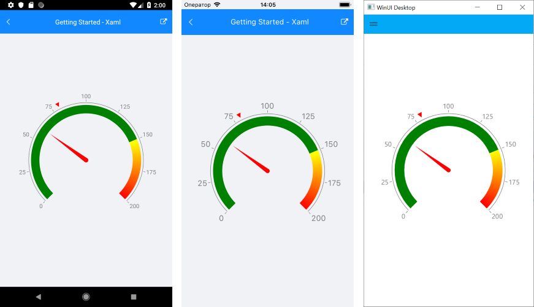

# Getting Started

## Define RadGauge control

```XAML
<telerikGauges:RadRadialGauge x:Name="gauge">
    <telerikGauges:RadRadialGauge.Axis>
        <telerikGauges:GaugeLinearAxis Maximum="200"
                                       Minimum="0"
                                       Step="25" />
    </telerikGauges:RadRadialGauge.Axis>
    <telerikGauges:RadRadialGauge.Indicators>
        <telerikGauges:GaugeNeedleIndicator Offset="30" Value="60" />
        <telerikGauges:GaugeShapeIndicator Value="80" />
    </telerikGauges:RadRadialGauge.Indicators>
    <telerikGauges:RadRadialGauge.Ranges>
        <telerikGauges:GaugeRangesDefinition>
            <telerikGauges:GaugeRange Color="Green"
                                      From="0"
                                      To="150" />
            <telerikGauges:GaugeGradientRange From="150" To="200">
                <telerikCommon:RadGradientStop Offset="150" Color="Yellow" />
                <telerikCommon:RadGradientStop Offset="200" Color="Red" />
            </telerikGauges:GaugeGradientRange>
        </telerikGauges:GaugeRangesDefinition>
    </telerikGauges:RadRadialGauge.Ranges>
</telerikGauges:RadRadialGauge>
```

Add the following namespace:

```XAML
xmlns:telerikGauges="clr-namespace:Telerik.XamarinForms.DataVisualization.Gauges;assembly=Telerik.Maui.Controls.Compatibility"
xmlns:telerikCommon="clr-namespace:Telerik.XamarinForms.Common;assembly=Telerik.Maui.Controls.Compatibility"
```			

Register a SkiaSharp renderer inside the `Configure` method of the **Startup.cs** file of your project:

```C#
.UseSkiaSharpCompatibilityRenderers().UseSkiaSharpHandlers()    
```

This is the result:
 


> You can follow this tutorial to set up also the RadVerticalGauge and RadHorizontalGauge controls which expose the same API.

### Gauge types

There are 2 gauge types that you can use to display different layout - radial and linear (horizontal and vertical). You can read more about these types at the listed articled below:

- [Radial Gauge]()
- [Horizontal Gauge]()
- [Vertical Gauge]()

### See Also

- [Axis]()
- [Indicators]()
- [Ranges]()
