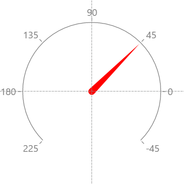
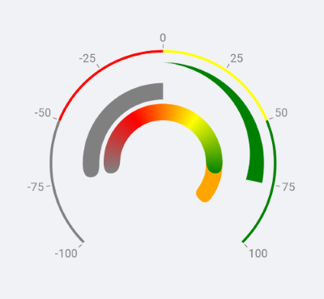
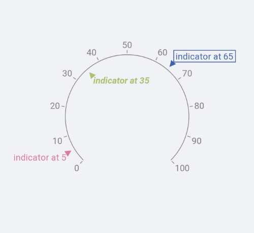

# Indicators

The Gauge indicators are elements that display data-related values in a different manner.

## Needle Indicator

The `GaugeNeedleIndicator` is part of the Radial Gauge. It presents a single value set by the `Value` property. The needle is intended to be visually similar to an actual gauge needle. The center of rotation of the needle coincides with the center of the gauge and is directed towards where the value on the gauge axis is. How far the tip of the needle gets is determined by its `Position` and `Offset` properties.


## Custom Needle Indicator

You can use a custom shape for the needle by taking advantage of the `Shape` property. To achieve the desired output, set up the geometry that describes the needle you want.

When the shape geometry is set, the gauge expects the following conditions to be met:

- The coordinates are relative values between 0 and 1.
- The rotation pivot point is (0.5, 0.5).
- The needle orientation is from (0.5, 0.5) to (1, 0.5).

When the gauge draws the needle, the geometry is scaled to the size in which it will be displayed. This size is a result of the diameter of the axis arc, and the needle position and offset. It is then rotated so that the needle points at the value.

In the following example, the angle of rotation is 45 degrees and, in this case, coincides with the needle value.




The following example demonstrates a custom needle shape:

```XAML
<telerikCommon:RadPathGeometry x:Key="Needle3">
    <telerikCommon:RadPathFigure StartPoint="0.533, 0.51">
        <telerikCommon:RadLineSegment Point="1, 0.5" />
        <telerikCommon:RadLineSegment Point="0.533, 0.49" />
        <telerikCommon:RadArcSegment Center="0.5, 0.5"
                                     Size="0.07, 0.07"
                                     StartAngle="20"
                                     SweepAngle="142" />
        <telerikCommon:RadLineSegment Point="0.43, 0.488" />
        <telerikCommon:RadLineSegment Point="0.43, 0.512" />
        <telerikCommon:RadArcSegment Center="0.5, 0.5"
                                     Size="0.07, 0.07"
                                     StartAngle="200"
                                     SweepAngle="142" />
    </telerikCommon:RadPathFigure>
</telerikCommon:RadPathGeometry>
```


The following image shows the end result.


## Shape Indicator

The `GaugeShapeIndicator` supports the following properties:

* `Value`&mdash;Defines a single value of the shape indicator.
* `Size`&mdash;Defines the size of the shape indicator.

The shape indicator is essentially a square box and is drawn so that its center coincides with the point defined by the `Position` and `Offset` properties. The shape is rotated around its center so that the default arrow shape always points towards the axis line.


## Customizing the Shape Indicator

You can use a custom shape for the `GaugeShapeIndicator` by taking advantage of the `Shape` property. To achieve the desired output, set up the geometry that describes the shape you want.

When the shape geometry is set, the gauge expects that these conditions are met:

- The coordinates are in relative values between 0 and 1.
- The rotation pivot point is (0.5, 0.5).
- The shape orientation is from (1, 0.5) to (0.5, 0.5).

When the gauge draws the shape, the geometry is scaled to the size in which it will be displayed. Then it is moved to the point defined by the `Position` and `Offset` properties. It is then rotated so that the shape points at the axis line. In the example below, the indicator value is 3.5 and the angle of rotation is 35 degrees.


Here is an example of a custom shape:

```XAML
<telerikCommon:RadPathGeometry x:Key="Shape1">
    <telerikCommon:RadPathFigure StartPoint="0, 0.5">
        <telerikCommon:RadLineSegment Point="1, 0.3" />
        <telerikCommon:RadLineSegment Point="1, 0.7" />
    </telerikCommon:RadPathFigure>
</telerikCommon:RadPathGeometry>
```


The following image shows the end result.


## Bar Indicator

The `GaugeBarIndicator` presents a single value set by the `Value` property. The bar indicator is drawn alongside and parallel to the axis line, and is drawn from the axis origin value.

The Bar indicator supports the following properties:

* `StartThickness`(`double`)&mdash;Specifies the start thickness of the Bar indicator.
* `EndThickness`(`double`)&mdash;Specifies the end thickness of the Bar indicator.
* `StartCap`(of type `Telerik.XamarinForms.DataVisualization.Gauges.GaugeBarIndicatorCap enumeration`)&mdash;Defines the start cap of the Bar indicator.
* `EndCap`(of type `Telerik.XamarinForms.DataVisualization.Gauges.GaugeBarIndicatorCap enumeration`)&mdash;Defines the end cap of the Bar indicator.

  The available options from the `GaugeBarIndicatorCap` enumeration are `Flat`, `Oval`, and `ConcaveOval`. The default value for the start and end caps is `Flat`.

The following example demonstrates how to implement a Bar indicator. 

```XAML
<telerikGauges:GaugeBarIndicator Fill="Green"
                                 StartThickness="0"
                                 Offset="15"
                                 Value="75" />
```


## Range Bar Indicator

The `GaugeBarIndicator` presents a value range set by the `From` and `To` properties.

```XAML
<telerikGauges:GaugeRangeBarIndicator FromCap="Oval"
                                      ToCap="Oval"
                                      Offset="65"
                                      From="-75"
                                      To="75">
    <telerikGauges:GaugeRangeBarIndicator.GradientStops>
        <telerikCommon:RadGradientStop Offset="-75" Color="Gray" />
        <telerikCommon:RadGradientStop Offset="-25" Color="Red" />
        <telerikCommon:RadGradientStop Offset="25" Color="Yellow" />
        <telerikCommon:RadGradientStop Offset="75" Color="Green" />
    </telerikGauges:GaugeRangeBarIndicator.GradientStops>
</telerikGauges:GaugeRangeBarIndicator>
```


The following image shows the end result.



In addition, the Range Bar indicator has the following properties:

* `FromThickness`(`double`)&mdash;Specifies the start thickness of the Range Bar indicator.
* `ToThickness`(`double`)&mdash;Specifies the end thickness of the Range Bar indicator.
* `FromCap`(of type `Telerik.XamarinForms.DataVisualization.Gauges.GaugeBarIndicatorCap enumeration`)&mdash;Defines the start cap of the Range Bar indicator.
* `ToCap`(of type `Telerik.XamarinForms.DataVisualization.Gauges.GaugeBarIndicatorCap enumeration`)&mdash;Defines the end cap of the Range Bar indicator.

  The available options from the `GaugeBarIndicatorCap` enumeration are `Flat`, `Oval`, and `ConcaveOval`. The default value is *Flat*.

## Text Indicator

The `GaugeTextIndicator` allows you to present some text on a specific value.

```XAML
<telerikGauges:GaugeTextIndicator HorizontalTextPlacement="Right"
                                  Stroke="#FF4062AD"
                                  StrokeThickness="1"
                                  Text="indicator at 65"
                                  TextColor="#FF4062AD"
                                  TextMargin="4"
                                  VerticalTextPlacement="Top"
                                  Offset="15"
                                  Value="65" />
```


The following image shows the end result.



## See Also

- [Positioning]()
- [Ranges]()
