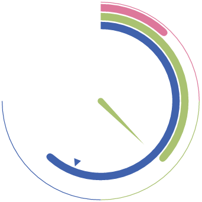

# Positioning

The gauge arranges most of its elements by taking into consideration the respective position property and the respective offset property. 

Some elements like the indicators have properties named **Position** and **Offset**. Other elements are composite, like the axis that handles both ticks and labels, and this is why it requires two sets of properties - **TickPosition** and **TickOffset**, and **LabelPosition** and **LabelOffset**. 

The offset is the distance from the axis line to the element. The gauge does not have any strategy to avoid overlapping of elements, so you will need to set adequate offset values to ensure that they are not positioned on top of each other. In the example below, all elements are arranged so that they are 2 pixels apart and never overlap each other.

```XAML
<telerikGauges:RadRadialGauge x:Name="gauge"
                              Margin="2"
                              AxisRadiusFactor="1"
                              StartAngle="90"
                              SweepAngle="360">
    <telerikGauges:RadRadialGauge.Axis>
        <telerikGauges:GaugeLinearAxis Maximum="100"
                                       Minimum="0"
                                       ShowLabels="False"
                                       StrokeThickness="0" />
    </telerikGauges:RadRadialGauge.Axis>
    <telerikGauges:RadRadialGauge.Ranges>
        <telerikGauges:GaugeRangesDefinition EndThickness="1"
                                             StartThickness="1"
                                             Offset="0">
            <telerikGauges:GaugeRange Color="#FFDD789B"
                                      From="0"
                                      To="25" />
            <telerikGauges:GaugeRange Color="#FFAAC271"
                                      From="25"
                                      To="50" />
            <telerikGauges:GaugeRange Color="#FF4062AD"
                                      From="50"
                                      To="75" />
        </telerikGauges:GaugeRangesDefinition>
    </telerikGauges:RadRadialGauge.Ranges>
    <telerikGauges:RadRadialGauge.Indicators>
        <telerikGauges:GaugeBarIndicator EndCap="Oval"
                                         EndThickness="10"
                                         Fill="#FFDD789B"
                                         StartThickness="10"
                                         Offset="3"
                                         Value="12.5" />
        <telerikGauges:GaugeBarIndicator EndCap="Oval"
                                         EndThickness="10"
                                         Fill="#FFAAC271"
                                         StartThickness="10"
                                         Offset="15"
                                         Value="37.5" />
        <telerikGauges:GaugeBarIndicator EndCap="Oval"
                                         EndThickness="10"
                                         Fill="#FF4062AD"
                                         StartThickness="10"
                                         Offset="27"
                                         Value="62.5" />
        <telerikGauges:GaugeShapeIndicator Fill="#FF4062AD"
                                           Position="Start"
                                           Offset="39"
                                           Value="56" />
        <telerikGauges:GaugeNeedleIndicator Fill="#FFAAC271"
                                            Offset="51"
                                            Value="37.5" />
    </telerikGauges:RadRadialGauge.Indicators>
</telerikGauges:RadRadialGauge>
```



## Radial Gauge Specifics

While the offset is the absolute distance from the axis line to the element, the position of the axis line itself is determined by the **AxisRadiusFactor** property, which is a relative value between 0 and 1. When the radial gauge is arranged, it calculates the largest square box in the middle of its arrange bounds and the gauge is laid out within this square box. The **AxisRadiusFactor** determines the size of the radius of the axis arc inside this box. Setting the radius factor to 1.0 results in the axis line occupying as much space as possible.

## See Also

- [Indicators]()
- [Ranges]()
