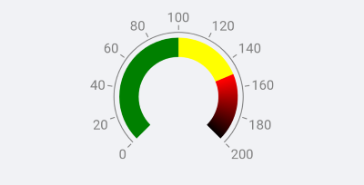

# Ranges

The Gauge ranges provide context to the indicated value or values. The ranges denote certain parts of the axis range and are usually displayed with different colors to provide additional information.

All ranges are arranged in an area alongside and parallel to the axis line. The distance from this area to the axis line is defined by the `Offset` property of the `GaugeRangesDefinition` class. The Gauge allows the stacking and overlapping of ranges and you need to set adequate `From` and `To` values to ensure that they are not positioned on top of each other.

To include ranges in your gauge

1. Set the `Ranges` property.

1. Pass an object of type `GaugeRangesDefinition`, which has a `Ranges` collection.

1. In this collection, add `GaugeRange` items when you need a solid color, or add `GaugeGradientRange` items when you need gradient colors.

```XAML
<telerikGauges:GaugeRangesDefinition>
    <telerikGauges:GaugeRange Color="Green"
                              From="0"
                              To="100" />
    <telerikGauges:GaugeRange Color="Yellow"
                              From="100"
                              To="150" />
    <telerikGauges:GaugeGradientRange From="150" To="200">
        <telerikCommon:RadGradientStop Offset="150" Color="Red" />
        <telerikCommon:RadGradientStop Offset="200" Color="Black" />
    </telerikGauges:GaugeGradientRange>
</telerikGauges:GaugeRangesDefinition>
```


The following image shows the end result.



## Gradient Ranges

You can use the `GaugeGradientRange` to include ranges with gradient color by defining gradient stops to the `GradientStops` collection of the gradient range. Each gradient stop has a color and an offset value that determine the final appearance of the item. The offset can either be treated as a relative value (between 0 and 1) or an absolute value (between the axis minimum and axis maximum values). This behavior is defined by the `IsOffsetRelative` property of the gradient range.

Here is an example when the offset is relative.

```XAML
<telerikGauges:GaugeRangesDefinition>
    <telerikGauges:GaugeGradientRange IsOffsetRelative="True"
                                      From="-25"
                                      To="25">
        <telerikCommon:RadGradientStop Offset="0" Color="Blue" />
        <telerikCommon:RadGradientStop Offset="1" Color="Red" />
    </telerikGauges:GaugeGradientRange>
</telerikGauges:GaugeRangesDefinition>
```


The following image shows the end result.


Here is an example when the offset is absolute.

```XAML
<telerikGauges:GaugeRangesDefinition EndThickness="15"
                                     StartThickness="0"
                                     Offset="2">
    <telerikGauges:GaugeGradientRange From="-25" To="25">
        <telerikCommon:RadGradientStop Offset="-25" Color="Blue" />
        <telerikCommon:RadGradientStop Offset="25" Color="Red" />
    </telerikGauges:GaugeGradientRange>
</telerikGauges:GaugeRangesDefinition>
```


The following image shows the end result.


## See Also

- [Indicators]()
- [Positioning]()
