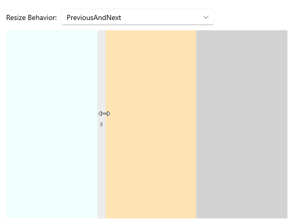

# .NET MAUI GridSplitter Styling

The GridSplitter control offers a range of styling options, allowing you to customize its appearance and adjust its visual states for different user interactions.

## Parent Element

You can use the `ParentLevel` (`int`) property to specify the level of the parent grid to resize.

## Resize Direction

You can control whether the GridSplitter control resizes rows or columns by using the `ResizeDirection ` (`enum` of type `Telerik.Maui.Controls.RadGridSplitter.GridResizeDirection`) property. 

The following options are supported:

* (Default) `Auto`&mdash;Determines whether to resize rows or columns based on its alignment (based on the value of the `HorizontalAlignment` and `VerticalAlignment` properties) and width compared to height
* `Columns`&mdash;Resizes columns when dragging the splitter.
* `Rows`&mdash;Resize rows when dragging the splitter.

## Resize Behavior

You can control which columns or rows are resized relative to the column or row for which the GridSplitter control is defined by using the `ResizeBehavior` (`enum` of type `Telerik.Maui.Controls.RadGridSplitter.GridResizeBehavior`) property. 

The following options are supported:

* (Default) `BasedOnAlignment`&mdash;Determines which `Grid` columns or rows to resize based on its alignment (based on the value of the `HorizontalAlignment` and `VerticalAlignment` properties).
* `CurrentAndNext`&mdash;Resizes the current and next `Grid` columns or rows. For a horizontal GridSplitter, space is redistributed between the row that is specified for the GridSplitter and the next row that is below it. For a vertical GridSplitter, space is redistributed between the column that is specified for the GridSplitter and the next column that is to the right.
* `PreviousAndCurrent`&mdash;Resize the previous and current `Grid` columns or rows. For a horizontal GridSplitter, space is redistributed between the row that is specified for the GridSplitter and the next row that is above it. For a vertical GridSplitter, space is redistributed between the column that is specified for the GridSplitter and the next column that is to the left.
* `PreviousAndNext`&mdash;Resize the previous and next `Grid` columns or rows. For a horizontal GridSplitter, space is redistributed between the rows that are above and below the row that is specified for the GridSplitter. For a vertical GridSplitter, space is redistributed between the columns that are to the left and right of the column that is specified for the GridSplitter.

Here is an example of how to set the `ResizeBehavior` correctly.

**1.** Define the GridSplitter in XAML:

<snippet id='gridsplitter-resize-configuration' />

**2.** Add the `telerik` namespace:

```XAML
 xmlns:telerik="http://schemas.telerik.com/2022/xaml/maui"
```

This is the result on WinUI:



> For a runnable example with the GridSplitter `ResizeDirection` scenario, see the [SDKBrowser Demo Application]() and go to **GridSplitter > Features** category.

## See Also

- [Styling the GridSplitter]()