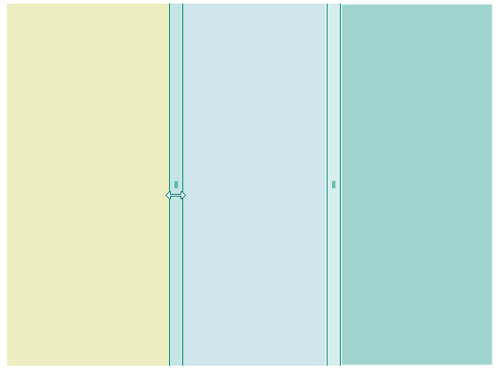
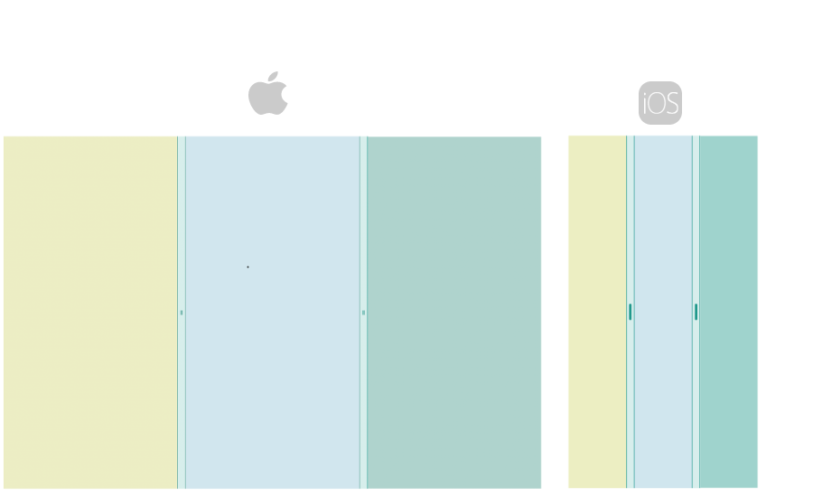

# .NET MAUI GridSplitter Styling

The GridSplitter allows you to customize its look using the following properties:

* `BackgroundColor` (`Color`)&mdash;Specifies the background color of the control.
* `Background` (`Brush`)&mdash;Specifies the background brush of the control.
* `BorderColor` (`Color`)&mdash;Specifies the border color of the control.
* `BorderBrush` (`Brush`)&mdash;Specifies the border brush of the control.
* `BorderThickness` (`Thickness`)&mdash;Specifies the border thickness of the control.
* `CornerRadius` (`Thickness`)&mdash;Specifies the border corner radius of the control.
* `ContentPadding` (`Thickness`)&mdash;Specifies the padding of the content in the control.

In addition you can style the gripper by using the `GripperColor` (`Color`) property.

## Visual States

You can use visual states to change the appearance of the control based on its state-such as when it's disabled and hovered.

The GridSplitter provides the following CommonStates visual states:

* `Normal`&mdash;Applies when the GridSplitter is in normal state.
* `MouseOver`&mdash;Applies when the mouse pointer is over the GridSplitter.
* `Disabled`&mdash;Applies when the GridSplitter is disabled.

This is the result of visual states applied:



## Example

Here is an example how to style the GridSplitter control and use the visual states.

**1** Define the GridSplitter in XAML.

<snippet id='gridsplitter-gripper-styling' />

**2.** Add the `telerik` namespace:

```XAML
 xmlns:telerik="http://schemas.telerik.com/2022/xaml/maui"
```

This is the result:



> For a runnable example with the GridSplitter Styling and visual states scenario, see the [SDKBrowser Demo Application]() and go to **GridSplitter > Features** category.

## See Also

- [Configure the GridSplitter]()