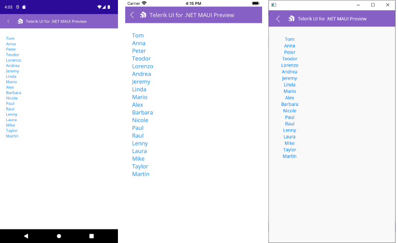

# Getting Started with the .NET MAUI ItemsControl

This guide provides the information you need to start using the Telerik UI for .NET MAUI ItemsControl by adding the control to your project.

At the end, you will be able to achieve the following result.



## Prerequisites

Before adding the ItemsControl, you need to:

1. [Set up your .NET MAUI application](#step-1-set-up-your-net-maui-application).

1. [Download Telerik UI for .NET MAUI](#step-2-download-telerik-ui-for-net-maui).

1. [Install Telerik UI for .NET MAUI](#step-3-install-telerik-ui-for-net-maui).

## Define the Control

1. When the your .NET MAUI application is set up, you are ready to add a ItemsControl to your page.

 ```XAML
<telerik:RadItemsControl x:Name="itemsControl"/>
 ```

1. Add the `telerik` namespace:

 ```XAML
xmlns:telerik="http://schemas.telerik.com/2022/xaml/maui"
 ```
 
1. Populate the ItemsControl with some data - in the example its `ItemsSource` is set to a list of string values:

 ```C#
this.itemsControl.ItemsSource = new List<string> {"Tom", "Anna", "Peter", "Teodor", "Lorenzo", "Andrea", "Jeremy", "Linda", "Mario", "Alex", "Barbara", "Nicole", "Paul", "Raul", "Lenny", "Laura", "Mike", "Taylor", "Martin"};
 ```

1. Register the Telerik controls through the `Telerik.Maui.Controls.Compatibility.UseTelerik` extension method called inside the `CreateMauiApp` method of the `MauiProgram.cs` file of your project:

 ```C#
 using Telerik.Maui.Controls.Compatibility;

 public static class MauiProgram
 {
	public static MauiApp CreateMauiApp()
	{
		var builder = MauiApp.CreateBuilder();
		builder
			.UseTelerik()
			.UseMauiApp<App>()
			.ConfigureFonts(fonts =>
			{
				fonts.AddFont("OpenSans-Regular.ttf", "OpenSansRegular");
			});

		return builder.Build();
	}
 }           
 ```

## Additional Resources

- [.NET MAUI ItemsControl Product Page](https://www.telerik.com/maui-ui/itemscontrol)
- [.NET MAUI ItemsControl Forum Page](https://www.telerik.com/forums/maui?tagId=1766)
- [Telerik .NET MAUI Blogs](https://www.telerik.com/blogs/mobile-net-maui)
- [Telerik .NET MAUI Roadmap](https://www.telerik.com/support/whats-new/maui-ui/roadmap)

## See Also

- [Setting the Items Source](#setting-the-items-source)
- [Using the Items Template](#customizing-the-appearance)