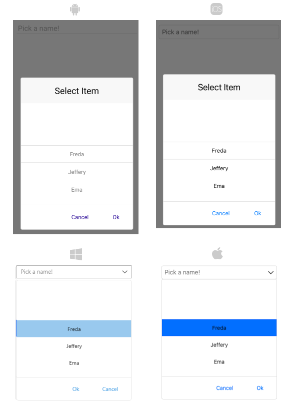

# Getting Started

This guide provides the information you need to start using the Telerik UI for .NET MAUI ListPicker by adding the control to your project.

At the end, you will be able to achieve the following result.



## Prerequisites

Before adding the ListPicker, you need to:

1. [Set up your .NET MAUI application](#set-up-your-net-maui-application).

1. [Download Telerik UI for .NET MAUI](#download-telerik-ui-for-net-maui).

1. [Install Telerik UI for .NET MAUI](#install-telerik-ui-for-net-maui).

## Define the Control

1. When the your .NET MAUI application is set up, you are ready to add a ListPicker control to your page.

 ```XAML
<telerik:RadListPicker Placeholder="Pick a name!"
							ItemsSource="{Binding Items}"
							DisplayMemberPath="FullName">
	<telerik:RadListPicker.BindingContext>
		<local:PeopleViewModel/>
	</telerik:RadListPicker.BindingContext>
	<telerik:RadListPicker.ItemTemplate>
		<DataTemplate>
			<Label Text="{Binding Name}"
				   HorizontalTextAlignment="Center"
				   VerticalTextAlignment="Center"/>
		</DataTemplate>
	</telerik:RadListPicker.ItemTemplate>
</telerik:RadListPicker>
 ```

1. Add a sample `ViewModel` class:

 ```C#
public class PeopleViewModel
{
	public PeopleViewModel()
	{
		this.Items = new ObservableCollection<Person>()
		{
			new Person("Freda","Curtis"),
			new Person("Jeffery","Francis"),
			new Person("Ema","Lawson"),
			new Person("Niki","Samaniego"),
			new Person("Jenny","Santos"),
			new Person("Eric","Wheeler"),
			new Person("Emmett","Fuller"),
			new Person("Brian","Johnas"),
		};
	}

	public ObservableCollection<Person> Items { get; set; }
}
 ```

1. Create the Business model:

 ```C#
public class Person
{
	public Person(string name, string lastName)
	{
		this.Name = name;
		this.LastName = lastName;
	}

	public string Name { get; set; }

	public string LastName { get; set; }

	public string FullName
	{
		get
		{
			return $"{this.Name} {this.LastName}";
		}
	}
}
 ```

1. Add the following namespace:

 ```XAML
xmlns:telerik="http://schemas.telerik.com/2022/xaml/maui"
 ```

1. Register the Telerik controls through the `Telerik.Maui.Controls.Compatibility.UseTelerik` extension method called inside the `CreateMauiApp` method of the `MauiProgram.cs` file of your project:

```C#
 using Telerik.Maui.Controls.Compatibility;

 public static class MauiProgram
 {
	public static MauiApp CreateMauiApp()
	{
		var builder = MauiApp.CreateBuilder();
		builder
			.UseTelerik()
			.UseMauiApp<App>()
			.ConfigureFonts(fonts =>
			{
				fonts.AddFont("OpenSans-Regular.ttf", "OpenSansRegular");
			});

		return builder.Build();
	}
 }           
```

## See Also

- [Looping]()
- [Templates]()
- [Styling]()
- [Visual Structure]()
