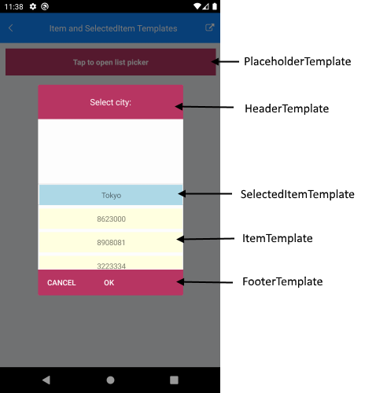
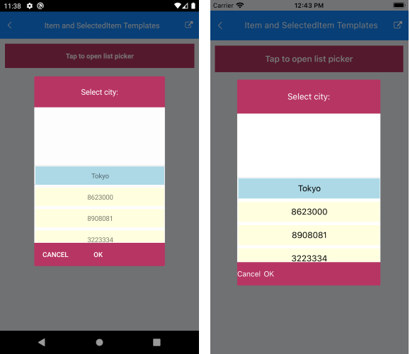

# Templates

The ListPicker for .NET MAUI provides the following templates:

* `ItemTemplate`(`DataTemplate`)&mdash;Defines the template used for displaying the list of items.
* `SelectedItemTemplate`(`DataTemplate`)&mdash;Specifies the template used for visualizing the selected item from the list.
* `PlaceholderTemplate`(`ControlTemplate`)&mdash;Defines the template visualized for the placeholder.  
* `DisplayTemplate`(`ControlTemplate`)&mdash;Defines the template visualized when an item from the list is selected.

Using `SelectorSettings` property (of type `Telerik.XamarinForms.Input.PickerPopupSelectorSettings`) you can define the following templates:

* `HeaderTemplate`(`ControlTemplate`)&mdash;Defines what will be displayed inside the dialog(popup) header.
* `FooterTemplate`(`ControlTemplate`)&mdash;Defines what will be displayed inside the dialog(popup) footer.

This is the Visual Structure of the ListPicker templates:



In addition, the ListPicker for .NET MAUI provides the following properties:

* `ItemsSource`(`IList`)&mdash;Specifies the collection used to generate the content of the list picker.
* `ItemLength`(`double`)&mdash;Defines the length of the items inside the list.
* `ItemSpacing`(`double`)&mdash;Defines the spacing between the items inside the list.
* `SelectedItem`(`object`)&mdash;Specifies the selected item of the list picker
* `DisplayMemberPath`(`string`)&mdash;Defines the path of the property which is to be displayed as `DisplayString`.

## Example

The following example demonstrates how to define a sample ListPicker:

<snippet id='listpicker-features-templates' />
```XAML
<telerikInput:RadListPicker PlaceholderTemplate="{StaticResource placeholderTemplate}"
							ItemTemplate="{StaticResource itemTemplate}"
							SelectedItemTemplate="{StaticResource selectedItemTemplate}"
							ItemLength="40"
							ItemSpacing="4"
							ItemsSource="{Binding Items}"
							DisplayMemberPath="Name"
							x:Name="listPicker">
	<telerikInput:RadListPicker.BindingContext>
		<local:CitiesViewModel/>
	</telerikInput:RadListPicker.BindingContext>
	<telerikInput:RadListPicker.SelectorSettings>
		<telerikInput:PickerPopupSelectorSettings HeaderTemplate="{StaticResource headerTemplate}"
												  FooterTemplate="{StaticResource footerTemplate}"/>
	</telerikInput:RadListPicker.SelectorSettings>
</telerikInput:RadListPicker>
```

Define the templates in the page resources:

## Item Template

<snippet id='listpicker-features-itemtemplate' />
```XAML
<DataTemplate x:Key="itemTemplate">
	<Label Text="{Binding Population}"
		   BackgroundColor="LightYellow"
		   HorizontalTextAlignment="Center"
		   VerticalTextAlignment="Center"/>
</DataTemplate>
```

## SelectedItem Template

<snippet id='listpicker-features-selecteditemtemplate' />
```XAML
<DataTemplate x:Key="selectedItemTemplate">
	<Label Text="{Binding Name}"
		   BackgroundColor="LightBlue"
		   HorizontalTextAlignment="Center"
		   VerticalTextAlignment="Center"/>
</DataTemplate>
```

## Placeholder Template

<snippet id='listpicker-features-placeholdertemplate' />
```XAML
<ControlTemplate x:Key="placeholderTemplate">
	<Label Text="Tap to open list picker"
		   FontAttributes="Bold"
		   TextColor="White"
		   BackgroundColor="#B73562"
		   HeightRequest="50"
		   VerticalTextAlignment="Center"
		   HorizontalTextAlignment="Center">
		<Label.GestureRecognizers>
			<TapGestureRecognizer Command="{TemplateBinding ToggleCommand}" />
		</Label.GestureRecognizers>
	</Label>
</ControlTemplate>
```

## DisplayTemplate

```XAML
<ControlTemplate x:Key="displayTemplate">
	<StackLayout>
		<Label Text="This is the DisplayTemplate of the ListPicker" FontSize="10"/>
		<Label Text="{TemplateBinding DisplayString}" TextColor="Black" FontSize="15" Grid.Row="1" VerticalTextAlignment="Center"/>
		<StackLayout.GestureRecognizers>
			<TapGestureRecognizer Command="{TemplateBinding ToggleCommand}" />
		</StackLayout.GestureRecognizers>
	</StackLayout>
</ControlTemplate>
```

## Header Template

<snippet id='listpicker-features-headertemplate' />
```XAML
<ControlTemplate x:Key="headerTemplate">
	<Label Text="Select city:"
		   TextColor="White"
		   FontSize="16"
		   VerticalTextAlignment="Center"
		   HorizontalTextAlignment="Center"
		   BackgroundColor="#B73562"/>
</ControlTemplate>
```

## Footer Template

<snippet id='listpicker-features-footertemplate' />
```XAML
<ControlTemplate x:Key="footerTemplate">
	<StackLayout Orientation="Horizontal" Spacing="0" HorizontalOptions="FillAndExpand" BackgroundColor="#B73562">
		<Button Text="Cancel"
				TextColor="White"
				BackgroundColor="Transparent"
				Command="{TemplateBinding CancelCommand}" />
		<Button Text="OK"
				TextColor="White"
				BackgroundColor="Transparent"
				Command="{TemplateBinding AcceptCommand}" />
	</StackLayout>
</ControlTemplate>
```

Set a sample business model:

<snippet id='listpicker-features-businessmodel' />
```C#
public class City
{
	public string Name { get; set; }
	public int Population { get; set; }
}
```

Define the `ViewModel`:

<snippet id='listpicker-features-viewmodel' />
```C#
public class CitiesViewModel
{
	public CitiesViewModel()
	{
		this.Items = new ObservableCollection<City>
		{
			new City { Name = "Tokyo", Population = 13929286 },
			new City { Name = "New York", Population = 8623000 },
			new City { Name = "London", Population = 8908081 },
			new City { Name = "Madrid", Population = 3223334 },
			new City { Name = "Los Angeles", Population = 4000000},
			new City { Name = "Paris", Population = 2141000 },
			new City { Name = "Beijing", Population = 21540000 },
			new City { Name = "Singapore", Population = 5612000 },
			new City { Name = "New Delhi", Population = 18980000 },
			new City { Name = "Bangkok", Population = 8305218 },
			new City { Name = "Berlin", Population = 3748000 },
		};
	}

	public ObservableCollection<City> Items { get; set; }
}
```

Add the following namespace:

```XAML
xmlns:telerikInput="clr-namespace:Telerik.XamarinForms.Input;assembly=Telerik.Maui.Controls.Compatibility"
```

The following image shows the end result:



>important For a sample templates example, refer to the **ListPicker/Templates** folder of the [Telerik UI for .NET MAUI SDKBrowser Application]().

## See Also

- [Styling]()
