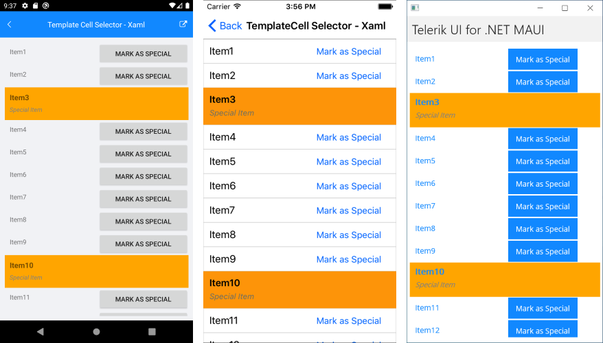

# ItemTemplateSelector

The ListView control exposes an `ItemTemplateSelector` property which you can use to apply different template to each item depending on a specific condition.  

This article will show you how you can utilize this property to achieve divergent appearance for the different items within your Telerik UI for .NET MAUI ListView control.

## TemplateSelector Implementation

Let's assume you have a `RadListView` bound to a collection of multiple `DataItem` objects and the appearance of each item depends on a specific property of the business object. Below is the `DataItem` class definition:

<snippet id='listview-itemtemplateselector-dataitem'/>
```C#
public class DataItem : NotifyPropertyChangedBase
{
	private string name;
	private bool isSpecial;

	public string Name
	{
		get { return this.name; }
		set { this.UpdateValue(ref this.name, value); }
	}

	public bool IsSpecial
	{
		get { return this.isSpecial; }
		set { this.UpdateValue(ref this.isSpecial, value); }
	}    
}
```

The first step is to create a sample `ViewModel` class with a collection of `DataItem` objects. The collection will later be applied to the `ItemsSource` property of the ListView:

<snippet id='listview-itemtemplateselector-sourcecollection'/>
```C#
public class ViewModel
{
	public ViewModel()
	{
		this.Source = new ObservableCollection<DataItem>{
			new DataItem{ Name = "Item1"},
			new DataItem{ Name = "Item2"},
			new DataItem{ Name = "Item3", IsSpecial = true },
			new DataItem{ Name = "Item4"},
			new DataItem{ Name = "Item5"},
			new DataItem{ Name = "Item6"},
			new DataItem{ Name = "Item7"},
			new DataItem{ Name = "Item8"},
			new DataItem{ Name = "Item9"},
			new DataItem{ Name = "Item10", IsSpecial = true },
			new DataItem{ Name = "Item11"},
			new DataItem{ Name = "Item12"},
			new DataItem{ Name = "Item13"},
			new DataItem{ Name = "Item14", IsSpecial = true },
			new DataItem{ Name = "Item15"},
			new DataItem{ Name = "Item16"}
		};
	}

	public ObservableCollection<DataItem> Source { get; private set; }
}
```

As you need to apply different template to the item based on the value of the `IsSpecial` property, you have to create a custom class that inherits from `DataTemplateSelector`. This class will return different `DataTemplate` according to whether the value is true or false:

<snippet id='listview-itemtemplateselector-customitemtemplateselector'/>
```C#
public class CustomItemTemplateSelector : DataTemplateSelector
{
	public DataTemplate Template1 { get; set; }
	public DataTemplate Template2 { get; set; }

	protected override DataTemplate OnSelectTemplate(object item, BindableObject container)
	{
		var book = item as DataItem;
		if (book.IsSpecial)
		{
			return this.Template2;
		}

		return this.Template1;
	}
}
```

As a last step, you need to set this custom class as the `ItemTemplateSelector` property of the `RadListView` and customize the templates within it:

<snippet id='listview-itemtemplateselector-setting-itemtemplateselector'/>
```XAML
<telerikDataControls:RadListView x:Name="listView" ItemsSource="{Binding Source}" >
	<telerikDataControls:RadListView.BindingContext>
		<local:ViewModel />
	</telerikDataControls:RadListView.BindingContext>
	<telerikDataControls:RadListView.ItemTemplateSelector>
		<local:CustomItemTemplateSelector>
			<local:CustomItemTemplateSelector.Template1>
				<DataTemplate>
					<telerikListView:ListViewTemplateCell>
						<telerikListView:ListViewTemplateCell.View>
							<Grid>
								<Grid.ColumnDefinitions>
									<ColumnDefinition/>
									<ColumnDefinition/>
								</Grid.ColumnDefinitions>
								<Label Grid.Column="0" Margin="10" Text="{Binding Name}" />
								<Button Grid.Column="1" Text="Mark as Special" Clicked="Button_Clicked"/>
							</Grid>
						</telerikListView:ListViewTemplateCell.View>
					</telerikListView:ListViewTemplateCell>
				</DataTemplate>
			</local:CustomItemTemplateSelector.Template1>
			<local:CustomItemTemplateSelector.Template2>
				<DataTemplate>
					<telerikListView:ListViewTemplateCell>
						<telerikListView:ListViewTemplateCell.View>
							<Grid BackgroundColor="Orange">
								<Grid.RowDefinitions>
									<RowDefinition />
									<RowDefinition />
								</Grid.RowDefinitions>
								<Label Text="{Binding Name}" FontSize="16" FontAttributes="Bold" VerticalOptions="Center" Margin="10, 10, 10, 0"/>
								<Label Text="Special Item" FontSize="13" FontAttributes="Italic" TextColor="Gray" Grid.Row="1" Margin="10, 0, 10, 10" />
							</Grid>
						</telerikListView:ListViewTemplateCell.View>
					</telerikListView:ListViewTemplateCell>
				</DataTemplate>
			</local:CustomItemTemplateSelector.Template2>
		</local:CustomItemTemplateSelector>
	</telerikDataControls:RadListView.ItemTemplateSelector>
</telerikDataControls:RadListView>
```

Add the needed namespaces:

```XAML
xmlns:telerikDataControls="clr-namespace:Telerik.XamarinForms.DataControls;assembly=Telerik.Maui.Controls.Compatibility"
xmlns:telerikListView="clr-namespace:Telerik.XamarinForms.DataControls.ListView;assembly=Telerik.Maui.Controls.Compatibility"          
```

Running the sample will lead to the following appearance of the control:



## See Also

- [ListView TextCell]()
- [ListView TemplateCell]()
- [Layouts]()
- [Items Styling]()
