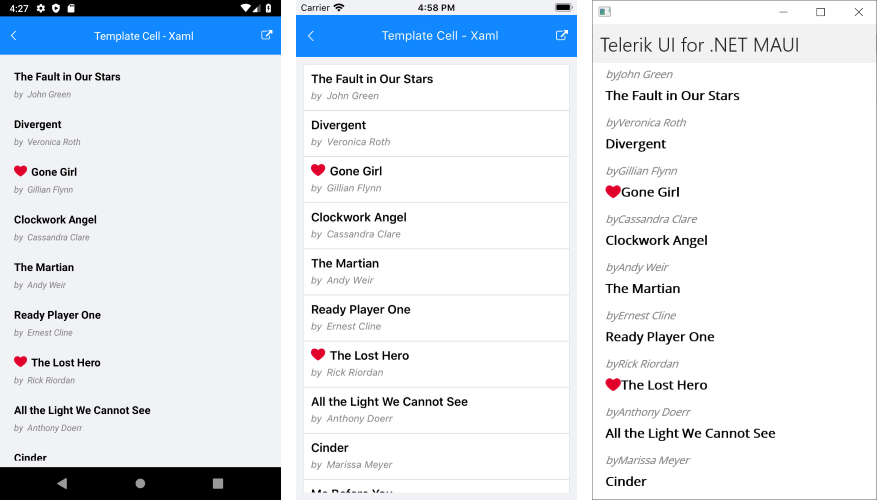

# .NET MAUI ListView Template Cell

Cells in the ListView are the presentation of each data item from the control's `ItemsSource`. You can choose between the `ListViewTextCell` and `ListViewTemplateCell` cell types.

The `ListViewTemplateCell` derives from `Microsoft.Maui.Controls.ViewCell` and used to present complex data sets as `RadListView.ItemTemplate`.

The example below demonstrates how to create a ListView with templated cells, like this:



Create a view model that will be the source of the ListView:

<snippet id='listview-celltypes-templatecell-viewmodel' />

Define the ListView control either in XAML.

**Define the ListView in XAML**

<snippet id='listview-celltypes-templatecell-listview-xaml' />

Add the `telerik` namespace:

```XAML
xmlns:telerik="http://schemas.telerik.com/2022/xaml/maui"
```						

**Define the ListView in code-behind**

For clarity, let's build the template of the list view cell in a separate method:

```C#
public View GetCellContent()
{
    var content = new Grid();

    var book = new Label
    {
        FontAttributes = FontAttributes.Bold,
        TextColor = Color.Black,
        FontSize = 16,
        VerticalOptions = LayoutOptions.Center
    };

    book.SetBinding(Label.TextProperty, new Binding(nameof(Book.Title)));

    var fav = new Image
    {
        Source = ImageSource.FromFile("favourite.png"),
        HeightRequest = 16,
        VerticalOptions = LayoutOptions.Center
    };

    fav.SetBinding(Image.IsVisibleProperty, new Binding(nameof(Book.IsFavourite)));

    var author = new Label
    {
        TextColor = Color.Gray,
        FontAttributes = FontAttributes.Italic,
        FontSize = 13
    };

    author.SetBinding(Label.TextProperty, new Binding(nameof(Book.Author)));

    var by = new Label
    {
        Text = "by",
        TextColor = Color.Gray,
        FontAttributes = FontAttributes.Italic,
        FontSize = 13
    };

    var main = new StackLayout { Orientation = StackOrientation.Horizontal, Margin = new Thickness(10, 10, 10, 0) };
    main.Children.Add(fav);
    main.Children.Add(book);

    var detail = new StackLayout { Orientation = StackOrientation.Horizontal, Margin = new Thickness(10, 0, 10, 10) };
    detail.Children.Add(by);
    detail.Children.Add(author);

    content.Children.Add(main, 0, 0);
    content.Children.Add(detail, 0, 1);

    return content;
}
```

Define the ListView:

```C#
var listView = new RadListView
{
    ItemsSource = new ViewModel().Source,
    ItemTemplate = new DataTemplate(() =>
    {
        return new ListViewTemplateCell
        {
            View = GetCellContent()
        };
    }),
};
```


## See Also

- [ListView Item Template Selector]()
- [ListView Layouts]()
- [Items Styling]()
