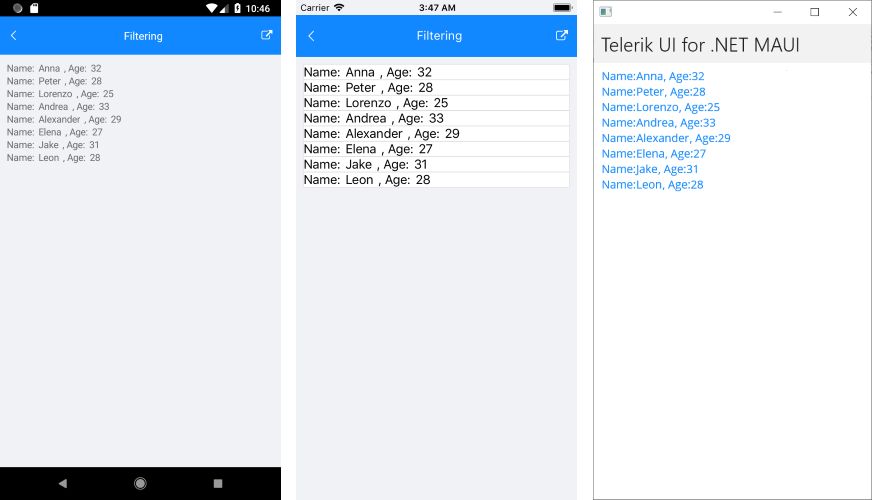
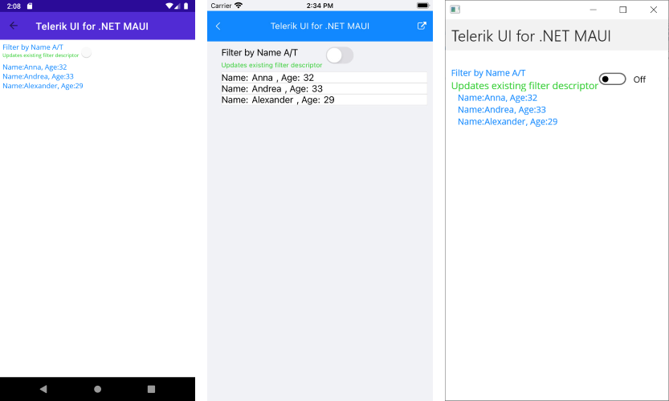

# .NET MAUI ListView Filtering

The ListView provides the functionality to programmatically filter its data at runtime. This can be achieved through adding filter descriptors that implement the `IFilter` interface to the `RadListView.FilterDescriptors` collection. You can use our `DelegateFilterDescriptor` implementation.

## DelegateFilterDescriptor

The `DelegateFilterDescriptor` property supports a `Filter`, which defines the function used to check whether a data item passes the filter or not.

**1.** Define the ListView in XAML:

<snippet id='listview-features-filtering-xaml'/>

**2.** Add a `DelegateFilterDescriptor` to the `FilerDescriptors` collection of the ListView instance:

<snippet id='listview-add-filter'/>

**3.** Here is the `AgeFilter` method containing the filtering logic:

<snippet id='listview-age-filter'/>

**4.** Define the `ViewModel` class:

<snippet id='listview-features-filtering-viewmodel'/>

**5.** Set the `Person` data class:

<snippet id='listview-features-filtering-data-class'/>

The following image shows the result after the data is filtered:

## Bindable Filter Descriptors

The `FilerDescriptors` collection of the ListView supports binding, which means that you can modify the directly descriptors directly from the `ViewModel`.

To control the `FilterDescriptor` collection through MVVM:

**1.** Create a property of type `ObservableCollection<FilterDescriptorBase>` in your `ViewModel`, which will contain the needed filters.

<snippet id='listview-features-filtering-bindable-viewmodel'/>

**2.** Define the data object:

<snippet id='listview-features-filtering-data-class'/>

**3.** Define the ListView in XAML:

<snippet id='listview-features-filtering-bindable-xaml'/>

The following image shows how this looks like:

## See Also

- [Grouping]()
- [Sorting]()
- [Selection]()
