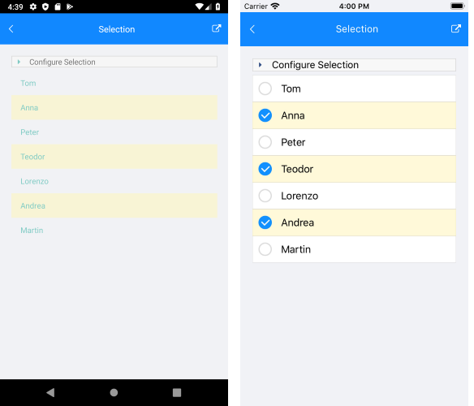

# Selection

**RadListView** component exposes selection feature. It allows single or multiple selection of the ListView items. This feature provides both visual and programmatic feedback for the actions of the user. Also you can disable the selection. 

## Selection Mode

RadListView provides three selection modes, which allow you to manipulate the type of selection. This is controlled by the **SelectionMode** property which has the following entries:

- **SelectionMode** (*Telerik.XamarinForms.DataControls.ListView.SelectionMode*): 
	- `None` - This mode doesn't allow users to select an item. 
	- `Single` - This is the default selection mode. It allows users to select only one item.
	- `Multiple` - This mode allows users to select more than one item. 

Check below how you can set **SelectionMode** in XAML and code-behind:

```XAML
<telerikDataControls:RadListView x:Name="listView"
                                 SelectionMode="Multiple" />
```
```C#
var listView = new RadListView();
listView.SelectionMode = Telerik.XamarinForms.DataControls.ListView.SelectionMode.Multiple;
```
	
## Selection Gestures
			
You can also configure how the selection to be triggered by the end users through the **SelectionGesture** property:

- **SelectionGesture** (*Telerik.XamarinForms.DataControls.ListView.SelectionGesture*):
	- `Tap` - tap on an item to select it. This is the default SelectionGesture value;
	- `Hold` - tap & hold on an item to select it.

```XAML	
<telerikDataControls:RadListView x:Name="listView"
                                 SelectionGesture="Hold" />
```
```C#
var listView = new RadListView();
listView.SelectionGesture = Telerik.XamarinForms.DataControls.ListView.SelectionGesture.Hold;
```

## Selected Item

- **SelectedItem** (*object*): Specifies the last selected item of the ListView.

## Selected Items Collection
- **SelectedItems** (*ObservableCollection&lt;object&gt;*): Read-only collection used to get the currently selected items;

## Selection Events
	
- **SelectionChanged**: An event that is triggered whenever the SelectedItems collection is changed. The __SelectionChanged__ event handler receives two parameters:
	* The sender argument which is of type object, but can be cast to the __RadListView__ type.
	* A __NotifyCollectionChangedEventArgs__ object which provides information on the collection changed event. For more details check [NotifyCollectionChangedEventArgs Class](https://docs.microsoft.com/en-us/dotnet/api/system.collections.specialized.notifycollectionchangedeventargs) topic.

## Styling the Selected Item(s)

You can customize the way selected items look by applying **SelectedItemStyle** property to the RadListView instance. For detailed information on the approach go to [Items Styles]() topic in ListView documentation.

## Example

The example below shows how to utilize RadListView selection feature - how you can set multiple selection, apply selected item style and retrieve the selected items in a ViewModel class.

First, create a ViewModel class with two collections - one for the ItemsSource of the ListView and one that will hold the SelectedItems. For the purpose of the example RadListView is bound to a collection of strings:

```C#
public class ViewModel : NotifyPropertyChangedBase
{
    private ObservableCollection<object> _selectedNames;

    public ViewModel()
    {
        this.Names = new ObservableCollection<string>() { "Tom", "Anna", "Peter", "Teodor", "Lorenzo", "Andrea", "Martin" };
    }

    public ObservableCollection<string> Names { get; set; }
    public ObservableCollection<object> SelectedNames
    {
        get { return this._selectedNames; }
        set
        {
            if (this._selectedNames != value)
            {
                if (this._selectedNames != null)
                {
                    this._selectedNames.CollectionChanged -= this.SelectedNamesCollectionChanged;
                }

                this._selectedNames = value;

                if (this._selectedNames != null)
                {
                    this._selectedNames.CollectionChanged += this.SelectedNamesCollectionChanged;
                }

                OnPropertyChanged("SelectedNames");

            }
        }
    }

    private void SelectedNamesCollectionChanged(object sender, NotifyCollectionChangedEventArgs e)
    {
        if (this.SelectedNames.Count > 0)
        {
            Application.Current.MainPage.DisplayAlert("Selected items:", string.Join(",", this.SelectedNames.ToArray()), "OK");
        }
    }
}
```

Next, add RadListView instance to your page with selection properties applied:

```XAML
<Grid Margin="10">
    <Grid.RowDefinitions>
        <RowDefinition Height="Auto"/>
        <RowDefinition/>
    </Grid.RowDefinitions>
            <VerticalStackLayout Margin="10">
                <Label Text="Set selection mode:" />
                <Picker x:Name="selectionModePicker" AutomationId="SelectionModePicker"/>
                <Label Text="Set selection gesture:" />
                <Picker x:Name="selectionGesturePicker" AutomationId="SelectionGesturePicker"/>
            </VerticalStackLayout>
    <Grid Grid.Row="1">
        <!-- >> listview-features-selection-xaml -->
        <telerikDataControls:RadListView  x:Name="listView" Margin="10"
                                      ItemsSource="{Binding Names}"
                                      SelectionMode="Multiple"
                                      SelectedItems="{Binding SelectedNames}">
            <telerikDataControls:RadListView.SelectedItemStyle>
                <telerikListView:ListViewItemStyle BackgroundColor="#88FFF5BA" 
                                               BorderColor="#88FFF5BA" />
            </telerikDataControls:RadListView.SelectedItemStyle>
        </telerikDataControls:RadListView>
        <!-- << listview-features-selection-xaml -->
    </Grid>
</Grid>
```

Add the namespaces:

```XAML
xmlns:telerikDataControls="clr-namespace:Telerik.XamarinForms.DataControls;assembly=Telerik.Maui.Controls.Compatibility"
xmlns:telerikListView="clr-namespace:Telerik.XamarinForms.DataControls.ListView;assembly=Telerik.Maui.Controls.Compatibility"                       
```

Set the ViewModel class as a BindingContext and call the InitializePickers() method:

```C#
this.BindingContext = new ViewModel();
this.InitializePickers();
```

The InitializePickers and SelectionChanged event implementation:

```C#
private void InitializePickers()
{
    selectionModePicker.Items.Add("None");
    selectionModePicker.Items.Add("Single");
    selectionModePicker.Items.Add("Multiple");
    selectionModePicker.SelectedIndexChanged += this.OnSelectionModeChanged;
    selectionModePicker.SelectedIndex = 2;

    selectionGesturePicker.Items.Add("Tap");
    selectionGesturePicker.Items.Add("Hold");
    selectionGesturePicker.SelectedIndexChanged += this.OnSelectionGestureChanged;
    selectionGesturePicker.SelectedIndex = 0;
}

// >> listview-features-onselectionchanged-csharp
private void OnSelectionGestureChanged(object sender, EventArgs e)
{
    switch ((sender as Picker).SelectedIndex)
    {
        case 0:
            listView.SelectionGesture = SelectionGesture.Tap;
            break;
        case 1:
            listView.SelectionGesture = SelectionGesture.Hold;
            break;
    }
}

private void OnSelectionModeChanged(object sender, EventArgs e)
{
    switch ((sender as Picker).SelectedIndex)
    {
        case 0:
            listView.SelectionMode = Telerik.XamarinForms.DataControls.ListView.SelectionMode.None;
            break;
        case 1:
            listView.SelectionMode = Telerik.XamarinForms.DataControls.ListView.SelectionMode.Single;
            break;
        case 2:
            listView.SelectionMode = Telerik.XamarinForms.DataControls.ListView.SelectionMode.Multiple;
            break;
    }
}
```

Here is how the **RadListView** control looks like on different platforms when multiple items are selected:



>important A sample Selection example is available in ListView -> Features folder of the [SDK Browser MAUI application](#sdk-browser-application).

## See Also
- [Items Grouping]()
- [Items Sorting]()
- [Items Styling]()
