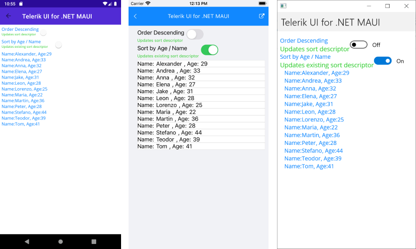

# Sorting

The ListView can be used to sort the visualized data. This can be achieved by adding different `SortDescriptors` to its `SortDescriptors` collection. There are two types of descriptors shipped with our code.

## PropertySortDescriptor

You can sort the data by a property value from the class that defines your business items. This descriptor exposes the following properties:

- `PropertyName`&mdash;Defines the string name of the property that is used to retrieve the key to sort by.
- `SortOrder`&mdash;Specifies sort order to ascending or descending.

## DelegateSortDescriptor

This descriptor enables you to sort by a custom key (for example, some complex expression combining two or more properties) instead of being limited by the value of a single property. This descriptor exposes the following properties:

- `SortOrder`&mdash;Sets the sort order to ascending or descending.
- `Comparer`&mdash;Defines the `Compare` method used by the internal [IComparer](https://docs.microsoft.com/en-us/dotnet/api/system.collections.icomparer).

### Example

Here is an example that will guide you how to use `SortDescriptor` in the ListView.

1. First, define the ListView in XAML:

 <snippet id='listview-features-sorting-xaml'/>
 ```XAML
<telerikDataControls:RadListView x:Name="listView"
					 ItemsSource="{Binding Items}">
	<telerikDataControls:RadListView.BindingContext>
		<local:ViewModel/>
	</telerikDataControls:RadListView.BindingContext>
	<telerikDataControls:RadListView.ItemTemplate>
		<DataTemplate>
			<telerikListView:ListViewTemplateCell>
				<telerikListView:ListViewTemplateCell.View>
					<HorizontalStackLayout>
						<Label Text="Name:"/>
						<Label Text="{Binding Name}"/>
						<Label Text=", Age:"/>
						<Label Text="{Binding Age}"/>
					</HorizontalStackLayout>
				</telerikListView:ListViewTemplateCell.View>
			</telerikListView:ListViewTemplateCell>
		</DataTemplate>
	</telerikDataControls:RadListView.ItemTemplate>
</telerikDataControls:RadListView>
 ```

1. Add a `PropertySortDescriptor` to the `SortDescriptors` collection of the ListView:

 <snippet id='listview-features-sorting-agesort'/>
 ```C#
listView.SortDescriptors.Add(new Telerik.XamarinForms.DataControls.ListView.PropertySortDescriptor { PropertyName = "Age", SortOrder = SortOrder.Ascending });
 ```

1. Use the following snippet for the `ViewModel` class:

 <snippet id='listview-features-sorting-viewmodel'/>
 ```C#
public class ViewModel
{
	public ViewModel()
	{
		this.Items = GetData();
	}

	public ObservableCollection<Person> Items { get; set; }

	private static ObservableCollection<Person> GetData()
	{
		var items = new ObservableCollection<Person>();

		items.Add(new Person { Name = "Tom", Age = 41 });
		items.Add(new Person { Name = "Anna", Age = 32 });
		items.Add(new Person { Name = "Peter", Age = 28 });
		items.Add(new Person { Name = "Teodor", Age = 39 });
		items.Add(new Person { Name = "Lorenzo", Age = 25 });
		items.Add(new Person { Name = "Andrea", Age = 33 });
		items.Add(new Person { Name = "Martin", Age = 36 });
		items.Add(new Person { Name = "Alexander", Age = 29 });
		items.Add(new Person { Name = "Maria", Age = 22 });
		items.Add(new Person { Name = "Elena", Age = 27 });
		items.Add(new Person { Name = "Stefano", Age = 44 });
		items.Add(new Person { Name = "Jake", Age = 31 });
		items.Add(new Person { Name = "Leon", Age = 28 });

		return items;
	}
}
 ```

1. Create a `Person` class and add the code below:

 <snippet id='listview-features-sorting-data-class'/>
 ```C#
public class Person
{
	public string Name { get; set; }
	public int Age { get; set; }
}
 ```


The following image shows the result once the data is sorted.


## Bindable SortDescriptors

The `SortDescriptors` collection of the ListView supports binding, which means you can modify the sort descriptors directly from the `ViewModel`.

To control the descriptors collections through MVVM:

1. Create a property of type `ObservableCollection<SortDescriptorBase>` in your `ViewModel` which will contain the needed sort descriptors:

 <snippet id='listview-features-bindable-sortdescriptor-viewmodel' />
 ```C#
public ObservableCollection<SortDescriptorBase> SortDescriptors
{
	get { return this.sortDescriptors; }
	set { this.UpdateValue(ref this.sortDescriptors, value); }
}
 ```

1. Use the `OneWayToSource` binding mode to bind that property to the `SortDescriptors` property of ListView. For demonstration purposes, this ListView uses the same `ViewModel` as in the previous example.

 <snippet id='listview-features-bindable-sortdescriptor-xaml' />
 ```XAML
<telerikDataControls:RadListView x:Name="listView"
								 Grid.Row="2"
								 SortDescriptors="{Binding SortDescriptors, Mode=OneWayToSource}"
								 ItemsSource="{Binding Items}">              
	<telerikDataControls:RadListView.ItemTemplate>
		<DataTemplate>
			<telerikListView:ListViewTemplateCell>
				<telerikListView:ListViewTemplateCell.View>
					<HorizontalStackLayout>
						<Label Text="Name:"/>
						<Label Text="{Binding Name}"/>
						<Label Text=", Age:"/>
						<Label Text="{Binding Age}"/>
					</HorizontalStackLayout>
				</telerikListView:ListViewTemplateCell.View>
			</telerikListView:ListViewTemplateCell>
		</DataTemplate>
	</telerikDataControls:RadListView.ItemTemplate>
</telerikDataControls:RadListView>
 ```

1. According to your preferences, add sort descriptors to the `SortDescriptors` collection in the `ViewModel`, for example:

 ```C#
private void UpdateExistingSortDescriptor()
{
	if (this.SortDescriptors == null)
		return;

	if (this.SortDescriptors.Count == 0)
	{
		this.SortDescriptors.Add(new PropertySortDescriptor()
		{
			PropertyName = "Day",
			SortOrder = SortOrder.Ascending
		});
	}
}
 ```


The following image shows the result:



## See Also

- [Grouping]()
- [Filtering]()
- [Selection]()
