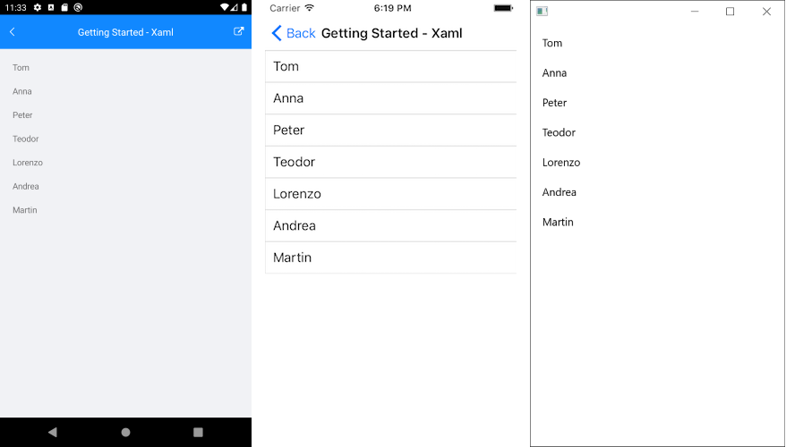

# Getting Started

## Define RadListView control

The snippet below shows a sample RadListView definition(_Do not use a `StackLayout` or `ScrollView` parent, see the **WARNING** note below_):

```XAML
<telerikDataControls:RadListView x:Name="listView" />
```
```C#
var listView = new RadListView();
```

In addition to this, you need to add the following namespace:

```XAML
xmlns:telerikDataControls="clr-namespace:Telerik.XamarinForms.DataControls;assembly=Telerik.Maui.Controls.Compatibility"
```

> **WARNING**: RadListView control provides UI virtualization, this feature requires the visual parent to provide vertical or horizontal space. To avoid breaking UI virtualization or gesture mechanisms, please follow these rules: 
>	* **Do not** place the RadListView control inside a `StackLayout`
>	* **Do not** place the RadListVew inside a `ScrollView`
>	* **Do not** set the RadListVew to a Grid `RowDefinition Height="Auto"`
>

## Populate RadListView with data

First, lets create a simple data and view model classes:

```C#
public class SourceItem
{
    public SourceItem(string name)
    {
        this.Name = name;
    }

    public string Name { get; set; }
}

public class ViewModel
{
    public ViewModel()
    {
        this.Source = new List<SourceItem> { new SourceItem("Tom"), 
											 new SourceItem("Anna"), 
											 new SourceItem("Peter"), 
											 new SourceItem("Teodor"), 
											 new SourceItem("Lorenzo"),
											 new SourceItem("Andrea"), 
											 new SourceItem("Martin") };
    }

    public List<SourceItem> Source { get; set; }
}
```

Here is the setup of the ListView:

```XAML
<telerikDataControls:RadListView x:Name="listView" ItemsSource="{Binding Source}">
    <telerikDataControls:RadListView.BindingContext>
        <local:ViewModel />
    </telerikDataControls:RadListView.BindingContext>
    <telerikDataControls:RadListView.ItemTemplate>
        <DataTemplate>
            <telerikListView:ListViewTemplateCell>
                <telerikListView:ListViewTemplateCell.View>
                    <Grid>
                        <Label Margin="10" Text="{Binding Name}" />
                    </Grid>
                </telerikListView:ListViewTemplateCell.View>
            </telerikListView:ListViewTemplateCell>
        </DataTemplate>
    </telerikDataControls:RadListView.ItemTemplate>
</telerikDataControls:RadListView>
```

You have to add the following namespaces:

```XAML
xmlns:telerikDataControls="clr-namespace:Telerik.XamarinForms.DataControls;assembly=Telerik.Maui.Controls.Compatibility"
xmlns:telerikListView="clr-namespace:Telerik.XamarinForms.DataControls.ListView;assembly=Telerik.Maui.Controls.Compatibility"
```

To visualize RadListView -> Register the Telerik controls through `Telerik.Maui.Controls.Compatibility.UseTelerik` extension method called inside the `Configure` method of the **Startup.cs** file of your project:

```C#
using Telerik.Maui.Controls.Compatibility;

public void Configure(IAppHostBuilder appBuilder)
{
    appBuilder        
        .UseTelerik()
        .UseMauiApp<App>();
        
}              
```

This is the result:



## See Also

- [Cell Types]()
- [Selection]()
- [Grouping]()
