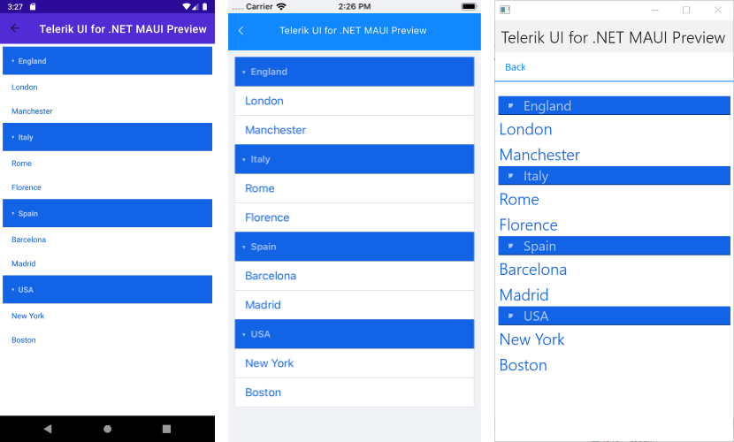

# GroupHeader Style

In addition to the [Item Styles](), the ListView enables you to modify the visual appearance of its group headers when grouping is enabled. The feature is implemented through the `GroupHeaderStyle` property of type `ListViewGroupStyle`.

The `ListViewGroupStyle` provides means for customizing the border as well as background and text color of the group headers. Below you can find a list of the available styling options:

* `BackgroundColor` (`Color`)&mdash;Sets the background of the group header(s).
* `BorderColor` (`Color`)&mdash;Sets the color of the border.
* `BorderWidth` (`double`)&mdash;Defines the width of the borer.
* `BorderLocation` (`Location`)&mdash;Defines an enumeration describing where the border will be visible.
* `TextColor` (`Color`)&mdash;Defines the text color of the ListView `GroupHeader`.

>important To learn more about the grouping functionality of the ListView, refer to the [Grouping Overview]() topic.

### Example

1. Create a `City` class:

 ```C#
public class City
{
    public string Name { get; set; }
    public string Country { get; set; }
}
 ```

1. Add a `ViewModel` class:

 ```C#
public class ViewModel
{
    public ObservableCollection<City> Cities { get; set; }

    public ViewModel()
    {
        this.Cities = new ObservableCollection<City>()
        {
            new City() { Name = "Barcelona", Country = "Spain"},
            new City() { Name = "Madrid", Country = "Spain"},
            new City() { Name = "Rome", Country = "Italy"},
            new City() { Name = "Florence", Country = "Italy"},
            new City() { Name = "London", Country = "England"},
            new City() { Name = "Manchester", Country = "England"},
            new City() { Name = "New York", Country = "USA"},
            new City() { Name = "Boston", Country = "USA"}
         };
    }
}
 ```


1. Add the `RadListView` definition with a `GroupHeaderStyle` applied:

 ```XAML
<telerikDataControls:RadListView x:Name="listView"
                                 ItemsSource="{Binding Cities}">
    <telerikDataControls:RadListView.BindingContext>
        <local:ViewModel />
    </telerikDataControls:RadListView.BindingContext>
    <telerikDataControls:RadListView.ItemTemplate>
        <DataTemplate>
            <telerikListView:ListViewTextCell Text="{Binding Name}"
                                              TextColor="#1263E5" />
        </DataTemplate>
    </telerikDataControls:RadListView.ItemTemplate>
    <telerikDataControls:RadListView.GroupHeaderStyle>
        <telerikListView:ListViewGroupStyle BackgroundColor="#1263E5"
                                            TextColor="#AAC7F6"
                                            BorderColor="#0A3A82"              
                                            BorderWidth="1" />  
    </telerikDataControls:RadListView.GroupHeaderStyle>
    <telerikDataControls:RadListView.GroupDescriptors>
        <telerikListView:PropertyGroupDescriptor PropertyName="Country" />
    </telerikDataControls:RadListView.GroupDescriptors>
</telerikDataControls:RadListView>
 ```


The following image shows the end result:



>important For a **GroupHeader Style** demo, refer to the **ListView/Styling** folder of the SDKBrowser MAUI application.

## See Also

- [Grouping]()
- [Item Styles]()
- [Items StyleSelector]()
