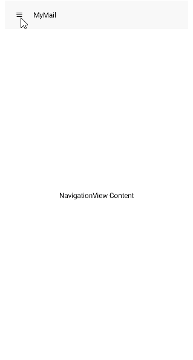
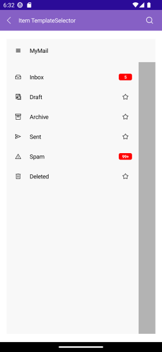

# Data Binding in .NET MAUI NavigationView

For all cases where the business items are not simple strings, data-binding is necessary to correctly visualize information. The NavigationView for .NET MAUI component supports data binding.

* `ItemsSource`(`IList`)&mdash;Defines a collection of items that are populated in the NavigationView.

The properties described below are used in a combination with the `ItemsSource` property when generating navigation items automatically from a custom collection of items:

* `DisplayMemberPath`(`string`)&mdash;Specifies the name of the property (the path) which will be displayed as a text in the generated navigation items.
* `DisplayMemberConverter`(`IValueConverter`)&mdash;Specifies a converter for the display member of the generated navigation items.
* `ImageSourcePath`(`string`)&mdash;Specifies the name of the property (the path to the image source) which will be displayed as an image in the generated navigation items.
* `ImageSourceConverter`(`IValueConverter`)&mdash;Specifies the converter for the image source of the generated navigation items.

## Styling the Navigation Items

You can style the generated items by setting the `ItemStyle` (`Style` with target type `NavigationViewItemView`) property or use a conditional styling by setting the `ItemStyleSelector` (of type `IStyleSelector` with `Style` property with target type `NavigationViewItemView`). Both properties are applicable when `ItemsSource` property is used.

## Customizing the Navigation Items

You can present complex data in the navigation items by using the `ItemTemplate` property. In addition, using the `ItemTemplate` property you can apply a different template to each item depending on a specific condition. The property is applicable when `ItemsSource` property is used.

## Examples

Let's create examples for Data Binding, Item Style, Item Template and selectors. All examples use the same ViewModel, business model and a converter for the images in the navigation items:

**1.** Add the following ViewModel:

<snippet id='navigationview-databinding-viewmodel' />

**2.** Add a sample business model

<snippet id='navigationview-databinding-dataitem'/>

**3.** The font icon converter implementation:

<snippet id='fonticon-converter'/>

**4.** Define the font converter in the page's resources:

<snippet id='navigationview-databinding-fontconverter-resource'/>

**5.** Add the common namespace to XAML page:

 ```XAML
xmlns:telerik="http://schemas.telerik.com/2022/xaml/maui"
 ```

__Example with Data Binding__

**1.** Define the NavigationView in XAML:

<snippet id='navigationview-databinding-xaml'/>

**2.** Define the StaticResources in the page's resources:

<snippet id='navigationview-databinding-fonts-resources'/>

Here is how the NavigationView looks when `ItemsSource` is set:



> For the runnable NavigationView DataBinding example, see the [SDKBrowser Demo Application]() and go to **NavigationView > Data Binding category**.

__Example with ItemStyle__

**1.** Define the NavigationView in XAML:

<snippet id='navigationview-databinding-itemstyle-xaml'/>

**2.** Define the `ItemStyle` resources in the page's resources:

<snippet id='navigationview-databinding-itemstyle'/>

Here is how the NavigationView looks when `ItemsSource` is set and `ItemStyle` is applied:


> For the runnable NavigationView ItemStyle example, see the [SDKBrowser Demo Application]() and go to **NavigationView > Data Binding category**.

__Example with ItemStyleSelector__

**1.** Define the NavigationView in XAML:

<snippet id='navigationview-databinding-itemstyleselector-xaml'/>

**2.** Define the `ItemStyleSelector` resources in the page's resources:

<snippet id='navigationview-databinding-itemstyleselector'/>

**3.** The `NavigationItemStyleSelector` implementation:

<snippet id='navigationview-styleselector'/>

Here is how the NavigationView looks when `ItemsSource` is set and `ItemStyleSelector` is applied:


> For the runnable NavigationView ItemStyleSelector example, see the [SDKBrowser Demo Application]() and go to **NavigationView > Data Binding category**.

__Example with ItemTemplate__

**1.** Define the NavigationView in XAML:

<snippet id='navigationview-databinding-itemtemplate-xaml'/>

**2.** Define the `ItemTemplate` in the page's resources:

<snippet id='navigationview-databinding-navigationitemtemplate'/>

Here is how the NavigationView looks when `ItemsSource` is set and `ItemTemplate` is applied:


> For the runnable NavigationView ItemTemplate example, see the [SDKBrowser Demo Application]() and go to **NavigationView > Data Binding category**.

__Example with ItemTemplateSelector__

**1.** Define the NavigationView in XAML:

<snippet id='navigationview-databinding-itemtemplateselector-xaml'/>

**2.** Define the `ItemTemplateSelector` resources in the page's resources:

<snippet id='navigationview-databinding-itemtemplateselector'/>

**3.** The `NavigationItemTemplateSelector` implementation:

<snippet id='navigationview-databinding-templateselector'/>

Here is how the NavigationView looks when `ItemsSource` is set and `ItemTemplateSelector` is applied:



> For the runnable NavigationView ItemTemplateSelector example, see the [SDKBrowser Demo Application]() and go to **NavigationView > Data Binding category**.

## See Also

- [Configure the Navigation Pane]()
- [Configure the Navigation Item]()
- [Configure the Navigation Header]()
