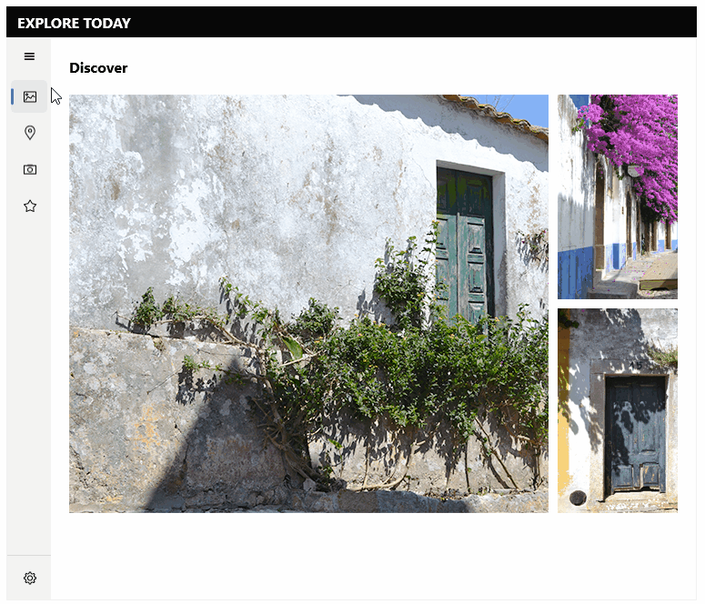

# .NET MAUI NavigationView Overview

The Telerik UI for .NET MAUI NavigationView is an adaptive control used to build a consistent navigational experience in .NET MAUI applications. The navigation items are rendered in a vertical layout. You can take advantage of the different options for displaying the navigation pane: adding header and footer to the pane and customizing its look.

## Key Features

* [Display modes]()&mdash;You can use different modes to display the navigation pane&mdash;Compact, Expanded and Minimal. 
* [Auto-changing the Display mode]()&mdash;NavigationView provides an option for automatically changing the display mode depending on the threshold width.
* [Data Binding]()&mdash;NavigationView has a support for binding to a complex object through the `ItemsSource` property.
* [Complex Object Support]()&mdash;NavigationView control provides you a way to specify which properties of your complex business object to be displayed as a text in the pane by setting the `DisplayMemberPath` property and as an image by setting the `ImageSourcePath` property.
* [Navigation Header]()&mdash;NavigationView has a navigation header that contains label and toggle navigation button that opens/closes the pane.
* [Navigation Pane]()&mdash;The component has a pane that holds the navigation items, pane header, and footer.
* [Pane Header and Footer]()&mdash;NavigationView allows you to add navigation items in the header, and in the footer. 
* [Selection]()&mdash;You can set selection through the `SelectedItem` property.
* [Customizable items]()&mdash;You can customize the visual appearance of the Navigation items.
* [Styling options]()&mdash;NavigationView allows you to style the navigation header, pane header, pane footer, navigation toggle button and navigation items.
* [Events]()&mdash;NavigationView emits a set of events that allow you to configure the component's behavior in response to specific user actions like clicking on item, changing the selection, opening/closing the pane and more.
* [Commands support]()&mdash;NavigationView provides commands that for opening, closing and toggling the pane.

# Next Steps

- [Getting Started with Telerik UI for .NET MAUI NavigationView]()

## See Also

- [.NET MAUI NavigationView Forum Page](https://www.telerik.com/forums/maui?tagId=1978)
- [Telerik .NET MAUI Blogs](https://www.telerik.com/blogs/mobile-net-maui)
- [Telerik .NET MAUI Roadmap](https://www.telerik.com/support/whats-new/maui-ui/roadmap)
