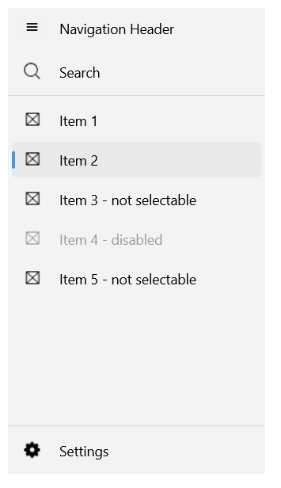

# .NET MAUI NavigationView Selection

The NavigationView for .NET MAUI enables the app users to quickly select item from the navigation pane. This topic will go through the provided by the NavigationView API related to item selection.

NavigationView control has a support for single selection. 

## Main Properties

* `SelectedItem`(`object`)&mdash;Specifies the currently selected item in the NavigationView. Set this property to the NavigationView.
* `IsSelectable`(`bool`)&mdash;Specifies whether the NavigationViewItem is selectable. Set this property to the NavigationViewItem.
* `IsSelected`(`bool`)&mdash;Specifies whether the NavigationViewItem is selected. Set this property to the NavigationViewItem.

## Events

NavigationView exposes a `SelectionChanged` event which is raised when the currently selected NavigationViewItem has changed. The `SelectionChanged` event handler receives two parameters:
	* The `sender` argument, which is of type `object`, but can be cast to the `RadNavigationView` control.
	* `System.EventArgs`.

## Example with Selection Properties

The example shows NavigationView Selection feature. 

**1.** Define the NavigationView control:

<snippet id='navigationview-selection' />

**2.** Add the `telerik` namespace:

```XAML
xmlns:telerik="http://schemas.telerik.com/2022/xaml/maui"
```

This is how the NavigationView selection looks:



> For the runnable NavigationView Selection example, see the [SDKBrowser Demo Application]() and go to **NavigationView > Features category**.

## See Also

- [Setting different Display Mode]()
- [Configure the Navigation Pane]()
- [Configure the Navigation Item]()
- [Configure the Navigation Header]()
- [Navigation Item Styling]()
- [Navigation Pane Styling]()
- [Navigation Header Styling]()
- [Events]()
- [Commands]()
