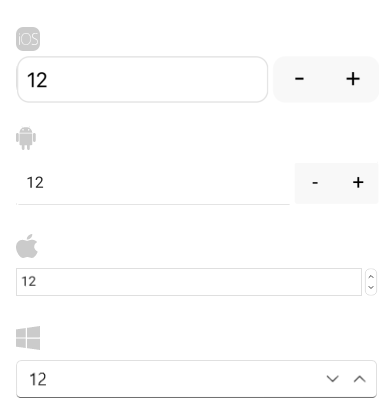

# Configuration Options

This article will explain all configuration options that NumericInput control provides.

## Numeric Value

The NumericInput provides the `Value`(`double?`) property, which allows you to set a predefined value that will be presented by the control.

The following example demonstrates how to use `Value`.

Define the `RadNumericInput` instance in XAML with the `Value` property set:

<snippet id='numericinput-features-value'/>

Add the `telerik` namespace:

```XAML
xmlns:telerik="http://schemas.telerik.com/2022/xaml/maui"
```

The following image shows the result on different platforms:



## Null Value Support

The `Value` property is of type nullable double, which enables the NumericInput control to accept `null` values as well.

The following example demonstrates how to set the `Value` property to accept `null` values.

```XAML
<telerik:RadNumericInput x:Name="numericInput" Value="{x:Null}" />
```

Check the result in the image below:


## Input Range

You can restrict the input using the `Minimum` and `Maximum` properties:

* `Minimum`(`double`)&mdash;The minimum value that can be insert in the numeric input.

* `Maximum`(`double`)&mdash;The maximum value that can be insert in the numeric input.

The following example demonstrates ho to set a range.

<snippet id='numericinput-features-minmax' />

The following image shows the end result:


## Step for Increment and Decrement value

The `Step` property defines the value step that will be applied to the input value upon each decrease/increase action. The default step is 1.

The following example demonstrates how to set a step.

<snippet id='numericinput-features-step' />

The following image shows the end result:


## See Also

- [Globalization]()
- [Commands]()
