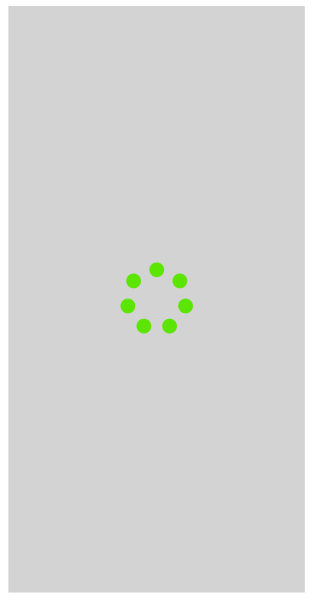

# Configuration

By setting the configuration options of the Telerik UI for .NET MAUI PDF Viewer, you can control how the opened document looks on the screen.

## Setting the Zoom Level

The PDF Viewer exposes the `MaxZoomLevel` and `MinZoomLevel` properties that allow you to define what zoom value will be available to the users:

* `MaxZoomLevel`(`double`)&mdash;Defines the maximum magnification factor at which content can be maximized. The default value is `3.0`.
* `MinZoomLevel`(`double`)&mdash;Defines the minimum magnification factor at which content can be minimized. The default value is `0.3`.

>note The `MaxZoomLevel` and `MinZoomLevel` properties work in conjunction with the `ZoomIn` and `ZoomOut` commands, which users utilize to change the zoom level in the application. For more details, see the [Commands]() article.

## Configure the Spacing between the Pages

The Telerik UI for .NET MAUI PDF Viewer allows you to control the space between the pages.

* `PageSpacing`(`double`)&mdash;Defines the space between the pages of the PDF Document. The default value is `20.0`.

## Customize the Default Busy Indicator

When loading documents in the PDF Viewer, a busy indicator appears on the screen. 

If the default look of the busy indicator does not suit your needs, you can define a custom template through the `BusyIndicatorTemplate` property:

* `BusyIndicatorTemplate`(`DataTemplate`)&mdash;Specifies the template visualized while the PDF document is loading.

The following example shows how to define a custom `BusyIndicatorTemplate`:

<snippet id='pdfviewer-busy-indicator-template-xaml' />

The next image illustrates the Busy Indicator template:

> For a runnable example with the PDF Viewer Busy Indicator, see the [SDKBrowser Demo Application]() and go to **PdfViewer > Features**.

## See Also

- [Available Commands]()
- [PdfViewer Toolbar]()
