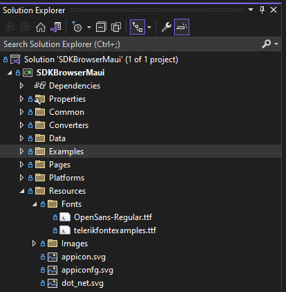

# Fonts

The Telerik .NET MAUI PDF Viewer supports standard and embedded fonts. 

## Standard Fonts

There are 14 standard fonts that are not embedded in the document when you use them. As our .NET MAUI PdfViewer works with the [RadPdfProcessing](https://docs.telerik.com/devtools/document-processing/libraries/radpdfprocessing/overview) model, these fonts can be accessed through the PdfProcessing [FontsRepository class](https://docs.telerik.com/devtools/document-processing/api/telerik.windows.documents.fixed.model.fonts.fontsrepository). 

You can find a full list of the provided standard fonts below:

* `Helvetica`
* `Helvetica-Bold`
* `Helvetica-Oblique`
* `Helvetica-BoldOblique`
* `Courier`
* `Courier-Bold`
* `Courier-Oblique`
* `Courier-BoldOblique`
* `Times-Roman`
* `Times-Bold`
* `Times-Italic`
* `Times-BoldItalic`
* `Symbol`
* `ZapfDingbats`

## Embedded Fonts

All fonts, which are not included in the 14 standard ones have to be embedded in the PDF document. Otherwise, the result when the document is rendered is unpredictable as the PdfViewer renderer fallbacks to the default fonts.

### Registering a Font

PdfViewer for .NET MAUI works with [RadPdfProcessing library](https://docs.telerik.com/devtools/document-processing/libraries/radpdfprocessing/overview) model

Utilize the PdfProcessing's FontsRepository `RegisterFont` static method to embed various fonts, including `TrueType` fonts. `RegisterFont` requires four parameters - `FontFamily`, `FontStyle` and `FontWeight` objects describing the font and a byte array containing the raw font data.

**Embed a non-standard font with PdfProcessing library**

**1**: Add the `.ttf` file containing the font data to your .NET MAUI project, in the example below it is placed inside `Resources` folder:



>Make sure to update the Build Action of the .ttf file to **Embedded resource**.

**2**: Add a sample implementation for reading the font data from a stream, for example:

```C#
private static byte[] ReadAllBytes(Stream input)
{
	byte[] buffer = new byte[16 * 1024];
	using (MemoryStream ms = new MemoryStream())
	{
		int read;
		while ((read = input.Read(buffer, 0, buffer.Length)) > 0)
		{
			ms.Write(buffer, 0, read);
		}
		return ms.ToArray();
	}
}
```

**3**: Embed the font through the `RegisterFont` method, here you need to use the above mentioned `ReadAllBytes` method to read the font data and return it as a byte array:

```C#
Assembly assembly = typeof(MainPage).Assembly;
Stream stream = assembly.GetManifestResourceStream("SampleApp.Resources.SampleFont.ttf");
var fontData = ReadAllBytes(stream);
Telerik.Windows.Documents.Fixed.Model.Fonts.FontsRepository.RegisterFont(
	new FontFamily("Verdana"), FontStyles.Normal, FontWeights.Normal, fontData);
```

Add the missing namespace related to the PdfProcessing library:

```C#
using Telerik.Documents.Core.Fonts;
```

**Result**: RadPdfViewer use the registered font data when rendering text with the same font set.

## See Also

- [RadPdfProcessing library](https://docs.telerik.com/devtools/document-processing/libraries/radpdfprocessing/overview)
