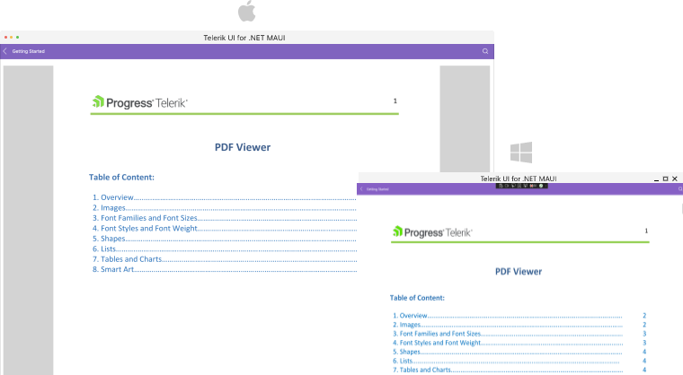
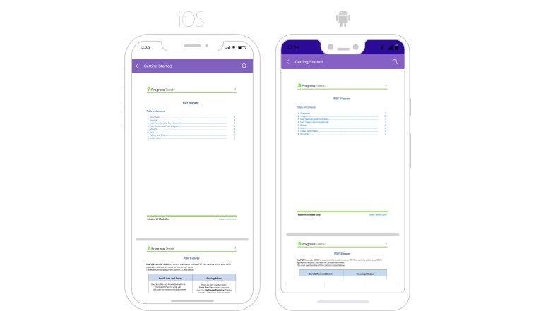

# Getting Started with the .NET MAUI PDF Viewer

This guide provides the information you need to start using the Telerik UI for .NET MAUI PDF Viewer by adding the control to your project.

At the end, you will be able to achieve the results from the first image on desktop platforms and the results from the second image on mobile platforms.





## Prerequisites

Before adding the PDF Viewer, you need to:

1. [Set up your .NET MAUI application](#step-1-set-up-your-net-maui-application).

1. [Download Telerik UI for .NET MAUI](#step-2-download-telerik-ui-for-net-maui).

1. [Install Telerik UI for .NET MAUI](#step-3-install-telerik-ui-for-net-maui).

1. [Register the required handlers](#step-4-register-required-handlers).

## Define the Control

**1.** When your .NET MAUI application is setup, you are ready to add a PDF Viewer control to your page.

<snippet id='pdfviewer-getting-started-xaml'/>

**2.** Add the `telerik` namespace:

```XAML
xmlns:telerik="http://schemas.telerik.com/2022/xaml/maui"
```

**3.** Visualize the PDF document by setting the `Source` property of the control:

<snippet id='pdfviewer-getting-started' />

**4.** Register the Telerik controls through the `Telerik.Maui.Controls.Compatibility.UseTelerik` extension method called inside the `CreateMauiApp` method of the `MauiProgram.cs` file of your project:

```C#
using Telerik.Maui.Controls.Compatibility;

public static class MauiProgram
{
	public static MauiApp CreateMauiApp()
	{
		var builder = MauiApp.CreateBuilder();
		builder
			.UseTelerik()
			.UseMauiApp<App>()
			.ConfigureFonts(fonts =>
			{
				fonts.AddFont("OpenSans-Regular.ttf", "OpenSansRegular");
			});

		return builder.Build();
	}
}           
```

The example above shows a PDF document visualized as an embedded resource. This is one of the options for loading a PDF with the `RadPdfViewer` control.

> For the runnable PDF Viewer Getting Started example, see the [SDKBrowser Demo Application]() and go to **PdfViewer > Getting Started**.

## Additional Resources

- [.NET MAUI PdfViewer Product Page](https://www.telerik.com/maui-ui/pdfviewer)
- [.NET MAUI PdfViewer Forum Page](https://www.telerik.com/forums/maui?tagId=1937)
- [Telerik .NET MAUI Blogs](https://www.telerik.com/blogs/mobile-net-maui)
- [Telerik .NET MAUI Roadmap](https://www.telerik.com/support/whats-new/maui-ui/roadmap)

## See Also

- [Commands]()
- [PDF Viewer Toolbar]()
