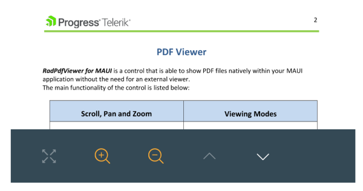

# .NET MAUI PDF Viewer Toolbar Styling

PDF Viewer for .NET MAUI provudes a flexible styling API for its toolbar items. 

In general the PDFViewerToolbar is based on the RadToolbar control. All toolbar items in the PdfViewer inherit from `ButtonToolbarItem`.

All styling properties available for the `ButtonToolbarItem` are applicable for the pdf toolbar items. For more details review the ButtonToolbar Styling article. 

Here is an example:

**1.** PDF Viewer and Toolbar definitions in xaml:

<snippet id='pdfviewer-toolbar-styling-xaml'/>

**2.** Add the following namespace:

```XAML
xmlns:telerik="http://schemas.telerik.com/2022/xaml/maui"
```

**3.**: Define the style in the page's resources:

```XAML
<Style TargetType="telerik:ButtonToolbarItemView" x:Key="commonStyle">
    <Setter Property="MinimumWidthRequest" Value="40"/>
    <Setter Property="BackgroundColor" Value="#608660C5"/>
</Style>

<Style TargetType="telerik:ButtonToolbarItemView" x:Key="zoomToolbarStyle" BasedOn="{StaticResource commonStyle}">
    <Setter Property="BorderBrush" Value="LightGray"/>
    <Setter Property="CornerRadius" Value="5"/>
    <Setter Property="BorderThickness" Value="2"/>
</Style>
```

**4.**: Pass the document to the `PdfViewer.Source`:

<snippet id='pdfviewer-toolbar'/>

Here is the result on the image below:



## See Also

- [RadPdfProcessing library](https://docs.telerik.com/devtools/document-processing/libraries/radpdfprocessing/overview)
