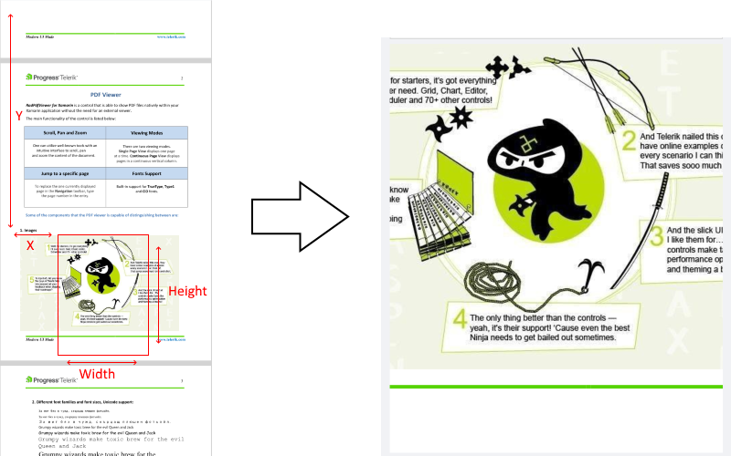

# Viewport Settings

The Telerik UI for .NET MAUI. PDF Viewer provides an API for getting and manipulating its viewport through the `Viewport` property and `ChangeViewport` method. 

The viewport is the window where the PDF Viewer displays its content and users can change the viewport through zooming, panning, and scrolling:


To explain how the viewport works, we first need to clarify the content of the PDF Viewer and how to define its size. The content of the PDF Viewer refers to the PDF document itself, specifically the document pages. The PDF Viewer offers two layout modes: `SinglePage` and `ContinuousScroll`, each utilizing different approaches to arrange the document pages. The method of defining the content varies based on the selected layout mode.

>tip For detailed information on the available layout modes, check the [Viewing Modes](#viewing-modes) topic.

## Layout Modes

The PDF Viewer supports two layout modes that you can set through its `LayoutMode` property:

* [`SinglePage`](#singlepage-layout-mode)
* [`ContinuousScroll`](#continuousscroll-layout-mode)

### `SinglePage` Layout Mode

With the `SinglePage` layout mode, the PDF Viewer shows one page at a time (the pages are stacked), so the content is the current page and the content size is the size of that page. If the document contains pages with different sizes, the content size is changed accordingly.

The viewport position is calculated relative to the current page.


### `ContinuousScroll` Layout Mode

In the `ContinuousScroll` layout mode, content is defined as all the document pages. In this mode, the pages are vertically ordered one below another with spacing between them, and they are horizontally centered. If the document contains pages with different widths, some pages may not be aligned at the `0` horizontal position.

The content width is determined by the widest page in the document. The content height is calculated by summing the heights of all the pages along with the distances between them. The spacing between pages is controlled by the `PageSpacing` property of the PDF Viewer.

So, the viewport position is calculated relative to the whole content (all pages and distances):



No matter which layout mode is selected, the viewport is the "window" which moves over the defined content and renders the PDF elements currently positioned in it.

The `Viewport` property of the PDF Viewer is of type *Xamarin.Forms.Rectangle* and can be defined by its top left corner at the (x, y) position and width and height values. Keep in mind it's possible to have negative X and Y values in case the viewport becomes bigger than the content itself.

## Example: Navigating to a Page 

The example below demonstrates how to utilize the `ChangeViewport` method and navigate to the last page of the document in the `ContinuousScroll` and `SinglePage` layout modes as well as how to access the current viewport.

**1.** Define the `RadPdfViewer` and `RadPdfToolbar`:

```XAML
<Grid>
	<Grid.RowDefinitions>
		<RowDefinition Height="Auto"/>
		<RowDefinition />
	</Grid.RowDefinitions>
	<telerikPdfViewer:RadPdfViewerToolbar PdfViewer="{Binding Source={x:Reference pdfViewer}}">
		<telerikPdfViewer:ZoomInToolbarItem />
		<telerikPdfViewer:ZoomOutToolbarItem />
		<telerikPdfViewer:NavigateToNextPageToolbarItem/>
		<telerikPdfViewer:NavigateToPreviousPageToolbarItem/>
		<telerikPdfViewer:NavigateToPageToolbarItem/>
		<telerikPdfViewer:FitToWidthToolbarItem/>
		<telerikPdfViewer:ToggleLayoutModeToolbarItem/>
	</telerikPdfViewer:RadPdfViewerToolbar>
	<telerikPdfViewer:RadPdfViewer x:Name="pdfViewer" Grid.Row="1"/>
</Grid>
```

**2.** Add the following namespace:

```XAML
xmlns:telerik="http://schemas.telerik.com/2022/xaml/maui"
```

**3.** Get the current viewport position and size:

<snippet id='pdfviewer-viewport-getviewport' />

**4.** Manipulate the viewport of the PDF Viewer:

<snippet id='pdfviewer-viewport-setviewport' />

## See Also

- [Commands]()
