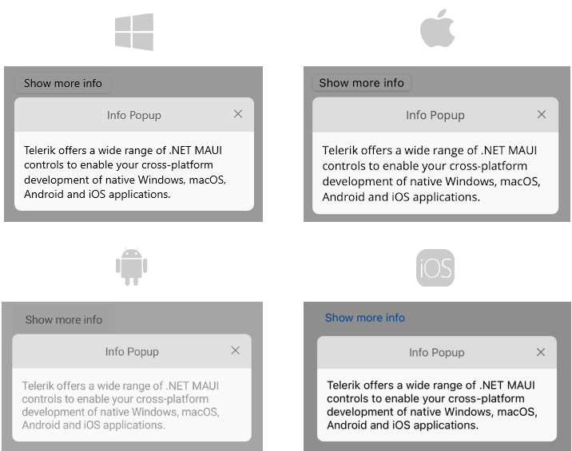

# Getting Started with .NET MAUI Popup

This guide provides the information you need to start using the Telerik UI for .NET MAUI Popup by adding the control to your project.

At the end, you will be able to achieve the following result.



## Prerequisites

Before adding the Popup, you need to:

1. [Set up your .NET MAUI application](#set-up-your-net-maui-application).

1. [Download Telerik UI for .NET MAUI](#download-telerik-ui-for-net-maui).

1. [Install Telerik UI for .NET MAUI](#install-telerik-ui-for-net-maui).

## Define the Control

1. When your .NET MAUI application is set up, you are ready to add a Popup control to your page.

	For demonstration purposes, the current scenario demonstrates how to add a sample Popup attached to a Button control. The purpose of the Popup here is to receive user input&mdash;it contains the Entry control for allowing the user to enter a comment and a button for closing the popup.

 <snippet id='popup-getting-started-xaml' />

1. Reference the event handlers.

 ```C#
private void ClosePopup(object sender, EventArgs e)
{
    popup.IsOpen = false;
}
private void ShowPopup(object sender, EventArgs e)
{
    popup.IsOpen = true;
}
 ```

1. Add the namespace.

 ```XAML
xmlns:telerik="http://schemas.telerik.com/2022/xaml/maui"
 ```

1. Register the Telerik controls through the `Telerik.Maui.Controls.Compatibility.UseTelerik` extension method called inside the `CreateMauiApp` method of the `MauiProgram.cs` file of your project:

 ```C#
 using Telerik.Maui.Controls.Compatibility;

 public static class MauiProgram
 {
	public static MauiApp CreateMauiApp()
	{
		var builder = MauiApp.CreateBuilder();
		builder
			.UseTelerik()
			.UseMauiApp<App>()
			.ConfigureFonts(fonts =>
			{
				fonts.AddFont("OpenSans-Regular.ttf", "OpenSansRegular");
			});

		return builder.Build();
	}
 }           
 ```
 
## Additional Resources

- [.NET MAUI Popup product page](https://www.telerik.com/maui-ui/popup)
- [.NET MAUI Popup forum page](https://www.telerik.com/forums/maui?tagId=1782)
- [Telerik .NET MAUI blogs](https://www.telerik.com/blogs/mobile-net-maui)
- [Telerik .NET MAUI roadmap](https://www.telerik.com/support/whats-new/maui-ui/roadmap)

## See Also

- [Modal Popup Support]()
- [Placement Configuration]()
- [Animations]()
