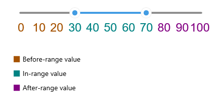

# Labels Styling

The RangeSlider for .NET MAUI control provides styling properties for its labels as well as a style selector, which you can use to apply different styles to the labels according to custom logic.

* `TextColor`&mdash;Defines a custom color for the labels.
* `FontFamily`&mdash;Specifies custom font family to the labels.
* `FontSize`&mdash;Specifies custom font size to the labels.
* `LabelStyle`&mdash;Defines custom style to the labels.

* `LabelStyleSelector(type Telerik.Maui.Controls.IStyleSelector)`&mdash;Defines a selector that can apply different styles to different labels.

Here is a quick example on how the `LabelStyleSelector` can be applied to set separate styles to the labels before the selected range, inside the selected range and after the selected range.

**1.** Create a custom style selector class which inherits from `Telerik.Maui.Controls.IStyleSelector`:

<snippet id='rangeslider-labels-styleselector-class' />

>`Telerik.Maui.Controls.IStyleSelector` provides a mechanism to select a `Microsoft.Maui.Controls.Style` based on a custom logic.

**2.** Add The style selector to the page's resources:

<snippet id='rangeslider-styling-labelsstyleselector'/>

**3.** Define the RangeSlider with the style selector applied:

<snippet id='rangeslider-styling-labelsstyleselector-xaml'/>

Check the result below:

## See Also

- [Labels]()
- [Track Styling]()
- [Ticks Styling]()