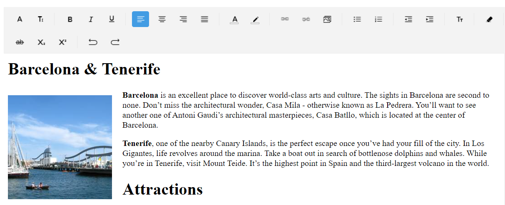

# RichTextEditor Toolbar

RichTextEditor control comes with various editing capabilities and with the help of the RadRichTextEditorToolbar you can provide to the users easy and quick way to edit their HTML content. The default toolbar include items for all the available text formatting options, alternatively you could customize the shown editing options according to your needs.

By default the RadRichTextEditorToolbar Items are auto-populated. You could change this by setting the RadRichTextEditorToolbar boolean `AutoGenerateItems` property to `False`. In this case you will need to manually define the available editing options, for more details check [Custom Toolbar]() article.

In order to attach the RichTextEditor control to the RadRichTextEditorToolbar control you need to set the `RichTextEditor` (from type `RadRichTextEditor`) property. All toolbar items execute their actions against the specified richtext editor.

<snippet id='richtexteditor-getting-started-xaml' />

On Mobile, the RichTextEditorToolbar is horizontally scrollable, so that the toolbar items can be easily accessed:


On Desktop, the toolbar items are wrapped:



## Predefined Toolbar Items

The table below shows all toolbar items available for both Desktop and Mobile:

| RichTextEditor Toolbar Item | Description |
| ------------- | --------------- |
| `RichTextEditorFontFamilyToolbarItem` | Changes the font family of the text with the selected from predefiend font families. |
| `RichTextEditorFontSizeToolbarItem` | Chnages the font size of the text. |
| `SeparatorToolbarItem` | Separates the toolbar items. |
| `RichTextEditorBoldToolbarItem` | Bolds the text. |
| `RichTextEditorItalicToolbarItem` |  Makes the text italic. |
| `RichTextEditorUnderlineToolbarItem` | underlines the text. |
| `RichTextEditorAlignLeftToolbarItem` | Align the content to the left of the available space. |
| `RichTextEditorAlignCenterToolbarItem` | Aligns the content centered in the available space. |
| `RichTextEditorAlignRightToolbarItem` | Align the content to the right of the available space. |
| `RichTextEditorAlignJustifyToolbarItem` | Distributes the content evenly in the available space. |
| `RichTextEditorTextColorToolbarItem` | Changes the text color of the text with a selection from predefined colors. |
| `RichTextEditorHighlightTextColorToolbarItem` | Changes the highlight color of the text with the selected from predefined colors. |
| `RichTextEditorBulletingToolbarItem` | Creates a bulleted/unordered list. |
| `RichTextEditorNumberingToolbarItem` | Creates a numbered/ordered list. |
| `RichTextEditorOutdentToolbarItem` | Moves the content of the current or selected paragraphs closer the margin of the control. |
| `RichTextEditorIndentToolbarItem` | Moves the content of the current or selected paragraphs farther away from the margin of the control. |
| `RichTextEditorTextFormattingToolbarItem` |  |
| `RichTextEditorClearFormattingToolbarItem` | Clears all formatting for the selection. |
| `RichTextEditorStrikethroughToolbarItem` | Crosses out the text. |
| `RichTextEditorSuperscriptToolbarItem` | Makes the text small and positioned below the paragraph line. |
| `RichTextEditorSubscriptToolbarItem` | Makes the text small and positioned above the paragraph line. |
| `RichTextEditorUndoToolbarItem` | Un-does the last action. |
| `RichTextEditorRedoToolbarItem` | Re-does the last action. |
| `RichTextEditorColorPickerToolbarItem` | Allows picking a specific color from a collection of colors. |
| `RichTextEditorCopyToolbarItem` | Copies the selected HTML to the clipboard. |
| `RichTextEditorCutToolbarItem` | Cuts the selected HTML to the clipboard. |
| `RichTextEditorAddOrEditHyperlinkToolbarItem` | Opens a popup to add ot edit a hyperlink. |
| `RichTextEditorAddHyperlinkToolbarItem` | Adds a hyperlink. |
| `RichTextEditorRemoveHyperlinkToolbarItem` | Remove the hyperlink for the current selection. |
| `RichTextEditorAddOrEditImageToolbarItem` | If image is selected, a dialog opens. If image is not selected, the `PickImage` event fires. |
| `RichTextEditorHyperlinkNavigationToolbarItem` | If hyperlink is selected, navigates to the predefined toolbar items related to hyperlink operations like: Edit, Open, Remove. If huperlink is not selected, opens a popup with predefined UI for adding a hyperlink to the current selection. |
| `RichTextEditorImageNavigationToolbarItem` | If image is selected, navigates to the operations related to image editing like: Cut, Copy, Remove, Paste, Edit. |

Here are the all toolbar items definition:

<snippet id='richtexteditor-alltoolbar-items-xaml' />

## RichTextEditor Toolbar Placement

There are some specifics you'd need to take into account when placing RichTextEditorToolbar on the page:

* On Android - when you place the RichTextEditor Toolbar below the RichTextEditor, you will need to set the Application WindowSoftInputModeAdjust to `Resize` - this setting causes the page to resize when the keyboard is shown and in this way if the RichTextEditorToolbar is on the bottom of the page it will be displayed over the keyboard when it appears.

You can apply it on application level like this:

```C#
App.Current.On<Android>().UseWindowSoftInputModeAdjust(WindowSoftInputModeAdjust.Resize);
```

>tip For more details on the matter check the [Soft Keyboard Input Mode on Android](https://learn.microsoft.com/en-us/dotnet/maui/android/platform-specifics/soft-keyboard-input-mode) from .NET MAUI documentation.

* on iOS -  if the RadRichTextEditorToolbar is positioned under the keyboard, when the keyboard shows, the control is translated over the keyboard, so users can access it without a problem. Due to [Xamarin.Forms implementation](https://learn.microsoft.com/en-us/dotnet/api/microsoft.maui.controls.visualelement.translationy?view=net-maui-6.0), it is important that the RadRichTextEditorToolbar is placed in a container which bounds would still contain it after the control is translated over the keyboard. Otherwise, the Tap and Pan gestures on the RadRichTextEditorToolbar will not work until the keyboard is hidden and the control is translated back to its original place.

>important For the RichTextEditor Toolbar examples refer to the [SDKBrowser Demo Application]() RichTextEditor -> Toolbar category.

## Custom Toolbar

You can easily customize the toolbar by setting the `AutoGenerateItems` to `False`. Then decide which toolbar items to include. For more details on this&mdash;Review the [Custom Toolbar]() article.

## See Also

- [Commands]()
- [Configure the RichTextEditor]()
- [Events]()
- [Working with images]()
- [Hyperlinks]()
