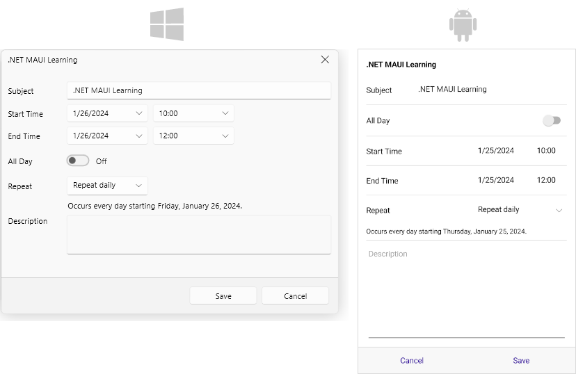
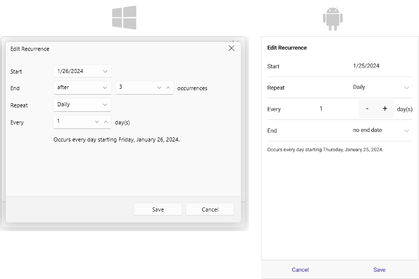
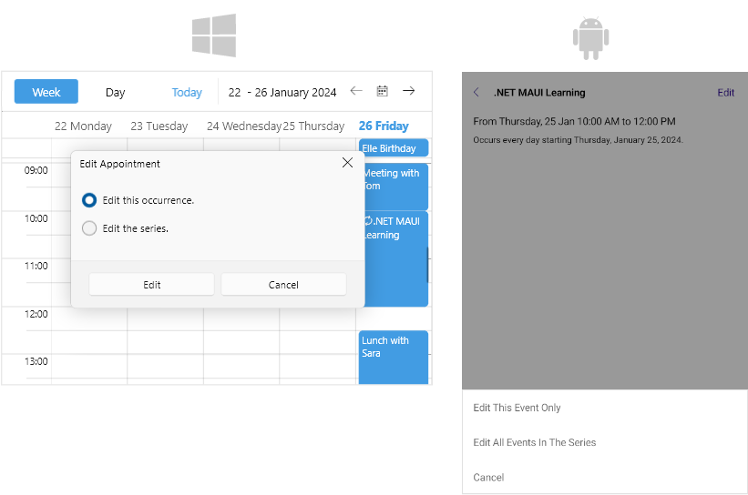

# .NET MAUI Scheduler Built-In Dialogs

The Telerik .NET MAUI Scheduler exposes built-in dialogs for the creation and modification of appointments, so you can provide users with the ability to directly schedule their meetings.

Check below the available dialogs for managing appointments.

## Create and Edit Appointment

`EditAppointmentDialog` is the dialog that allows the end user to create a new appointment or edit an existing one.

* On desktop, the `EditAppointmentDialog` appears when the end user double-clicks an empty slot or an appointment.
* On mobile, the behavior of the `EditAppointmentDialog` depends on the selected calendar slot:
   * If the end user taps an empty slot, the Edit Appointment dialog appears to let them create a new appointment. 
   * If the end user taps an existing appointment and then taps Edit in the Preview Appointment dialog, the Edit Appointment dialog appears to let them modify the appointment.



## Preview Appointment

(Android- and iOS-only) When the end user taps an existing appointment, the `PreviewAppointmentDialog` lets them preview the appointment details, or edit or delete the appointment. 


## Edit Recurrence

The `EditRecurrenceDialog` lets the end user configure the recurrence settings of an appointment.



## Edit Recurrence Choice

When the end user interacts with a recurring appointment, the `EditRecurrenceChoiceDialog` lets them choose if they want to edit a single occurrence or the entire series.



## Delete Recurrence Choice

When the end user interacts with a recurring appointment, the `DeleteRecurrenceChoiceDialog` lets them choose if they want to delete a single occurrence or the entire series.


## Delete Appointment Choice

(Desktop-only) When the end user attempts to delete an appointment, the `DeleteAppointmentChoiceDialog` asks for confirmation.


## Methods

Use the following methods to show the built-in dialogs of the Scheduler:

* `CreateAppointmentWithDialog(DataRange range)`&mdash;Opens a dialog for creating an appointment.
* `EditAppointmentWithDialog(Occurrence occurrence)`&mdash;Opens a dialog for editing an exsisting appointment.
* `DeleteAppointmentWithDialog(Occurrence occurrence)`&mdash;Opens a dialog for deleting an existing appointment.

The following example demonstrates how to use the methods for managing the built-in dialogs:

**1.** Create a sample view with a `RadScheduler` instance and a few buttons:

<snippet id='scheduler-dialogs-methods-xaml' />

**2.** Add the buttons' clicked event handlers in the code-behind:

<snippet id='scheduler-dialogs-methods-eventhandlers' />

## Events

The Scheduler exposes the following events for its built-in dialogs:

* `DialogOpening`&mdash;Raised when a dialog is about to be opened. The `DialogOpening` event handler receives two parameters:
    * The sender argument, which is of type `object`, but can be cast to the `RadScheduler` type.
    * A `SchedulerDialogOpeningEventArgs` object with the following properties:
       * `DialogType`&mdash;Provides the dialog type.
       * `Cancel`&mdash;If `True`, cancels the dialog opening.
* `DialogClosing`&mdash;Raised when a dialog is about to be closed. The `DialogClosing` event handler receives two parameters:
    * The sender argument, which is of type `object`, but can be cast to the `RadScheduler` type.
    * A `SchedulerDialogClosingEventArgs` object with the following properties:
       * `DialogType`&mdash;Provides the dialog type.
       * `Cancel`&mdash;If `True`, cancels the dialog closing.
       * `DialogResult (bool?)`&mdash;Indicates how the dialog was closed. `null` when closed with the **Close** button. `False` when closed with the **Cancel** button. `True` in all other cases.

Check a quick example on how to use the `DialogOpening` and `DialogClosing` events:

**1.** Add the `RadScheduler` definition:

<snippet id='scheduler-dialogs-events-xaml' />

**2.** Add the event handlers:

<snippet id='scheduler-dialogs-events' />

## Styling

You can style the visual appearance of each dialog by creating the corresponding `Style` with `TargetType` set to `SchedulerDialog`. Here is a list of the available `Style` properties:

* `EditAppointmentDialogStyle`&mdash;Defines the `Style` that will be applied on the Edit Appointment dialog.
* `EditRecurrenceDialogStyle`&mdash;Defines the `Style` that will be applied on the Edit Recurrence dialog.
* `EditRecurrenceChoiceDialogStyle`&mdash;Defines the `Style` that will be applied on the Edit Recurrence Choice dialog.
* `DeleteAppointmentChoiceDialogStyle`&mdash;(Desktop-only)Defines the `Style` that will be applied on the Delete Appointment Choice dialog.
* `DeleteRecurrenceChoiceDialogStyle`&mdash;Defines the `Style` that will be applied on the Delete Recurrence Choice dialog.
* `PreviewAppointmentDialogStyle`&mdash;(Android- and iOS-only)Defines the `Style` for the Preview Appointment dialog. 

**Example with styling the edit appointment dialog**

**1.** Define the Scheduler with the `EditAppointmentDialogStyle` in XAML:

```XAML
 <telerik:RadScheduler x:Name="scheduler"
                       EditAppointmentDialogStyle="{StaticResource CustomSchedulerEditAppointmentDialog_Style}"/>
```

**2.** Define the style in the resources of the page:

```XAML
<Style x:Key="CustomSchedulerEditAppointmentDialog_Style" TargetType="telerik:SchedulerDialog">
    <Setter Property="ControlTemplate" Value="{StaticResource CustomSchedulerEditAppointmentDialog_ControlTemplate}" />
    <Setter Property="HeightRequest" Value="{OnPlatform Default=450, WinUI=530}" />
</Style>
```

Review the `ControlTemplate` definition in the <a href="https://github.com/telerik/maui-samples/tree/main/Samples/ControlsSamples/Examples/SchedulerControl/CustomizationExample/Resources" target="_blank">Resources folder of the Controls Samples application > Scheduler/Customization example</a>.

> For a runnable example demonstrating the Scheduler built-in edit appointment dialog customization, see the [Controls Samples Application]() and go to **Scheduler > Customization**. 

## See Also

- [Appointments]()
- [Recurrence Pattern]()
- [Recurrence Rule]()
- [Views]()