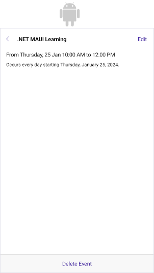

# .NET MAUI Scheduler Built-In Dialogs

The Telerik .NET MAUI Scheduler exposes built-in dialogs for the creation and modification of appointments, so you can provide users with the ability to directly schedule their meetings.

Check below the available dialogs for managing appointments.

* **PreviewAppointment Dialog**&mdash;(Android- and iOS-only) When the end user taps an existing appointment, the dialog lets them preview the appointment details, or edit or delete the appointment. 

* **EditAppointmentDialog**&mdash;Lets the end user create a new appointment or edit an existing one. 
    * On desktop, the Edit Appointment dialog appears when the end user double-clicks an empty slot or an appointment. 
    * On mobile, the behavior of the Edit Appointment dialog depends on the selected calendar slot. If the end user taps an empty slot, the Edit Appointment dialog appears to let them create a new appointment. If the end user taps an existing appointment and then taps Edit in the Preview Appointment dialog, the Edit Appointment dialog appears to let them modify the appointment.

* **EditRecurrenceDialog**&mdash;Lets the end user configure the recurrence settings of an appointment.

* **EditRecurrenceChoiceDialog**&mdash;When the end user interacts with a recurring appointment, lets them choose if they want to edit a single occurrence or the entire series.

* **DeleteRecurrenceChoiceDialog**&mdash;When the end user interacts with a recurring appointment, lets them choose if they want to delete a single occurrence or the entire series.

* **DeleteAppointmentChoiceDialog**&mdash;(Desktop-only) When the end user attempts to delete an appointment, asks for confirmation.

### Methods

Use the following methods to show the built-in dialogs of the Scheduler:

* `CreateAppointmentWithDialog(DataRange range)`&mdash;Opens a dialog for creating an appointment.
* `EditAppointmentWithDialog(Occurrence occurrence)`&mdash;Opens a dialog for editing an exsisting appointment.
* `DeleteAppointmentWithDialog(Occurrence occurrence)`&mdash;Opens a dialog for deleting an existing appointment.

The following example demonstrates how to use the methods for managing the built-in dialogs:

**1.** Create a sample view with a `RadScheduler` instance and a few buttons:

<snippet id='scheduler-dialogs-methods-xaml' />

**2.** Add the buttons' clicked event handlers in the code-behind:

<snippet id='scheduler-dialogs-methods-eventhandlers' />

### Events

The Scheduler exposes the following events for its built-in dialogs:

* `DialogOpening`&mdash;Raised when a dialog is about to be opened. The `DialogOpening` event handler receives two parameters:
    * The sender argument, which is of type `object`, but can be cast to the `RadScheduler` type.
    * A `SchedulerDialogOpeningEventArgs` object with the following properties:
       * `DialogType`&mdash;Provides the dialog type.
       * `Cancel`&mdash;If `True`, cancels the dialog opening.
* `DialogClosing`&mdash;Raised when a dialog is about to be closed. The `DialogClosing` event handler receives two parameters:
    * The sender argument, which is of type `object`, but can be cast to the `RadScheduler` type.
    * A `SchedulerDialogClosingEventArgs` object with the following properties:
       * `DialogType`&mdash;Provides the dialog type.
       * `Cancel`&mdash;If `True`, cancels the dialog closing.
       * `DialogResult (bool?)`&mdash;Indicates how the dialog was closed. `null` when closed with the **Close** button. `False` when closed with the **Cancel** button. `True` when <BE SPECIFIC>.

Check a quick example on how the `DialogOpening` and `DialogClosing` events can be used:

**1.** Add the `RadScheduler` definition:

<snippet id='scheduler-dialogs-events-xaml' />

**2.** Add the event handlers:

<snippet id='scheduler-dialogs-events' />

### Customization

You can customize the visual appearance of each dialog by creating the corresponding style with TargetType set to `SchedulerDialog`. Here is a list of the available Style properties:

* `EditAppointmentDialogStyle`&mdash;Defines the Style that will be applied on the edit appointment dialog control.
* `EditRecurrenceDialogStyle`&mdash;Defines the Style that will be applied on the edit recurrence dialog control.
* `EditRecurrenceChoiceDialogStyle`&mdash;Defines the Style that will be applied on the edit recurrence choice dialog control.
* `DeleteAppointmentChoiceDialogStyle`&mdash;Defines the Style that will be applied on the delete appointment choice dialog control.
* `DeleteRecurrenceChoiceDialogStyle`&mdash;Defines the Style that will be applied on the delete recurrence choice dialog control.
* `PreviewAppointmentDialogStyle`&mdash;Defines the Style that will be applied on the preview appointment dialog control. This dialog is only used in Android and iOS. 

## See Also

- [Appointments]()
- [Recurrence Pattern](% slug recurrence-pattern %})
- [Recurrence Rule](% slug recurrence-rule %})
- [Views]()
