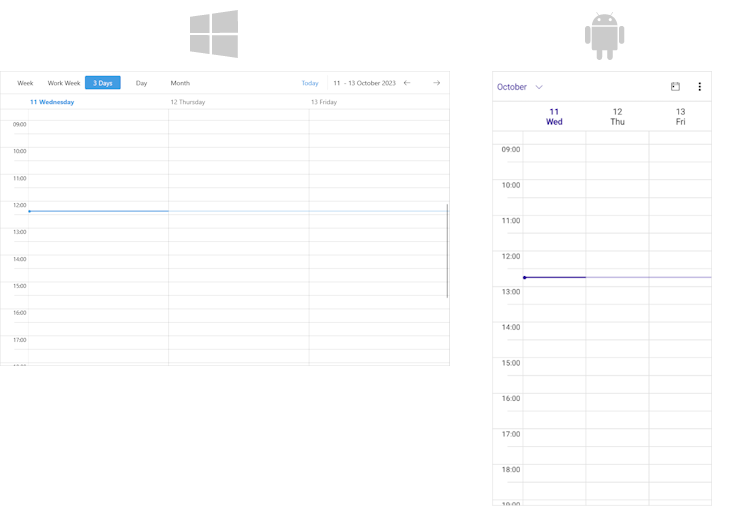

# Multiday View 

The Multiday View definition represents a definition of a view that shows multiple days as in day view mode.

## Set the Multiday View

Add a `MultidayViewDefinition` to the `ViewDefinitions` collection of the `RadScheduler` instance with `VisibleDays` and `Title` applied.

```XAML
<telerik:RadScheduler AutomationId="scheduler">
    <telerik:RadScheduler.ViewDefinitions>
       <telerik:MultidayViewDefinition VisibleDays="3" Title="3 Days" />
    </telerik:RadScheduler.ViewDefinitions>
</telerik:RadScheduler>
```




## Properties

* `DayStartTime`&mdash;Defines the time used to indicate the start of the day.
* `DayEndTime`&mdash;Defines the time used to indicate the end of the day.
* `IsCurrentTimeIndicatorVisible`&mdash;Defines the value indicating whether the current time indicator is visible.
* `MajorTickLength`&mdash;Defines the length of the major ticks.
* `MinorTickLength`&mdash;Defines the length of the minor ticks.
* `MinTimeRulerExtent`&mdash;Defines the minimum size of the time ruler in pixels.
* `VisibleDays`&mdash;Defines the number of visible days in the view.

## See Also

- [Views]()
- [Day View]()
- [Week View]()
- [Month View]()
