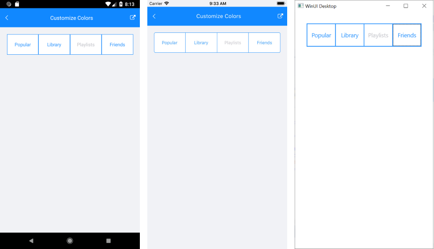

# Styling

The SegmentedControl provides a set of properties for customizing the text and background colors of its segments.

## List of Color Properties

The colors that are applied to the segments differ between the states of the control.

The SegmentedControl exposes the following properties:

- `SegmentBackgroundColor`&mdash;The background color applied to the unselected segments.
- `SegmentTextColor`&mdash;The text color applied to the unselected segments.
- `SelectedSegmentBackgroundColor`&mdash;The background color applied to the selected segment.
- `SelectedSegmentTextColor`&mdash;The text color applied to the selected segment.
- `DisabledSegmentTextColor`&mdash;The text color applied to the disabled segments.

### Example

The following example shows how to set the different segment colors.

```XAML
<telerikInput:RadSegmentedControl x:Name="segmentControl"
                                  Margin="10"
                                  DisabledSegmentTextColor="#C2C3C9"
                                  HeightRequest="60"
                                  SegmentBackgroundColor="#FFFFFF"
                                  SegmentTextColor="#3A9BFD"
                                  SelectedSegmentBackgroundColor="#3A9BFD"
                                  SelectedSegmentTextColor="#FFFFFF"
                                  VerticalOptions="Start">
    <telerikInput:RadSegmentedControl.ItemsSource>
        <x:Array Type="{x:Type x:String}">
            <x:String>Popular</x:String>
            <x:String>Library</x:String>
            <x:String>Playlists</x:String>
            <x:String>Friends</x:String>
        </x:Array>
    </telerikInput:RadSegmentedControl.ItemsSource>
</telerikInput:RadSegmentedControl>
```

The following image shows the end result.



## See Also

- [Selection]()
- [Disabled Segments]()
