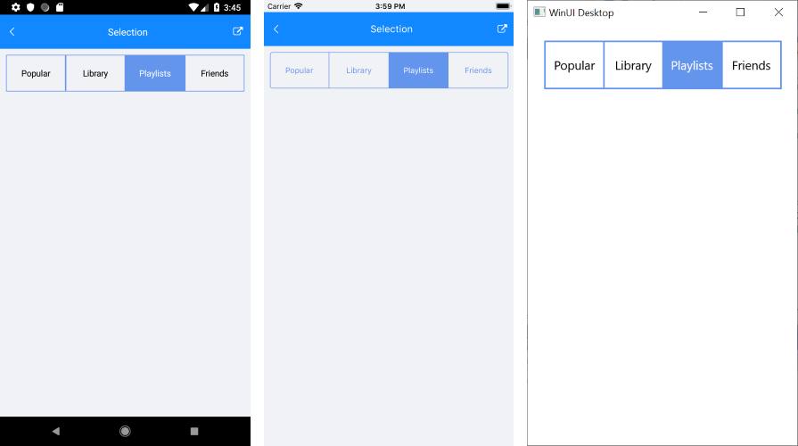

# Selection

The SegmentedControl exposes properties, which can help you work with the items selection.

## Setting the Selected Segment

The SegmentedControl provides a `SelectedIndex` property, which you can use to set the selected item.

## Setting the Selection Colors

You can define custom colors for the text and the background of the selected segment by using the `SelectedSegmentBackgroundColor` and `SelectedSegmentTextColor` properties of the SegmentedControl.

## Updating the Selected Item

The SegmentedControl exposes a `SelectionChanged` event, which is fired when the selected item is programmatically changed or updated due to user interaction.

The `SelectionChanged` event handler receives two parameters:
* The sender argument, which is of type `object`, but can be cast to the `RadSegmentedControl` type.
* A `ValueChangedEventArgs&lt;int&gt;` object, which provides the old and new value of the `SelectedIndex`.

## Example

The following example demonstrates how to utilize the selection feature of SegmentedControl.

1. First, create a `ViewModel` class containing the SegmentedControl items and the `int` property for defining the `SelectedIndex`:

 ```C#
public class ViewModel
{
    public ViewModel()
    {
        this.Categories = new ObservableCollection<string>() { "Popular", "Library", "Playlists", "Friends" };
        this.SelectedCategory = 2;
    }

    public ObservableCollection<string> Categories { get; set; }
    public int SelectedCategory { get; set; }
}
 ```

1. Then, add the SegmentedControl definition and apply the `ItemsSource`, `SelectedIndex`, and the selection colors properties:

 ```XAML
<telerik:RadSegmentedControl x:Name="segmentControl"
							  ItemsSource="{Binding Categories}"
							  SelectedIndex="{Binding SelectedCategory}"
							  SelectedSegmentTextColor="White"
							  SelectedSegmentBackgroundColor="CornflowerBlue"                                
							  HeightRequest="60"
							  VerticalOptions="Start">
</telerik:RadSegmentedControl>
 ```

1. Lastly, define the `ViewModel` as the `BindingContext` of the control:

 ```C#
this.segmentControl.BindingContext = new ViewModel();
 ```

The image below shows the end result on different platforms:



## See Also

- [Customizing the Segment Colors]()
