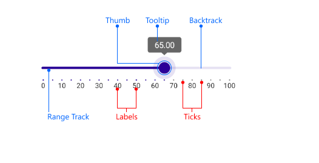

# .NET MAUI Silder Visual Structure

The visual structure of the .NET MAUI Slider represents the anatomy of the UI component. Being familiar with the visual elements of the Slider allows you to quickly find the information required to configure them.

The following image shows the anatomy of the Slider.

## Displayed Elements

- **Backtrack**&mdash;The part of the slider the thumb sildes across.
- **Thumb**&mdash;A draggable handle which represents the slider value.
- **Range Track**&mdash;The part of the backtrack from its start along to the value thumb.
- **Ticks** and **Labels**&mdash;Used for clarity of what the underlying min-max range is.
- **Tooltips**&mdash; Used for clarity of what the value corresponding to the dragged element is.

## See Also

- [Telerik .NET MAUI Blogs](https://www.telerik.com/blogs/mobile-net-maui)
- [Telerik .NET MAUI Roadmap](https://www.telerik.com/support/whats-new/maui-ui/roadmap)