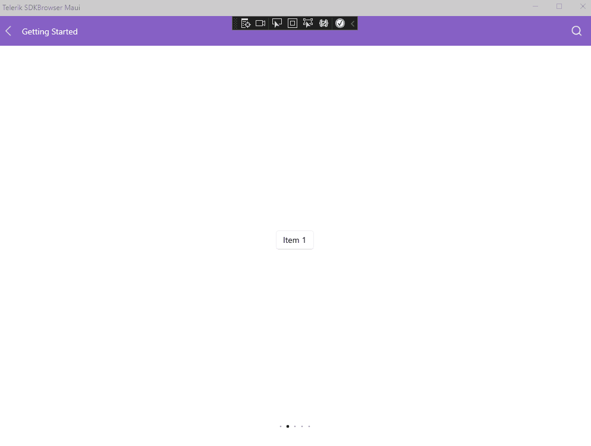

# .NET MAUI SlideView Interaction

The application users can change the views by using the navigation buttons or pan gesture (both on mobile and desktop) and indicators (on desktop).

By default, the pan gesture is disabled on desktop and enabled on mobile. You can change this behavior by using the `InteractionMode` (enum of type `Telerik.Maui.Controls.SlideView.SlideViewInteractionMode`) property. The available options are:
* `None`—the default value on desktop.
* `Pan`—the default value on mobile.

## Infinite Looping

By default, when you reach the last view, the **Next** button won't do anything. You can change this behavior through the `HasLooping` property and allow the repeating of the views when the user reaches the last view:

`HasLooping`(Default value`False`)&mdash;This property allows to achieve infinite looping.

See the result below in the `.gif` file:

## See Also

- [Binding SlideView to Data]()
- [Using Navigation Buttons in SlideView]()
- [Executing Commands on Slide Action]()
- [Handling the SlideView Events]()
- [Using an Item Template in SlideView]()
- [Changing the SlideView Appearance through a Control Template]()
- [Styling the SlideView Component]()
- [Styling the SlideView Indicators]()
