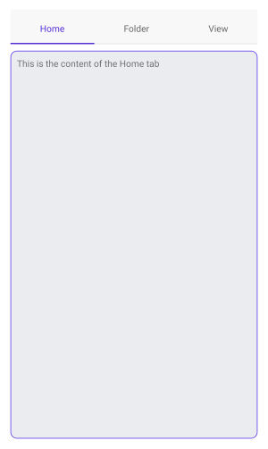

# .NET MAUI TabView Styling

TabView provides means for modifying its visual appearance, so that it matches the style of the app.  You can style different parts of the TabView - its header, items and content area. 

> Check the [TabView Visual Structure]() topic for a visual representation of the TabView elements.

## TabView Styling

You can use any of the following TabView properties to change its look&amp;feel:

* `BackgroundColor`
* `BorderColor`
* `BorderThickness` 
* `CornerRadius`
* `ContentPadding`

In addition, TabView provides the listed below styling properties for modifying its elements - header, TabView items and content area.

* `HeaderStyle` - specifies the style of the entire header area (border, background color etc.);
* `HeaderItemStyle` - specifies the style of the individual header items (font, text color etc.)
* `ContentStyle` - specifies the style of the entire content area (borders, background color etc.);

## Header Styling

Through `HeaderStyle` property of the TabView you can modify the `TabViewHeader`. `TabViewHeader` provides the following properties:

* `BackgroundColor`
* `BorderColor`
* `BorderThickness` 
* `CornerRadius`
* `ContentPadding`

Check below a quick example:

<snippet id='tabview-styling-headerstyle' />

And the result is the following:

## HeaderItem Styling

Through `HeaderItemStyle` property of the TabView the following styling properties can be applied to the `TabViewHeaderItem`:

* `BackgroundColor` - specifies the background color of the header item
* `BorderColor` - specifies the border color of the header item
* `BorderThickness` - specifies the border thickness of the header item
* `CornerRadius` - specifies the corner radius of the header item
* `ContentPadding` - specifies the padding of the inner content of the header item
* `TextColor` - specifies the color of the text in the header item
* `FontFamily` - specifies the font family of the text in the header item
* `FontSize` - specifies the font size of the text in the header item
* `FontAttributes` - specifies the font attributes of the text in the header item
* `TextDecorations` - specifies the decorations of the text in the header item
* `HorizontalTextAlignment` - specifies the horizontal alignment of the text in the header item
* `VerticalTextAlignment` - specifies the vertical alignment of the text in the header item
* `ImageSource` - specifies the source of the image icon in the header item
* `ImageAspect` - specifies the aspect of the image icon in the header item
* `ImageWidth` - specifies the width of the image icon in the header item
* `ImageHeight` - specifies the height of the image icon in the header item
* `ImageSpacing` - specifies the spacing between the image icon and the text in the header item
* `ImagePosition` - specifies the position of the image icon relative to the text (Left, Top, Right, Bottom)

<snippet id='tabview-styling-headeritemstyle' />

Here is the TabView after applying the `HeaderItemStyle`:

## Content Styling

TabView's `ContentStyle` property allows you to style the content area. `TabViewContent` provides the following properties:

* `BackgroundColor`
* `BorderColor`
* `BorderThickness` 
* `CornerRadius`
* `ContentPadding`

<snippet id='tabview-styling-contentstyle' />

The image below shows TabView after applying `ContentStyle`:

## See Also

- [TabViewItem]()
- [Selection]()
- [Templates]()