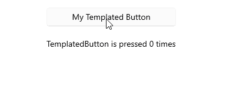
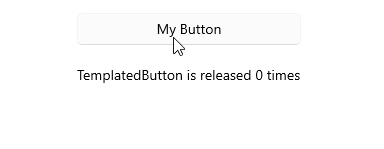

# .NET MAUI TemplatedButton Events

The .NET MAUI TemplatedButton emits a set of events that allow you to configure the component's behavior in response to specific user actions.

The .NET MAUI TemplatedButton exposes the following events:

* `Clicked`&mdash;Raised when the `RadTemplatedButton` is clicked or tapped. The `Clicked` event handler receives two parameters:
	* The `sender` argument which is of type `RadTemplatedButton`.
	* An `EventArgs` object which provides information about the `Clicked` event.

* `Pressed`&mdash;Raised when `RadTemplatedButton` is pressed (a finger presses on the buton, or a mouse button is pressed with a pointer positioned over the button). The `Pressed` event handler receives two parameters:
	* The `sender` argument which is of type `RadTemplatedButton`.
	* An `EventHandler` object which provides information about the `Pressed` event.

* `Released`&mdash;Raised when the `RadTemplatedButton` is released (the finger or mouse button is released). The `Released` event handler receives two parameters:
	* The `sender` argument which is of type `RadTemplatedButton`.
	* An `EventHandler` object which provides information about the `Released` event.

## Using the Clicked Event

The following example demonstrates how to use the `Clicked` event.

**1.** Define the button in XAML:

<snippet id='templatedbutton-event-clicked' />

**2.** Add the `telerik` namespace:

```XAML
xmlns:telerik="http://schemas.telerik.com/2022/xaml/maui"
```

**3.** Add the `Clicked` event:

<snippet id='templatedbutton-clicked-event' />

This is the result on WinUI:


> For a runnable example demonstrating the TemplatedButton Clicked event, see the [SDKBrowser Demo Application]() and go to the **TemplatedButton > Events** category.

## Using the Pressed Event

The following example demonstrates how to use the `Pressed` event.

**1.** Define the button in XAML:

<snippet id='templatedbutton-event-pressed' />

**2.** Add the `telerik` namespace:

```XAML
xmlns:telerik="http://schemas.telerik.com/2022/xaml/maui"
```

**3.** Add the `Pressed` event:

<snippet id='templatedbutton-pressed-event' />

This is the result on WinUI:



> For a runnable example demonstrating the TemplatedButton Pressed event, see the [SDKBrowser Demo Application]() and go to the **TemplatedButton > Events** category.

## Using the Released Event

The following example demonstrates how to use the `Released` event.

**1.** Define the button in XAML:

<snippet id='templatedbutton-event-released' />

**2.** Add the `telerik` namespace:

```XAML
xmlns:telerik="http://schemas.telerik.com/2022/xaml/maui"
```

**3.** Add the `Released` event:

<snippet id='templatedbutton-released-event' />

This is the result on WinUI:



> For a runnable example demonstrating the TemplatedButton Released event, see the [SDKBrowser Demo Application]() and go to the **TemplatedButton > Events** category.

## See Also

- [Configure the TemplatedButton]()
- [Loading Button]()
- [Set Visual States]()
- [Execute Command]()
- [Style the TemplatedButton]()