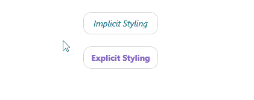

# .NET MAUI TemplatedButton Styling

The TemplatedButton provides a set of styling options by exposing properties for customizing its visual appearance.

## Styling the TemplatedButton

To style the TemplatedButton, use the following properties:

* `Background` (`Brush`)&mdash;Specifies the background brush of the control.
* `BackgroundColor` (`Color`)&mdash;Specifies the background color of the control.
* `BorderColor` (`Color`)&mdash;Specifies the border color of the control.
* `BorderBrush` (`Brush`)&mdash;Specifies the border brush of the control.
* `BorderThickness` (`Thickness`)&mdash;Specifies the border thickness of the control.
* `CornerRadius` (`CornerRadius`)&mdash;Specifies the corner radius of the control.
* `Padding` (`Thickness`)&mdash;Specifies the padding of the control.
* `TextColor` (`Color`)&mdash;Specifies the color of the `Label.Text` created when `Content` is `string` and `ContentTemplate` is not set.

### Using the Styling API

The following example demonstrates how to apply implicit and explicit styles to the TemplatedButton.

**1.** Define the buttons in XAML:

<snippet id='templatedbutton-styling' />

**2.** Define the explicit styling to the page's resources:

<snippet id='templatedbutton-styling-explicit' />

**3.** Define the implicit styling to the page's resources:

<snippet id='templatedbutton-styling-implicit' />

**4.** Add the `telerik` namespace:

```XAML
xmlns:telerik="http://schemas.telerik.com/2022/xaml/maui"
```

This is the result on WinUI:



> For a runnable example demonstrating the TemplatedButton Styling options, see the [SDKBrowser Demo Application]() and go to **TemplatedButton > Styling** category.

## See Also

- [Configure the TemplatedButton]()
- [Loading Button]()
- [Set Visual States]()
- [Events]()
- [Execute Command]()
